# 战列舰

> 战列舰（英语：battleship），美国军规常用代号为BB，是装有厚重装甲和大口径主炮的大型军舰，是人类创造的最庞大和复杂的武器系统之一，大舰巨炮主义时代的极致产物。19世纪末到第二次世界大战期间，战列舰作为海军中最大的武装舰艇，是一个国家海军力量的标志，故常作为「主力舰」（capital ship）或旗舰（flag ship）使用。随着潜艇技术日渐成熟，及空中优势破坏战力平衡和精确制导武器的开发，战列舰已不再被认为是建立海上优势所必须的装备，因此已经全部退役。
> 

## 目录
* [战列舰简介](#bb_introduction)
  * [前无畏舰](#pre-dreadnought)
  * [无畏舰](#dreadnought)

* [各国战列舰](#bb_country_list)
  * [英国](#bb_en)
    * [英国战列舰列表](#bb_en_list)
    * [英国部分战列舰介绍](#bb_en_info)
  * [美国](#bb_us)
    * [美国战列舰列表](#bb_us_list)
    * [美国部分战列舰介绍](#bb_us_info)
  * [日本](#bb_jp)
  * [德国](#bb_de)
  * [法国](#bb_fr)
  * [意大利](#bb_ita)

---

## 战列舰介绍

「战列舰」此一称呼，源自大航海时期的风帆舰（全称ship of the line of battle，简称ship of the line或line-of-battle ship）——自 17 世纪中叶至 19 世纪中叶，主要排成战列线进行侧舷炮战的大型风帆军舰。随着蒸汽机、爆破弹和钢铁装甲的发展，19 世纪后期出现了称为**铁甲舰**（Ironclads）的蒸汽装甲舰，即是后来铁甲战列舰和装甲巡洋舰的前身。1906 年服役的**无畏号**（HMS Dreadnought）标志着战列舰「全装重型火炮」的革命，后来所有按这个概念设计的战列舰均称为**无畏舰**，与之相对，之前的战列舰称为**前无畏舰**。不久，出现了比无畏号更强大的战列舰，称为**超无畏舰**。

为了占据海权优势，列强争相建造更大的战列舰引起了长期的全球性军备竞赛。第一次世界大战中爆发了战列舰对决的日德兰海战。战后，各海军大国通过限制海军军备条约对缔约国战列舰的数量和性能作出限制。条约生效期间称为「海军假日」。条约失效后，出现了最后一波建造战列舰的热潮，出现了大和号等排水量超过 60,000 吨的超级巨舰。即使如此，战列舰的价值一直受到质疑，更小、更廉价的潜艇、鱼雷和飞机都能对战列舰造成严重伤害。第二次世界大战期间的作战经验得出航空母舰将取代战列舰成为海战的主导力量。战后，尚存的战列舰纷纷走上退役道路，原有的建造计划被取消，只有美国海军曾在几次战争中重新将数艘旧战列舰当作海上炮台投入使用。

美国最后两艘战舰威斯康辛号（BB-64）和密苏里号（BB-63）参与 1990 年海湾战争，是战列舰最后参与的大型战役。战争结束后，两舰先后于 1991 年和 1992 年退役，并分别在 2006 年和 1995 年除役。现在只有美国和日本保留了数艘退役战列舰，作为浮动博物馆使用。

### 前无畏舰
1892 年，英国建成世界首艘全金属战列舰君权号（HMS Royal Sovereign）。其将主炮塔设置于中轴线上的设计令君权号成为世界上首艘前无畏舰，成为随后各国彷照的样板。此后战列舰的设计建造进入前无畏时代，即以全金属建造舰体，口径可达 305 毫米（12 英寸）的主炮设置于中轴线，200-300 毫米的防护装甲和 12,000 吨的满载排水量，航速可达 16-18 节。战列舰的**主炮口径**、**装甲厚度**、**航速**和**排水量**成为各国公认的四大要素指标。 此时期的战列舰大多装设两种倍径的主炮，动力多为燃煤往复式蒸汽机。直至 1906 年英国无畏号战列舰出现前，世界各国的海军纷纷建造或进口大批前无畏舰，前无畏舰也成为此时期各国海军的主力舰船。

**前无畏舰**介于铁甲舰和无畏舰之间。较铁甲舰增加排水量至 1 万吨以上，标配 2 至 4 门 12 寸左右的重型火炮为主炮，仍在舷侧配有大量一种以上中口径火炮为副炮；技术上，因电动或液压系统的普及，沉重的主炮得以安装更沉重的封闭式装甲旋转炮塔，和机械辅助装填，而非铁甲舰包括操舵仍依赖众多人力操作；船体完全采用钢结构，而非钢木混合结构；动力采用燃煤蒸汽机，而非机帆混合动力。较无畏舰，则主炮数量较少，仍类似风帆战舰时代以接舷近战战术为主导思想，而非无畏舰以远距离重炮跨射作战为主要作战手段。

在 1890 年代，各国海军开始以英国庄严级战舰作为蓝本建造新型战舰。典型的前无畏舰演进过程经历了英国特拉法加级铁甲舰-->皇家主权级战舰-->庄严级战舰至最后的纳尔逊勋爵级战舰过程，随后进入无畏舰时代。主要技术革新集中在炮塔上；从开始的固定露天炮台人力火炮旋转，演化至一体化炮塔机械力旋转；从梨形炮座，提弹机位于炮塔座圈之外，演化至炮塔轴心提弹机，全方向供弹。当这些千奇百怪的新技术在实战的尝试中稳定成型为各国采用后，最终促成了无畏型战列舰的诞生。

以意大利、德国、日本和美国等新兴海军强国以前无畏舰为骨干，大力扩充舰队。面对新兴力量的威胁，英国、法国和俄罗斯亦以扩充舰队作为回应。因此，在 1890 年代，新建战舰数量大增，新战舰的外表亦十分相似。

---

### 无畏舰
1906年，英国皇家海军的「无畏号」下水服役，由于其技术与设计之先进远超过同时代的战列舰，故以其为名自成一种新型战列舰的类别——「无畏舰」，而落伍的旧式战列舰则全部被归为「前无畏舰」，意指「无畏舰」出现前设计者。

「无畏舰」具两种革命性的创新设计，一为采取「全重炮」武装配置，其装备的大口径火炮数远超过以往的战列舰，二为使用蒸汽涡轮发动机作为推进系统。随着「无畏舰」逐渐成为海上力量、乃至于国力的重要指标，各国展开了规模巨大的「无畏舰」建造竞赛，遍及欧洲、亚洲和美洲国家，尤其是英国与德国最为激烈、建造数量最多。「无畏舰」造舰竞赛一定程度上促成了第一次世界大战的爆发，并一直持续到开战当年，在仅仅五年造舰技术迅速发展的时间里，「无畏舰」在火炮口径、吨位、装甲和推进力都有了飞跃性的提高，甚至出现了在前述的技术指标上发展到极致的「超无畏舰」，而原先领先全球的「无畏号」反而在开战后成了落伍的二线战列舰。一次大战结束后，世界海军列强为避免再因造舰竞赛重起战端，召开了「华盛顿裁军会议」，以此限制各国海军军舰的吨位和武装，但许多艘「超无畏舰」依旧服役到第二次世界大战。

尽管在20世纪初世界各国耗费大量资源、争相建造「无畏舰」，但历史上却只在1916年爆发过一次「无畏舰」舰队间的大规模交战——「日德兰之战」，为英国与德国的主力舰队于日德兰半岛附近海域进行的一次海战，尽管双方兵力投入之多，却没有产生什么决定性的结果。第一次世界大战后，由于后来建造的军舰皆全部具备了「无畏舰」的技术概念，故该名词也不再作为特定舰种之类别而无再使用，另外「无畏舰」一词亦可用于具备其特征、在「无畏舰革命」展开后出现的新式战列舰类型——战列巡洋舰之上。

---

## 各国战列舰

### 英国战列舰

#### 各时期战列舰列表

##### 无畏舰（1906-1910）

| 船名（中文） | 船名（英文） | 级别 | 下水年份 | 服役年份 |
|:-:|:-:|:-:|:-:|:-:|
| 无畏号 | HMS Dreadnought | 无畏级 | 1906 | 1906 |
| 柏勒洛丰号 | HMS Bellerophon | 柏勒洛丰级 | 1907 | 1909 |
| 壮丽号 | HMS Superb |	柏勒洛丰级 | 1907 | 1909 |
| 鲁莽号 | HMS Temeraire |	柏勒洛丰级 | 1907 | 1909 |
| 圣文森特号	|HMS St.Vincent	|圣文森特级	|1908	|1909|	
| 科林伍德号	| HMS Collingwood | 圣文森特级 | 1908 | 1910 |
| 前卫号 | HMS Vanguard | 圣文森特级 | 1909 | 1910 |
| 涅普顿号 | HMS Neptune | 涅普顿级 | 1909 | 1911 |
| 巨像号 | HMS Colossus | 巨像级 | 1910 | 1911 |
| 赫丘利斯号 | HMS Hercules | 巨像级 | 1910 | 1911 |

##### 超无畏舰（1910-1945）

* **俄里翁级战列舰**（Orion class）（1910-1911）（同级舰4艘）
  * 俄里翁号（HMS Orion）
  * 君主号（HMS Monarch）
  * 征服者号（HMS Conqueror）
  * 雷神号（HMS Thunderer）
* **英王乔治五世级战列舰** （1911年）（King George V class）（1911-1912）（同级舰4艘）
  * 英王乔治五世号（HMS King George V）
  * 百夫长号（HMS Centurion）
  * 大胆号（HMS Audacious）
  * 埃阿斯号（HMS Ajax）
* **铁公爵级战列舰**（Iron Duke class）（1912-1913）（同级舰4艘）
  * 铁公爵号（HMS Iron Duke）
  * 马尔博罗号（HMS Marlborough）
  * 本鲍号（HMS Benbow）
  * 印度皇帝号（HMS Emperor of India）
* **爱尔兰号战列舰**（HMS Erin）（1913）
* **加拿大号战列舰**（HMS Canada）（1913）
* **伊丽莎白女王级战列舰**（Queen Elizabeth class）（1913-1915）（同级舰5艘）
  * 伊丽莎白女王号（HMS Queen Elizabeth）
  * 厌战号（HMS Warspite）
  * 巴勒姆号（HMS Barham）
  * 英勇号（HMS Valiant）
  * 马来亚号（HMS Malaya）
* **复仇级战列舰**（Revenge class）（1914-1916）（同级舰5艘）
  * 复仇号（HMS Revenge）
  * 皇家橡树号（HMS Royal Oak）
  * 君权号（HMS Royal Sovereign）
  * 决心号（HMS Resolution）
  * 拉米利斯号（HMS Ramillies）
* **纳尔逊级战列舰**（Nelson class）（1925）（同级舰2艘）
  * 纳尔逊号（HMS Nelson）
  * 罗德尼号（HMS Rodney）
* **英王乔治五世级战列舰** （1936年）（King George V class）（1939-1940）（同级舰5艘）
  * 英王乔治五世号（HMS King George V）
  * 威尔士亲王号（HMS Prince of Wales）
  * 约克公爵号（HMS Duke of York）
  * 安森号（HMS Anson）
  * 何奥号（HMS Howe）
* **前卫号战列舰**（HMS Vanguard）（1944）

---

#### 英国部分战列舰介绍

**无畏号**
> 无畏号（英语：HMS Dreadnought），英国皇家海军的一种划时代设计的战列舰。它出现了很多现代军舰的特征，远优于同时期的同类军舰，而之后的火力改进，更在20世纪初期导致了列强之间的海军军备竞赛。

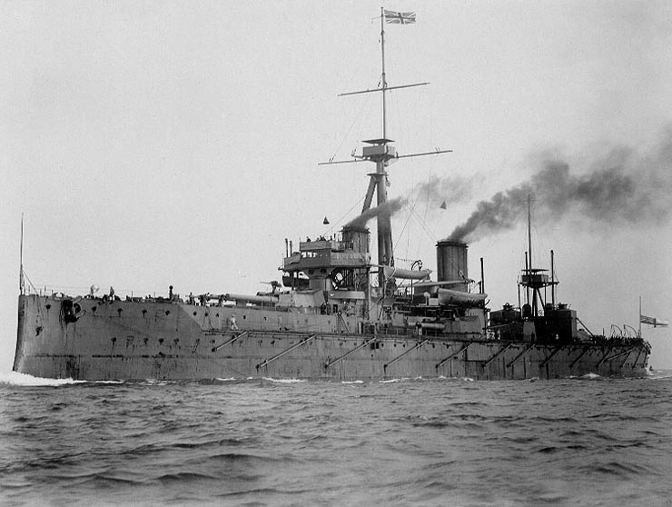

**无畏号 技术数据**
| 数据项 | 数据值 |
| :---: | :---: |
|**排水量**| 18120 长吨（18410 公吨）（标准）   20730 长吨（21060 公吨）（满载） |
|**全长**| 527 英尺（160.6 米）|
|**全宽**| 82 英尺 1 英寸（25.0 米）|
|**吃水**| 29 英尺 7.5 英寸（9.0 米）（满载）|
|**动力**| 4 轴   帕森斯直接驱动蒸汽涡轮发动机|
|**最高速度**| 21 节 |
|**续航距离**| 以 10 节速度航行时为 6,620 海里
|**乘员**| 700 人－810 人|
|**武器装备**|	5×双联装 BL 12 英寸 Mk X 主炮   27×单管 QF 12 磅 18 英寸 Mk I 副炮   5×18英寸（450毫米）鱼雷发射管|
|**装甲**| 水线装甲带：4～11 英寸（102～279 毫米）  甲板：0.75～3 英寸（19～76 毫米）  炮座：4～11 英寸（102～279 毫米）  炮塔：3～12 英寸（76～305 毫米）  司令塔：11 英寸（279 毫米）  水密舱壁：8 英寸（203 毫米）|

**设计特点**

无畏号为长艏楼船型，取消一般战列舰的船艏水下撞角。其最大不同是「全装重型火炮（All-Big-Gun）」，十门主炮都是 12 英寸口径，分成五座双联装炮塔。艏艉各一座，舯部舰体中心线一座，在锅炉舱后方；两舷对称各一座，在二个锅炉舱之间。因此，单侧舷火力最大为主炮八门，向前火力最大为主炮六门，各主炮射击性能一致并配合火力控制系统，无畏号整体攻击火力大幅提升。副炮口径仅 3 英寸以下，用以防御小型鱼雷艇等（注：「艏」音同首，造船工程学的船首；「舯」音同中，指船中央部分；「艉」音同尾，指船尾部）。5 门鱼雷发射管装设在吃水线下方，并在船侧身加挂钢制防鱼雷网。

无畏号是第一个使用了 4 台蒸汽涡轮推进机组的大型战舰，功率大于旧式往复式蒸汽机组，其 21 节的最高航速超过既有的任何战列舰，使得虽有的巨大吨位，在追逐与躲避仍能十分灵活。长时间高速行驶的可靠性也很好，恶劣天气也能出海作战，并对官兵的工作和生活环境条件都有了明显的改善，确保了人员的士气与战力。无畏号的设计也获得了更加强的生存力，该舰种安装的内外防护工程均经过设计，全面防御能力不下于任何战舰，装甲以表面硬化处理，重要部位的厚度高达 11 英寸。水线下的水密隔舱不设横向联络门，以加强水密结构，提高抗沉能力。

**服役生涯**

1907 年 12 月 3 日才正式服役，并担任英国皇家海军各本土舰队的旗舰，直到 1912 年。

第一次世界大战中的 1916 年 3 月 18 日，无畏号在北海撞沉德国 U-29 号潜艇，由于入坞维修而错过了日德兰海战。1916－1918 年派往泰晤士河口巡逻。1919 年转入后备役。1921 年出售拆毁。

**影响**

> 无畏号革新武备、动力、防护等各方面的传统观念，其火力和动力装置的设计更具革命性，可以说是近代造船工业化经验与成就指标，当时各海军强国非常重视，纷纷把旧战列舰快速更新换代，比照而建成新型战列舰舰队，产生新一轮海军军备竞赛。无畏号代表战列舰技术的重要分水岭，是 19 世纪列强海军不断演进的集大成者，一般通称其同类为「无畏舰」，之前的战列舰则称作「前无畏舰」。

---

**俄里翁级战列舰**

1909 年英国为应付与德国之间海军造舰竞赛的压力，通过开工8艘主力舰的庞大追加预算，回应德国海军的挑战。英国皇家海军全新设计的四艘猎户座级战列舰于 1909 年 11 月29 日-1910 年4 月开工，重点提升了火力，与以往英国建造的战列舰完全不同，在英国被称为「超级无畏级」战列舰，并成为后续英国超级无畏舰乔治五世国王级战列舰、铁公爵级战列舰的设计蓝本（也被称为 1909型战列舰）。为保持英国海军在火力方面的优势地位，安装 10 门新的 13.5 英寸口径主炮取代原先的 12 英寸口径，并用更重的炮弹。之前的 12 英寸/ 50 倍口径长身管的主炮存在散布大以及相当大的烧蚀的问题。首次在英国皇家海军无畏舰上采用主炮塔全部沿舰体纵向中轴线布置的形式，5 座双联装主炮主炮塔，炮塔舰体艏艉呈背负式各布置两座，舯部一座，便于全部主炮发扬同舷侧射火力。猎户座级进一步加强了要害区域的防御装甲。为控制重量，猎户座级取消了以往英国战列舰标志性的后部主桅杆，相比后续的英国超级无畏舰前部主桅截然不同的置于前烟囱之后。

1912 年英国皇家海军在雷神号战列舰上首次安装了「中央火力控制系统」，由皇家海军军官珀西·斯科特爵士发明的射击指挥仪安装在主桅杆的平台上。在主炮齐射时可以集中观测校正弹着点、统一解算射击诸元，火炮根据指令调整方向对准目标变得相对容易，命中率成倍提高。1912 年 11 月在猎户座号和雷霆号之间进行射击对比试验，安装了射击指挥方位盘的雷霆号命中率为猎户座号的 6 倍。

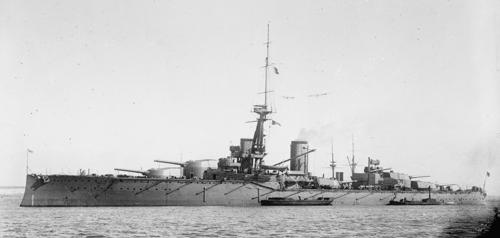

**俄里翁级 技术数据**

| 数据项 | 数值 |
| :---: | :---: |
| 舰型 | 超无畏舰 |
| 排水量 | 22,000 长吨（标准）    25,870 长吨（满载） |
| 全长 | 581英尺（177.1米）|
| 全宽 | 88英尺（26.8米）|
| 吃水 | 24英尺（7.3米）|
| 动力来源 | 主机输出功率27000马力 |
| 速度 | 21节（38.9千米每小时）|
| 续航距离 | 10节 续航 6,730 海里 |
| 乘员 | 750–1100|
| 武器装备 | 10 × BL 13.5 英寸 /45 倍径 Mk V 主炮 (5×2)   16 × BL 4 英寸 Mk VII 副炮 (16×1)   3 × 21 英寸（533 毫米）水下鱼雷管 |
| 装甲 | Belt: 12英寸（305 mm）  防水舱: 10英寸（254 mm）  甲板: 4英寸（102 mm）  炮塔: 11英寸（279 mm）  炮座: 10英寸（254 mm）|

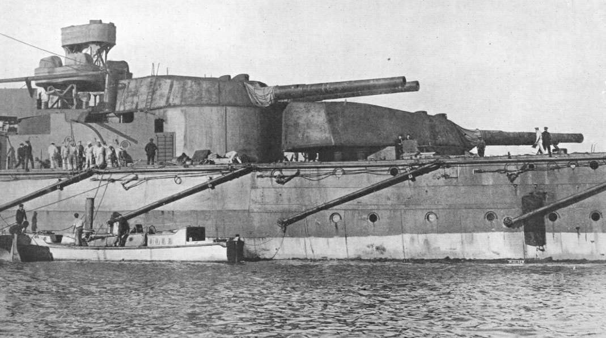

**同级舰**

| 舰名	|建造商	|下水	|服役|
| :---: | :---: | :---: | :---: |
| 俄里翁号 HMS Orion	| 朴次茅斯海军基地	| 1910年8月20日	| 1912年1月2日 |
| 君主号 HMS Monarch	| 阿姆斯特朗-惠特沃斯 | 1911年3月30日 | 1912年4月27日 |
| 征服者号 HMS Conqueror	| 博德摩尔船厂 | 1911年5月1日 | 1912年12月1日 |
| 雷神号 HMS Thunderer	| 泰晤士钢铁 | 1911年2月1日 | 1912年6月15日 |

**服役生涯**

「俄里翁」级的四艘姐妹战舰都参与了日德兰海战，在开战后，俄里翁级四艘舰被编入了大舰队，在日德兰海战爆发时，「俄里翁」号作为第二战列舰分舰队的第二战列舰中队旗舰，同其他三艘俄里翁级组成了第二战列舰分舰队的第二战列舰中队。

一战结束后，根据《华盛顿海军条约》的规定而报废。其中君主号担任了炮击和轰炸的目标靶舰，雷神号曾作为训练舰从 1922 年至 1926 年报废。

---

**伊丽莎白女王级战列舰**

20 世纪初期第一次世界大战前夕，各海军强国围绕建造无畏舰展开海军军备竞赛，各国海军正计划建造安装更大口径主炮和加强装甲防护的超级无畏级战列舰；在 1905 年后英德海军造舰竞赛日趋白热化，研发更新更好造更多的战舰成为显学，英国人声称德国额外每增加建造一艘主力舰英国就将造两艘作为回应。

英国皇家海军在 1912 年研发出成功的第五型 13.5 英寸舰炮，装备在俄里翁级战舰以后服役的战舰上，但是英国得知马肯森级战斗巡洋舰将装备 35 公分（13.8 英寸）舰炮。为巩固皇家海军在战舰火力上的优势地位，海军大臣丘吉尔极力主张为 1912 年即将开工的新战舰开发更强大的 15 英寸舰炮，海洋军事部（英语：Admiralty）评估研发新炮需要 1-2 年的时间，过去的经验是先开发出火炮再兴建可使用的战舰，并没有同时造舰兼开发的往例，假如研发延宕，即有可能让斥资钜额的战舰面临困境，不过开发单位不负上层所望达成需求。新型炮出于保密，对外声称口径为 14 英寸。

伊丽莎白女王级原始布局是效仿铁公爵级战舰，配备 5 座双连装炮塔，极速 21 节。但是在狮级战斗巡洋舰研发经验中，英国工程师了解到取消船体中央的 Q 炮塔可以为整个轮机系统争取到更多可用空间，并让战舰获得额外动力去增强防御，且 15 吋炮的弹头投射能量足以取代一座双连装炮塔，因此主炮采用4座双联装，布局采用艏艉对称在舰体中心线上呈背负式各布置两座。

除了火炮设计思维的变更，伊丽莎白女王级同时也是英国皇家海军首批次运用**全重油锅炉动力**设计的战舰。皇家海军建设指挥部提供的评估报告认为全重油锅炉设计技术上已可行，海军上将费舍尔也赞成未来战舰运用石油作为轮机动力的概念；相较煤炭，同体积的石油蕴含更大的能量密度，后勤补给较为简便，同时也比较不会产生浓烈的燃烧黑烟；只是在 1910 年代不产石油的英伦三岛要如何确保维持战舰操作的燃料储备是个较考验高层手腕的问题；丘吉尔因此介入英伊石油公司合约，确保战争时皇家海军石油来源无虑。使用全重油推进的伊丽莎白女王级因此获得 25 节极速，接近当时战列巡洋舰的航行速度；英国海军战舰编组上原先是 3 艘主力战舰配合 1 艘战斗巡洋舰，借由战斗巡洋舰的高速争取在海战时抢位优势；因为伊丽莎白女王级具有比当时战舰更加优势的航速，因此在这批订单中直接采购了 4 艘本级舰，不再搭配战斗巡洋舰编组。新建五号舰是因为马来亚自治领提供造舰预算，并不在原订计划当中；在皇家海军的文书资料中已经排入六号舰，该舰将命名为阿金科特，但造舰预算并无着落，最后六号舰的计划在1914年取消，而阿金科特号战舰这个舰名则给予征收自为奥斯曼帝国承造的苏丹奥斯曼一世号战舰。

**伊丽莎白女王级 技术数据**

|   **数据项**   |              数据         |
|:-:|:-:|
| **满载排水量** |         33020吨   改装后36300吨          |
|    **全长**    |                195米                      |
|    **全宽**    |              27.4米 (改装后31.7米)            |
|    **吃水**    |                  9.2米                       |
|    **燃料**    |                   柴油                       |
|    **锅炉**    |                24台锅炉 (改装后8台)           |
|    **功率**    |            75000马力 （改装后85000马力）       |
|  **最高速度**  |               25节 （改装后23.5节）            |
|  **续航距离**  |                8,600海里/12.5节                 |
|    **乘员**    |            925人 （改装后1124人）                |
|  **武器装备**  | 4 座双联装 15 英寸/ 42 倍口径主炮（共 8 门）  12 门 6 英寸 / 45 倍口径副炮   2 门 76 毫米炮   533 毫米鱼雷发射管 4 具   40 毫米和 20 毫迈克尔射炮众多   伊丽莎白女王号、勇士号 1937 年改装中拆除副炮改装 4.45 英寸口径双联装高平炮 10 座 |
| **装甲** | 侧舷装甲带（最大）13 英寸   主甲板 2.5-5 英寸   炮塔（正面）13 英寸   炮座 10 英寸   司令塔 11 英寸   装甲总重 8100 吨 |

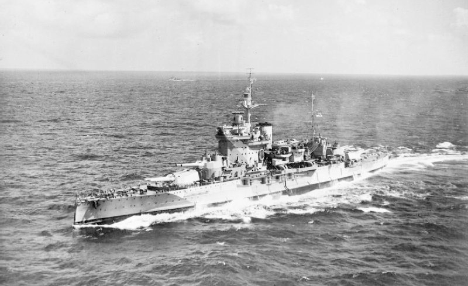

**服役历程**

一战:

一号舰伊丽莎白女王号 1912 年 10 月 21 日开工，各舰在 1912 年 10 月至 1913 年期间相继开工，单舰造价大约 240 万英镑。原来计划伊丽莎白女王级安装 16 门炮郭式 6 英寸副炮，伊丽莎白女王号建成后发现位于后部炮塔舰体两舷的 4 门炮位置比较低（炮位比其他 6 英寸副炮降低一层甲板），易受海浪冲刷而无法使用，完工不久就拆除了，其他各舰均未安装。

1915 年 2 月 25 日伊丽莎白女王号参加了对土耳其苏都巴哈土军阵地的轰击。这次对岸炮击行动是英国海军第一次在实战中使用 381 毫米火炮，1916 年 5 月 22 日进入干船坞进行大修。

1916 年 5 月 31 日在日德兰海战中，4舰同级舰（伊丽莎白女王号回国入坞维修，错过参战）编成第5战舰中队（指挥官休·埃文·托马斯海军少将，旗舰巴勒姆号战舰），海战中支援前卫，迎战由弗朗兹·冯·希佩尔将军指挥的德国海军第1侦查集群；就德国公海舰队司令赖因哈德·舍尔陈述：「她们以绝佳的速度与准确性开火」。

海战中，第 5 战舰中队重创了吕佐号战斗巡洋舰、塞德利茨号战斗巡洋舰等舰艇，15 英寸舰炮足够在德国战舰射程外优先开火，让德方陷入被动；不过第 5 战舰中队除旗舰外仍受到轻重不等的创伤，其中受创最重者为厌战号战舰，她因操舵装置失灵卡死右转，因此在海战中曾开入德国舰队射程内，遭到德国舰队击火重创，至少被击中 15-18 发大口径炮弹。海战结束后受伤各舰均在两个月内修复。1916 年 11 月伊丽莎白女王号接替铁公爵号战舰成为皇家海军大舰队旗舰。

二战:

第二次世界大战中该级舰被广泛使用，战争前期该级舰长期在地中海海域作战。尤其是厌战号多次受创伤而最终安然无恙，成为二战中英国海军的传奇战舰。即使是现代化改装项目较少的马来亚号也曾经吓阻过德国肖恩霍斯特号和格奈森瑙号对英国船队的袭击。1940 年 4 月，厌战号调回英国参加挪威战役，在纳尔维克率领驱逐舰围歼了一支德国驱逐舰分舰队。1940 年7 月，厌战号在地中海卡拉布里亚海战中，命中 26400 码外的意大利战列舰，这是经确认的战列舰最远距离炮击命中纪录。1941 年3 月马塔潘角海战中，厌战号、英勇号、巴勒姆号为首的英国舰队夜战中击沉了意大利 3 艘重巡洋舰。1941 年马来亚号、厌战号先后受创，根据租借法案开往美国（美国尚未参战）修理。巴勒姆号 1941 年 11 月在地中海被德国潜艇发射 3 枚鱼雷击中沉没。在太平洋战争爆发后，1942 年1 月厌战号一度加入英国远东舰队成为旗舰。

1941 年12 月，伊丽莎白女王号和英勇号在亚历山大港内遭到意大利海军蛙人袭击坐沉海底，打捞修复后于 1943 年先后加入英国远东舰队参加对日本作战。1943 年厌战号、英勇号参加了在西西里岛与意大利本土的登陆战役，9 月厌战号在萨莱诺被无线电遥控滑翔炸弹击中丧失了战斗力。1944年6月，厌战号、马来亚号参加了诺曼底登陆战役。

战争结束之后，伊丽莎白女王级战列舰于 1947年-1948 年相继退役解体。

**同级舰列表**
| 舰名 | 舷号 | 建造商 | 下水日期 | 服役日期 | 备注 |
|:---:|:---:|:---:|:---:|:---:|:---:|
| 伊丽莎白女王号   HMS Queen Elizabeth | 00 | 朴资茅斯海军船坞 | 1913 年 10 月 16 日 | 1914 年 12 月22 日 | 1948 年被拆解 |
| 厌战号   HMS Warspite | 03 | 朴资茅斯海军船坞 | 1913 年 11 月 26 日 | 1915 年 3 月 8 日 | 1950 年被拆解 |
| 英勇号   HMS Valiant | 02 | Fairfield | Shipbuilding | 1914 年 11 月 4 日 | 1916 年 1 月 13 日 | 1948 年被拆解 |
| 巴勒姆号   HMSBarham | 04 | John | Brown | 1914 年 10 月 31 日 | 1915 年 10 月 19 日 | 1941 年 11 月被德军潜艇发射鱼雷击沉 |
| 马来亚号   HMS Malaya | 01 | 阿姆斯特朗-威特沃斯 | 1915 年3 月 18 日 | 1916 年 2 月 1 日 | 1948 年被拆解 |

---

**纳尔逊级战列舰**

英国在华盛顿海军条约限制下建造的一型 35000 吨级、装备 16 英寸主炮的战列舰。也是过去放弃的 N3 级战舰之缩小改良版，该型共有纳尔逊号、罗德尼号两艘。

**服役历程**

第一次世界大战结束后，英国曾计划建造 N3 型战列舰，因《华盛顿海军条约》签定而夭折。1922 年英国在条约规定的吨位内开始建造纳尔逊级战列舰。纳尔逊级采用平甲板船型，不再是以往英国战舰常用的艏楼船型。根据日德兰海战的经验教训着重提升装甲防护水准，首次采用倾斜布置水线装甲带，是当时舷侧装甲最厚的战舰。受条约规定 35000 吨的限制，纳尔逊级采用 3 座三联装主炮炮塔全部在舰桥之前，而动力机舱集中配置在舰体后部这种非常规的布局，目的是将有限的重装甲防护区最大限度集中在重点部位，但是这样的设计造成主炮存在后方死角的缺陷，且密集排列的主炮一旦下方弹药库失火，连锁反应也令人担忧。受条约规定排水量的限制，决定在一定程度上牺牲动力性能，航速较慢(比较伊丽莎白女王级战列舰)。纳尔逊级安装 16 英寸口径主炮，全炮塔化的双联装 6 英寸口径高平两用副炮。但其高速轻弹在实战中被证明效率低下，其使用的 Mark I 16 寸炮弹在远距存速急剧下降导致炮弹贯穿力不足，远距离贯穿深度只相当于旧式的 Mark I 15 英寸舰炮和新式的 Mark VII 14 英寸舰炮，更无法和同期的美国 Mark I 16 英寸舰炮、日本三年式 410 毫米舰炮相比。并且该舰 23 节的最大速度在二战中不合适伴随高速部队如航母编队等行动，适航性、稳定性也不理想。因而在英国海军中地位不高，甚至低于一战前动工的伊丽莎白女王级战列舰。同级舰：纳尔逊号（Nelson）、罗德尼号（Rodney）。

两艘纳尔逊级战列舰 1927 年完工。纳尔逊级战列舰与日本的两艘长门级战列舰、美国的三艘科罗拉多级战列舰等 7 艘拥有最大口径火炮的战列舰，被各国海军人士称为「七巨头」（Big Seven）。第二次世界大战时，除罗德尼号参加了围歼德国俾斯麦号战列舰的海战外，该级舰大多是执行护航和为登陆行动提供火力支援的任务。1944 年纳尔逊号参加了诺曼底战役。1945 年纳尔逊号开赴印度洋参加针对日本的作战行动，纳尔逊号见证了日军在印度尼西亚群岛的受降行动。战后，两艘纳尔逊级战列舰先后退役拆解。

_profile_drawing.png)

**纳尔逊级 技术数据**
| 数据项 | 数据 |
| :----: | :----: |
| **标准排水量**  | 33,950 吨 |
| **满载排水量**   | 38,000 吨 |
| **全长** | 216.5 米 |
| **全宽** |32.3 米 |
| **动力** | 两座寇蒂斯蒸汽轮机 双轴驱动 |
| **功率**   | 45,000 匹马力                       |
| **最高速度** | 23.8 节 |
| **续航距离**   | 7,000 海里（16 节）5,500 海里（23 节） |
| **乘员** |  1,314-1,640 人            |
| **武器装备**| 3 座三连装 45 倍径 16 英寸主炮   6 座二连装 50 倍径 6 英寸副炮   6 门单装 4.7 英寸高射炮   8 门 40 毫米机炮   2 门 622 毫米鱼雷发射管   二战时   3 座三连装 45 倍径 16 英寸主炮   6 座二连装 50 倍径 6 英寸副炮   6 门单装4.7英寸高射炮   6 座 8 连装 40 毫米砰砰机炮   4 座 4 连装 40 毫米波佛斯机炮   2 门 622 毫米鱼雷发射管 |
| **装甲** | 水线装甲带：356 毫米（倾斜 18-22 度） 甲板：152 毫米  炮塔（正面）406 毫米（第三炮塔 457 毫米）（侧面） 229 毫米   炮座 381 毫米   舰桥 330 毫米|

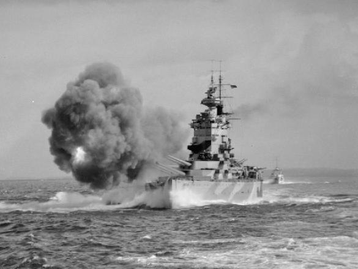

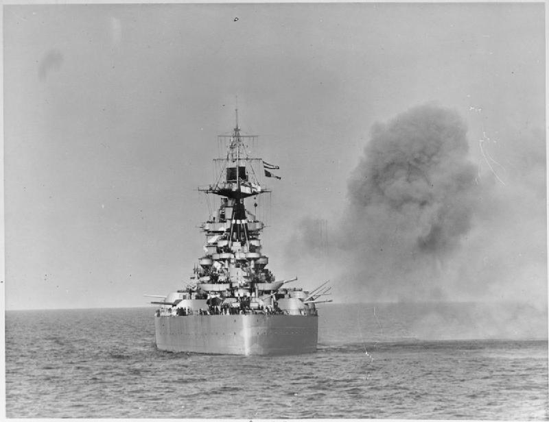

**同型舰**

| 船名 | 旗号数 | 制造厂 | 下水日期 | 服役日期 | 结局 |
| :----: | :----: | :----: | :----: | :----: | :----: |
| 纳尔逊号战舰 | 28 | 阿姆斯特朗-威特沃斯 | 1925 年 9 月 3 日 | 1927 年 8 月 15 日 | 1949 年被拆卸 |
| 罗德尼号战舰 | 29 | 卡梅尔-赖德	1925 年 12 月 17 日 | 1927 年 11 月 10 日 | 1948 年被拆卸 |

---

**英王乔治五世级战列舰 （1936 年）**

英国于 1930 年代末建造的一级战列舰，也是二战前英国建造的最后一级战列舰。其设计遵守 1936 年第二次伦敦海军条约（限制战列舰的标准排水量不超过 35000 吨，主炮口径不大于 14 英寸即 356 毫米）的规定，是典型的条约型战列舰。同级舰有英王乔治五世号（HMS King George V ）、威尔士亲王号（HMS Prince of Wales）、约克公爵号（HMS Duke of York）、安森号（HMS Anson）、豪号（HMS Howe）5艘。

**建造背景**

第一次世界大战结束后，英国、法国、美国、日本、意大利等国先后签订了华盛顿海军条约与伦敦海军条约，保证将新战列舰的建造冻结到 1936 年 12 月。1936 年初，美、英、法等国签署了第二次伦敦海军条约，规定战列舰的标准排水量不超过 35000 吨，主炮口径不大于 14 英寸，但不再限制战列舰的数量。于是，各海军强国又出现了建造战列舰的热潮。

虽然面临造价问题、针对战列舰是否过时的争论和调集人力、物力上的问题，英国皇家海军仍然认为需要拥有与潜在对手相当的战列舰。为了新的战列舰能赶在 1937 年初开始建造，1940 年服役，英国海军参考谈判进展，取消了建造装备 15 英寸以上口径主炮战列舰的计划，决定推荐排水量 35000 吨，安装 3 座四联装 356 毫米口径主炮，航速 26 节的战列舰方案。1936 年，英国海军部批准了建造 5 艘英王乔治五世级战列舰的方案。

1936 年，日本宣布退出裁军会议，意大利也未在条约上签字，美国则宣布只有在日本遵守条约限制的情况下美国才不会突破条约限制。结果 1937 年初匆忙开工的英王乔治五世级战列舰的 356 毫米（14 英寸）主炮口径是同时代战列舰中最小的，弹丸重量最轻，威力最低。而在建造时由于设计排水量限制节省重量的原因，最终主炮数量由 12 门又减少为 10 门，数量上的优势也消失了。但是该级舰的水线装甲带仅次于日本大和级。

**英王乔治五世级（1936） 技术数据**
| 数据项 | 数据 |
| :---: | :---: |
| **排水量**   | 标准排水量 35000 吨   满载排水量 40580 吨 |
| **全长**     | 227 米 水线长 225.5 米                     |
| **全宽**     | 31.4 米                                 |
| **吃水**     | 10.8 米                                 |
| **燃料柴油** | 锅炉八具三鼓蒸气锅炉                   |
| **动力**     | 四轴三叶螺旋桨 125,000 马力            |
| **最高速度** | 29 节                                   |
| **续航距离** | 15000 海里/ 10 节                         |
| **乘员**     | 1,314 - 1,631 人                        |
| **侦搜系统** | 雷达                                   |
| **武器装备** | 10 门 14 英寸/ 45 倍口径主炮（两座四联装炮塔，一座双联装炮塔）  16 门 133 毫米/ 50 倍口径高平两用炮   32-48 门双联装 40 毫米及 20 毫米高射炮   大量 12.7mm 机枪 |
| **装甲** | 舷侧装甲带：13.7-14.7 英寸 艏艉水线 4.4-5.4 英寸   甲板 7 英寸   炮塔（正面）13 英寸   炮座 13 英寸   装甲总重：12612 吨 |
| **舰载机** | 四架海象侦察机 |

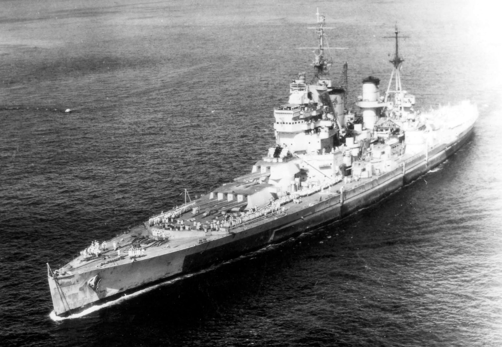

_at_Devonport,_March_1945.jpg)

**服役历程**

**英王乔治五世号**

英王乔治五世号1937年1月1日于维克斯·阿姆斯特朗船厂开工，1939年2月21日下水，1940年12月11日服役。服役后担任英国皇家海军本土舰队旗舰。

1941 年 5 月 22 日，参加对德国俾斯麦号战列舰的搜寻。5 月 27 日与其交火并命中。当日俾斯麦号战沉。在交火中它和威尔士亲王一样受到机械故障和不熟练水兵的错误操作的困扰：在 284 雷达的指引下,它在 0853-0913时的 34 次齐射中取得了 14 次跨射,而从 0920 时一个炮塔失灵,最后每门炮都由于防焰锁定机构的问题经历过一次错过齐射。10 门炮中有 5 门变得无法发射直到最后,而 A 炮塔 3 号炮两次失控开火因此被关闭了半小时。

1941 年 10 月～1942 年 5 月，为前往苏联的护航运输队护航。

1944 年 10 月～1945 年 9 月，加入英国太平洋舰队，参加对日作战。

1945 年 10 月～1946 年 12 月，作为本土舰队旗舰。

后改为训练舰，1950 年转预备役，1957 年拆毁。

**威尔士亲王号**

1937 年 1 月 1 日在卡梅尔·赖德船厂开工，1939 年 5 月 3 日下水，1941 年 3 月 31 日服役。

1941 年 5 月，在尚未完成测试调试时，就和胡德号战列巡洋舰一起参加了堵截德国海军俾斯麦号战列舰的行动。1941 年 5 月 24 日在丹麦海峡海战中，开火命中俾斯麦号，造成后者航速下降及燃油流失。胡德号被击沉后，被命中7弹且受主炮故障困扰的威尔士亲王号退出战斗。

1941 年 8 月，威尔士亲王号运载首相丘吉尔到纽芬兰，签署了著名的《大西洋宪章》。

1941 年，同反击号战列巡洋舰一起加入英国远东舰队（Z舰队），12月2日到达新加坡。12 月 10 日在马来亚海域由于缺乏空中掩护被日军轰炸机击沉。威尔士亲王号被 6 枚鱼雷和1颗炸弹命中。

**约克公爵号**

1937 年 5 月 5 日在约翰·布朗造船厂开工，1940 年 2 月 28 日下水，1941 年 11 月 4 日服役。

1942 年 3 月～10 月，为前往苏联的护航运输队护航，之后参加火炬行动。

1943 年12 月，在为前往苏联的护航运输队护航途中击沉德国肖恩霍斯特号战列巡洋舰。

1945 年 4 月，加入英国太平洋舰队，随后返回英国成为本土舰队旗舰。

1957 年拆毁。

**安森号**

1937 年 7 月 20 日在斯旺·亨特和怀姆·理查德森船厂开工，1940 年 2 月 24 日下水，1942 年 6 月 22 日服役。

1942 年9 月起为前往苏联的护航运输队护航。

1944 年 4 月，参加围歼德国提尔皮茨号战列舰的“钨素行动”。

1945 年 4月，加入英国太平洋舰队。

1949 年转预备役，1957 年拆毁。

**何奥号**
1937 年 6 月 1 日在费尔菲尔德船厂开工，1940 年 4 月 9 日下水，1942 年 8 月 20 日服役。

1942 年 12 月～1943 年5 月，编入本土舰队。

1943 年 7 月，参加入侵意大利。

1944 年，成为英国太平洋舰队的旗舰，参加对日作战。

1946 年转为训练舰，1951 年转后备役，1958 年拆毁。

---

### 美国战列舰

美国的战列舰大致上可以粗分为前无畏舰、无畏舰、第一至第二次世界大战过渡时期，与第二次世界大战四个不同时期的舰种。唯一的例外是缅因号与德克萨斯号，这两艘战列舰并无法归类至前述四种类型中。

**命名规则**

美国军舰的命名是由美国海军部长亲自决定的。1898 年 5 月 4 日通过的一项法令规定：美国海军所有一等战列舰和浅水重炮舰应以联邦各州的州名命名，不得以任何城市名、地名或人名来命名，除非备选的州名已全部使用完毕，且这些城市名、地名或人名不会和现有的州名混淆[1]。唯一的例外是奇沙治号（USS Kearsage BB-5），是以南北战争期间非常活跃的北军战斗用单桅纵帆船（Sloop-of-war）奇沙治号为命名来源，至于后者则是以新罕布什尔州境内的奇沙治山作为命名。美国的 50 个州中不曾“拥有”战列舰的州有是蒙大拿州、阿拉斯加州及夏威夷州。由于二战结束且战列舰在海军的地位已逐渐被航空母舰取代，蒙大拿级战列舰的建造项目仅在纸上规划的阶段就遭到中止，从未被制造出来过。阿拉斯加及夏威夷则在停止建造战列舰后的 1959 年才正式成为美国州份。

每年，美国海军历史中心通过指挥链为海军作战部长提供一批主选和备选的舰名，随后由作战部长将该年度造船计划可用的舰名以备忘录的形式推荐给海军部长，由其从中挑选合适的名字命名新建造的战列舰。总体而言，美国战列舰舰名的选择没有严格的规律，但从 1901 年的伊利诺伊号战列舰开始，如果每级内有两艘，则以梅森-迪克森线南北各一个州来命名。如 1941 年的北卡罗来纳级战列舰中的华盛顿号源北方州、北卡罗来纳号源自南方州；如果每级内有三艘、四艘或六艘，也必定至少包含一艘以南方州命名的战列舰。如新墨西哥级战列舰中的密西西比号、科罗拉多级战列舰中的西弗吉尼亚号和马里兰号、以及衣阿华级战列舰中的密苏里号等，都是源于南方州。

#### 美国战列舰列表

| 船舰编号 | 舰名 | 级别 |
| :---: | :---: | :---: |
| 无编号 | Maine 缅因号 | 无级别 |
| 无编号 | Texas 德克萨斯号 | 二等战列舰 |
| BB-1 | Indiana 印第安纳号 | 印第安纳级 |
| BB-2 | Massachusetts 马萨诸塞号 | 印第安纳级 |
| BB-3 | Oregon 俄勒冈号 | 印第安纳级 |
| BB-4 | Iowa 衣阿华号 | 印第安纳级 |
| BB-5 | Kearsarge 奇沙治号 | 奇沙治级 |
| BB-6 | Kentucky 肯塔基号 | 奇沙治级 |
| BB-7 | Illinois 伊利诺伊号 | 伊利诺伊级 |
| BB-8 | Alabama 亚拉巴马号 | 伊利诺伊级 |
| BB-9 | Wisconsin 威斯康辛号 | 伊利诺伊级 |
| BB-10 | Maine 缅因号 | 缅因级 |
| BB-11 | Missouri 密苏里号 | 缅因级 |
| BB-12 | Ohio 俄亥俄号 | 缅因级 |
| BB-13 | Virginia 弗吉尼亚号 | 弗吉尼亚级 |
| BB-14 | Nebraska 内布拉斯加号 | 弗吉尼亚级 |
| BB-15 | Georgia 佐治亚号 | 弗吉尼亚级 |
| BB-16 | New Jersey 新泽西号 | 弗吉尼亚级 |
| BB-17 | Rhode Island 罗德岛号 | 弗吉尼亚级 |
| BB-18 | Connecticut 康涅狄格号 | 康涅狄格级 |
| BB-19 | Louisiana 路易斯安那号 | 康涅狄格级 |
| BB-20 | Vermont 佛蒙特号 | 康涅狄格级 |
| BB-21 | Kansas 堪萨斯号 | 康涅狄格级 |
| BB-22 | Minnesota 明尼苏达号 | 康涅狄格级 |
| BB-23 | Mississippi 密西西比号 | 密西西比级 |
| BB-24 | Idaho 爱达荷号 | 密西西比级 |
| BB-25 | New Hampshire 新罕布什尔号 | 康涅狄格级 |
| BB-26 | South Carolina 南卡罗来纳号 | 南卡罗来纳级 |
| BB-27 | Michigan 密歇根号 | 南卡罗来纳级 |
| BB-28 | Delaware 拉伐尔号 | 拉伐尔级 |
| BB-29 | North Dakota 北达科他号 | 拉伐尔级 |
| BB-30 | Florida 佛罗里达号 | 佛罗里达级 |
| BB-31 | Utah 犹他号 | 佛罗里达级 |
| BB-32 | Wyoming 怀俄明号 | 怀俄明级 |
| BB-33 | Arkansas 阿肯色号 | 怀俄明级 |
| BB-34 | New York 纽约号 | 纽约级 |
| BB-35 | Texas 德克萨斯号 | 纽约级 |
| BB-36 | Nevada 内华达号 | 内华达级 |
| BB-37 | Oklahoma 俄克拉何马号 | 内华达级 |
| BB-38 | Pennsylvania 宾夕法尼亚号 | 宾夕法尼亚级 |
| BB-39 | Arizona 亚利桑那号 | 宾夕法尼亚级 |
| BB-41 | New Mexico 新墨西哥号 | 新墨西哥级 |
| BB-42 | Mississippi 密西西比号 | 新墨西哥级 |
| BB-42 | Idaho 爱达荷号 | 新墨西哥级 |
| BB-43 | Tennessee 田纳西号 | 田纳西级 |
| BB-44 | California 加利福尼亚号 | 田纳西级 |
| BB-45 | Colorado 科罗拉多号 | 科罗拉多级 |
| BB-46 | Maryland 马里兰号 | 科罗拉多级 |
| BB-47 | Washington 华盛顿号 | 科罗拉多级 |
| BB-48 | West Virginia 西弗吉尼亚号 | 科罗拉多级 |
| BB-49 | South Dakota 南达科他号 | 南达科他级 |
| BB-50 | Indiana 印第安纳号 | 南达科他级 |
| BB-51 | Montana 蒙大拿号 | 南达科他级 |
| BB-52 | North Carolina 北卡罗来纳号 | 南达科他级 |
| BB-53 | Iowa 衣阿华号 | 南达科他级 |
| BB-54 | Massachusetts 马萨诸塞号 | 南达科他级 |
| BB-55 | North Carolina 北卡罗来纳号 | 北卡罗来纳级 |
| BB-56 | Washington 华盛顿号 | 北卡罗来纳级 |
| BB-57 | South Dakota 南达科他号 | 南达科他级 |
| BB-58 | Indiana 印第安纳号 | 南达科他级 |
| BB-59 | Massachusetts 马萨诸塞号 | 南达科他级 |
| BB-60 | Alabama 亚拉巴马号 | 南达科他级 |
| BB-61 | Iowa 衣阿华号 | 衣阿华级 |
| BB-62 | New Jersey 新泽西号 | 衣阿华级 |
| BB-63 | Missouri 密苏里号 | 衣阿华级 |
| BB-64 | Wisconsin 威斯康辛号 | 衣阿华级 |
| BB-65 | Illinois 伊利诺伊号 | 衣阿华级 |
| BB-66 | Kentucky 肯塔基号 | 衣阿华级 |
| BB-67 | Montana 蒙大拿号 | 蒙大拿级 |
| BB-68 | Ohio 俄亥俄号 | 蒙大拿级 |
| BB-69 | Maine 缅因号 | 蒙大拿级 |
| BB-70 | New Hampshire 新罕布什尔号 | 蒙大拿级 |
| BB-71 | Louisiana	路易斯安那号 | 蒙大拿级 |

---

#### 美国部分战列舰介绍

**内华达级战列舰**

内华达级战列舰是美国建造的一种超无畏舰。

内华达级战列舰采用了当时颇具争议的被称为「All or Nothing Armor Scheme」的装甲防护设计（称为「重点防护」），因为美国海军认为战列舰传统防护体系的中等厚度装甲无法防御无畏型战列舰不断加大口径的主炮穿甲弹。这是美国海军战列舰防护设计上的重大革新。其主要设计特点是，战舰的非重要部位减少或没有装甲防护，而重要部位（主炮塔、轮机舱、指挥塔等要害部位）则得到最大限度的装甲防护。其设计思想被其他各国海军所借鉴。安装 10 门 14 英寸口径主炮，双联装和三联装主炮炮塔各两座，采用艏艉对称的布置形式。

同级舰两艘，首舰内华达号（ BB-36 ）1916 年 3 月服役。另一艘是俄克拉何马号战列舰（ BB-37 ）。

1930 年两舰进行中期改装，加宽舰体增加浮力和改善对鱼水雷的防护能力，彻底改造舰桥和前后主桅。改装三脚主桅并增设桅楼。1941 年 12 月 7 日日本海军偷袭珍珠港，俄克拉荷马号至少承受了5枚鱼雷和数枚小型炸弹的攻击，致使该舰倾覆沉没。而内华达号是港中唯一得以开动的战列舰，企图驶出港口，在日军第二波进攻中成为主要目标，为避免在港口出口沉没抢滩搁浅。其后在西海岸进行现代化改装，改建上层建筑，撤去全部旧式副炮，改装高平双用炮。战争中内华达号往来于太平洋和欧洲战区之间，参加了诺曼底战役、硫磺岛战役和冲绳岛战役。战争结束后，内华达号 1946 年参与比基尼岛原子弹的试验。1948 年 7 月作为靶船被击沉。

2020 年 5 月美国《海军时报》报道，在珍珠港的西南约 70 海里，深度超过15400英尺或者3英里的海域发现了内华达号战列舰残骸。

**内华达级（1936） 技术数据**
| 数据项 | 数据值 |
| :---: | :---: |
| 标准排水量 | 28,400 吨（改装后 30,500 吨）|
| 全长 | 177.8 米 |
| 全宽 | 29.6 米（改装后 32.9 米） |
| 吃水 | 9.9 米 |
| 功率 | 26,500 马力（改装后 31,500 马力）|
| 最高速度 | 20.5 节 |
| 续航距离 | 15,700 浬（10 节）|
| 乘员 | 1,300 人 |
| 武器装备 | 10 门 356 毫米/ 45 倍径主炮（双联装和三联装炮塔各两座）   21 座 127 毫米副炮（第一次改装拆除 9 座）   16 门 127 毫米高平两用炮（第二次改装，双联装八座）   太平洋战争中：   加装 40 毫米高射炮 40 门，20 毫米高射炮 45 门  
| 装甲 | 侧舷水线（最大）13.5 英寸   炮塔（正面）18 / 16 英寸   指挥塔 16 英寸 |

**同级舰**

**内华达号**（舷号：BB-36）是本级舰首舰，1912 年 12 月开工，1914 年 7 月下水，1916 年 3 月服役。最初内华达号曾在太平洋和大西洋舰队服役。1927 年到 1930 年进行现代化改装，而后一直在太平洋舰队服役。1941 年 12 月 7 日日本海军偷袭珍珠港，内华达号停泊在珍珠港瓦胡岛战列舰群的末尾。在第一波空袭中，内华达号率先投入反击，并且是港中还能开动的战列舰，内华达号试图开出珍珠港，为此她成为第二波袭击的主要目标。在第二波空袭中，内华达号被命中了 6 枚以上的炸弹后，为避免在港口出口沉没，内华达号在福特岛的西南抢滩搁浅。其后在西海岸进行现代化改装，重新改建上层建筑，撤去全部旧式副炮，改装高平双用炮。内华达号于 1943 年 5 月加入北太平洋收复阿留申群岛的火力支援任务。

1942 年改装后的内华达号
1943 年 6 月，内华达号再次回纽约进行改装。改装后 1944 年，内华达号在大西洋参加了诺曼底登陆战役的火力支援。任务完成后，又返回太平洋。1945 年 3 月，内华达号参加了硫磺岛战役和冲绳岛登陆战的登陆火力掩护任务。被神风自杀飞机击中。内华达号是一艘战功卓著的战舰，第二次世界大战中共获得7枚战斗之星勋章。战后，1946 年，作为靶船参与比基尼岛的原子弹的试验。1948 年 7 月，作为"衣阿华"号的靶舰被击沉 。

**俄克拉荷马号**（舷号：BB-37），是内华达级的 2 号舰。1912 年 10 月开工，1914 年 3 月下水，1916 年 5 月服役。第一次世界大战中，与其姊妹舰内华达号参与护送美国军队去欧洲参战，而后参与护送总统赴巴黎和会。第一次世界大战后，俄克拉荷马号交替在大西洋和太平洋舰队服役，完成了各种训练和显示武力的使命。1927 年至 1929 年，俄克拉荷马号进行了现代化改装。改装后，俄克拉荷马号继续带着海军学院的学员和预备役人员在各大洋训练。在 1936 年西班牙内战期间，参与了人员的撤离任务。而后一直在太平洋服役。1941 年 12 月 7 日晨，俄克拉荷马号由于停泊在马里兰号战列舰的外侧，而至少承受了 5 条鱼雷。由于俄克拉荷马号的气密性问题，致使该舰在进攻开始 20 分钟后向左倾覆。当时舰长和许多高级军官均在岸上，有 410 多人随舰体沉入了大海，只有其中 30 几人获救。1943 年，俄克拉荷马号被打捞上来，但已无维修价值，该舰即从太平洋舰队注销。1944 年，在拖曳回美国西海岸解体途中沉没。因为珍珠港的战斗，俄克拉荷马号得到一枚战斗之星勋章。

_capsized_at_Pearl_Harbor.jpg "俄克拉荷马号横翻")

---

**宾夕法尼亚级战列舰**

宾夕法尼亚级战列舰（Pennsylvania-class）是美国建造的其中一型战列舰。有宾夕法尼亚号和亚利桑那号两条。

美国海军 1913 年开工建造内华达级战列舰的改进型——宾夕法尼亚级战列舰。宾夕法尼亚级增加了主炮数量，采用四座三联装 14 英寸主炮的炮塔替换了内华达级的双联装主炮塔，使用 12 门 14 英寸口径火炮，相对同期日本的战列舰主炮布局，节约了重装甲防护面积。全新的动力系统，全面采用蒸汽轮机，是美国海军首批全部使用燃油锅炉的战列舰，但是航速提高有限。同型舰：宾夕法尼亚号（BB 38）、亚利桑纳号（BB 39）。

1930 年代宾夕法尼亚级进行中期改装，前后主桅改为三脚桅并增设桅楼，改良防护性能，撤去部分副炮改装高射炮。

1941 年 12 月 7 日日本海军偷袭珍珠港时，宾夕法尼亚号是太平洋舰队的旗舰，因正在船坞中修理而未受到鱼雷攻击。而亚利桑纳号的命运与其姊妹舰却有天壤之别，亚利桑纳号被 1 颗 800 公斤炸弹引燃水上机弹射器的黑火药并引起舰艏弹药库发生大爆炸，迅速沉没，舰上共有 1177 人丧生。1942 年宾夕法尼亚号进行现代化改装，拆除后主桅，改建舰桥，撤去全部旧式副炮，改装高平两用炮。1943 年之后至 1945 年在进攻日本的作战中，宾夕法尼亚号参加了历次两栖登陆作战，成为美国海军战功卓著的战舰。战后 1946 年作为靶舰参加比基尼岛原子弹实验。

1962 年美国政府在亚利桑纳号舰体水下原位建立了一个水上纪念馆。

**宾夕法尼亚级战列舰数据**
| 数据项 | 数据值 |
| :---: | :---: |
| 标准排水量 | 32,440 吨 / 34,400 吨（1941 年） |
| 满载排水量 | 39,224 吨（1941 年）/ 40,605 吨（1945 年） |
| 全长 | 185.3米 |
| 全宽 | 29.6米(现代化改装后32.4米) |
| 吃水 | 10.2米 |
| 动力 | 蒸汽轮机带动发电机驱动 |
| 功率 | 31,500 马力（现代化改装后 35,200 马力） |
| 续航距离 | 6070 海里 / 12 节（现代化改装后 7310 海里 / 18 节） |
| 乘员 | 915 人－1300 人 |
| 武器装备 | 12 门 356 毫米 / 45 倍口径主炮   22 座 127 毫米口径副炮（第一次改装拆除 14 座）   宾夕法尼亚号 1943 年改装 127 毫米口径高平炮(8×2)   波佛斯 40 毫米高射炮 40 门   厄利孔 20 毫米机炮 49 门 |
| 装甲 | 侧舷水线（最大）13.5 英寸   炮塔（正面）18 英寸,（侧面） 9 英寸   司令塔（最大）16 英寸 |
| 舰载机 | 无 |

**服役历程**

宾夕法尼亚号并没有参加第一次世界大战的作战，原因是以燃油为燃料不适合与当时的其它战舰编队。随后宾夕法尼亚号一直作为所在舰队的旗舰参与训练和演习。1930 年代宾夕法尼亚号进行了现代化改装。1941 年太平洋战争爆发时，宾夕法尼亚号是太平洋舰队的旗舰。1943 年后至 1945 年在进攻日本的作战中，宾夕法尼亚号参加了历次两栖登陆作战，成为美国海军战功卓著的战舰。宾夕法尼亚号共获得了 8 枚战斗之星勋章。1946 年宾夕法尼亚号退役，同年作为靶舰参加原子弹实验，在夸贾林岛击沉。

1941 年 12 月 7 日，日本海军偷袭珍珠港时，宾夕法尼亚号是太平洋舰队的旗舰，因正在船坞中修理而未受到鱼雷攻击。而亚利桑纳号的命运与其姊妹舰却有天壤之别，亚利桑纳号被 1 颗炸弹穿透前甲板并引起舰艏弹药库发生大爆炸，迅速沉没，舰上共有 1177 人丧生。亚利桑那号因为珍珠港战斗获得了一枚战斗之星勋章。1962 年 5 月，美国总统肯尼迪指定亚利桑那号沉没处为国家陵园，并在沉没处的水上建立了一座亚利桑那纪念馆。

_burning_after_the_Japanese_attack_on_Pearl_Harbor_-_NARA_195617_-_Edit.jpg "亚利桑纳号沉没")

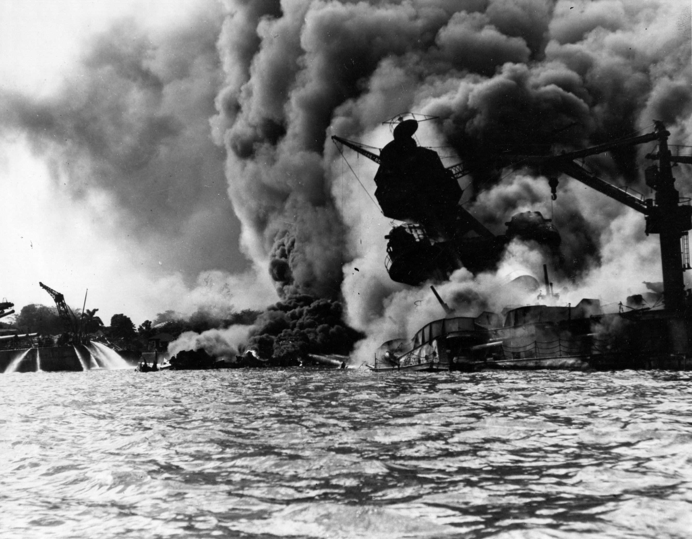

_on_10_December_1941.jpg "亚利桑纳号")

---

**新墨西哥级战列舰**

新墨西哥级战列舰于 1914 年开工建造，相对宾夕法尼亚级战列舰的设计进行了一些较大的改进，采用「飞剪」型舰艏，提高在大浪中行驶时的稳定性（后来这种舰艏成为美国海军舰船的一种特征）。改用蒸汽轮机—发电机驱动电动机的动力装置，动力系统虽然有改进，但航速提高有限。改用 50 倍口径身管的 14 英寸口径主炮，主炮炮塔的布局与宾夕法尼亚级相同。加强水平甲板的防御装甲。同级舰：新墨西哥号（BB40）、密西西比号（BB41）、爱达荷号（BB42）

该级舰 1930 年代改装中，拆除笼式主桅改建塔式舰桥，改良动力系统，并拆除部分旧式副炮，加装防空火炮。 第二次世界大战爆发时新墨西哥级均在大西洋舰队服役，1941 年新墨西哥号开始参加中立巡逻。珍珠港事件后，新墨西哥级战列舰于 1942 年先后调动到太平洋战区，1943 - 1944 年进行现代化改装。该级舰参加了太平洋战区的数次两栖作战，包括苏里高海峡夜战。新墨西哥号曾在冲绳岛战役中接任美国海军第五舰队司令雷蒙德·斯普鲁恩斯的旗舰。 战争结束后，密西西比号 1946 年开始作为火炮、导弹靶船，1956 年退役被拆毁。该级其它各舰于1947年拆毁。

**新墨西哥级战列舰数据**
| 数据项 | 数据 |
| :---: | :---: |
| 标准排水量 | 32,000（改装后 35,000 吨） |
| 满载排水量 | 33,000（改装后 40,181 吨） |
| 全长 | 190.3 米 |
| 全宽 | 29.6 米（改装后 32.4 米） |
| 吃水 | 10.4米 |
| 动力 | 蒸汽轮机带动发电机驱动 |
| 功率 | 32,000 马力（改装后 44,000 马力）   最大航速：22 节 |
| 续航距离 | 6400 海里 / 12 节（改装后 12,750 海里 / 18 节） |
| 乘员 | 1084 人－1930 人 |
| 武器装备 | 12 门 356 毫米 / 50 倍口径主炮   22 座 127 毫米口径副炮（第一次改装拆除 12 - 14 座）  第二次改装 16 门 127 毫米高平炮8×2   波佛斯 40 毫米高射炮 40 - 52 门   厄利孔 20 毫米机炮 40 门  
| 装甲 | 侧舷水线（最大）13.5 英寸   炮塔（正面）18 英寸   司令塔 16 英寸   甲板 3.5 英寸（改装后 6 英寸）|
| 舰载机 | 无 |

---

**田纳西级战列舰**

田纳西级战列舰是新墨西哥级战列舰的改进型，1917 年开工。根据日德兰海战的经验，舰体划分多层隔舱，水下防御性能比美国海军以往建造的战列舰有很大改进，并加强了舰体水平防御装甲。该级舰采用与新墨西哥级相同的电气推进动力系统。提高主炮仰角，延长了射程。在其前后主桅上架设安装大型火控设施的桅楼（部分前期建造的战列舰也实施了此项改装）。 同级舰：田纳西号（BB43）、加利福尼亚号（BB44）

加利福尼亚号 1921 年竣工服役时被用作太平洋舰队的旗舰。

1941 年 12 月 7 日日本海军偷袭珍珠港，并排停靠的西弗吉尼亚号沉没阻挡了内侧的田纳西号，附近亚利桑纳号战列舰爆炸后的残骸和火灾给田纳西号造成很大损害。加利福尼亚号被三枚鱼雷击中舰体沉入水中。田纳西级两舰在 1942 年进行彻底的现代化改装，撤去旧式副炮，舰体上层建筑改建成与南达科他级战列舰类似的式样，加强防空和防鱼雷的能力。改装完成的田纳西号、加利福尼亚号 1944 年相继投入太平洋战场，参加了之后包括莱特湾海战、冲绳岛战役在内的大部分的登陆战役。战后，加利福尼亚号、田纳西号于 1947 年和 1959 年退役。

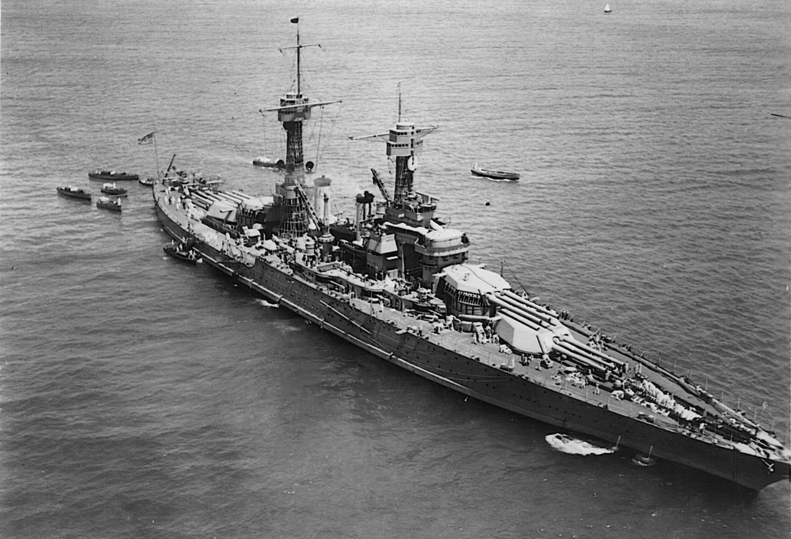

**田纳西级战列舰数据**
| 数据项 | 数据 |
| :---: | :---: |
| 标准排水量 | 33,190 吨 |
| 满载排水量 | 36,455 吨 / 40,950 吨（改装后） |
| 全长 | 190.3 米 |
| 全宽 | 29.7 米（现代化改装后 32.9 米） |
| 吃水 | 9.2 米 |
| 动力 | 2 台威斯丁豪斯式蒸汽机轮（「加利福利亚」号 GE 式）+2 台发电机   8 座巴布科克-威尔考克斯式燃油锅炉，功率 27200 马力   航速 21 节   载重油 4656 吨（改装后 4893 吨）|
| 功率 | 28,600 马力（现代化改装后 30,900 马力） |
| 续航距离 | 5240 海里 / 12 节（现代化改装后 9,700 海里 / 18 节） |
| 乘员 | 1500 人－2200 人 |
| 武器装备 | 12 门 356 毫米 / 50 倍口径主炮    14 门 127 毫米口径副炮（现代化中改装拆除）   现代化改装 16 门 127 毫米口径高平炮 8×2   波佛斯 40 毫米高射炮 40 - 56 门   厄利孔 20 毫米机炮 40 门 |
| 装甲 | 侧舷水线（最大）13.5 英寸   炮塔（正面）18 英寸，（侧面）9 英寸   司令塔 16 英寸   甲板 5 英寸（现代化改装后 7 英寸） |
| 舰载机 | 无 |

**服役动态**

**田纳西号**

1941 年 12 月 7 日日本海军偷袭珍珠港时，田纳西号停泊在西弗吉尼亚号的内侧，空袭开始 5 分钟后，田纳西号舰上的高射炮开火，田纳西号外侧的西弗吉尼亚号在被多条鱼雷击中后坐沉，阻塞了田纳西号移动的路线。随后，田纳西号也被几颗炸弹击中，但损伤并不严重，真正给田纳西号造成重大损害的是亚利桑那号爆炸后残骸和燃油火灾。田纳西号上的火势不久得到控制。对比其他舰只的损伤，田纳西号伤势较轻。在西海岸进行了维修和改装。

1942 年 3 月，田纳西号与马里兰号、科罗拉多号重新返回战场，在中途岛海战期间田纳西号编入后备部队。

1942 年 8 月，田纳西号再次回西海岸进行现代化改装。改装中舰体田纳西号的上层建筑拆除重建，增加了对空和对鱼雷的防御能力，这使其适应其护航的任务。
1943 年 5 月之后，田纳西号参加了参加了太平洋大部分的两栖登陆作战，包括北太平洋收复阿留申群岛、马绍尔群岛、塞班岛、关岛、菲律宾战役。
1944 年 10 月 24 日，田纳西号和其它5艘战列舰参加了夜间的苏里高海峡海战。其中由于田纳西、加利福尼亚号和西弗吉尼亚号装有较现代化的火控系统，所以较其他战列舰有一定的优势，田纳西号共发射 69 发 14 英寸口径炮弹。随后，田纳西号进行小改装。
1945 年后，田纳西号继续参加了硫磺岛和冲绳岛的两栖登陆战役。

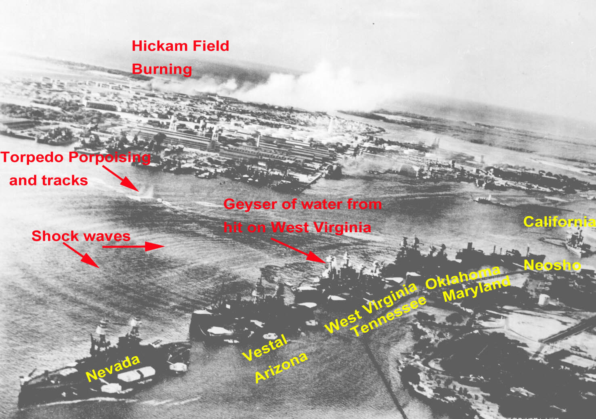

**加利福尼亚号**

1929 年至 1930 年，加利福尼亚号进行了现代化改装，改装内容包括安装各种防空火炮。

1944 年 5 月，加利福尼亚号参加了进攻马里亚纳群岛的战役。

1944 年 10 月，开始收复菲律宾的作战中，莱特湾海战中加利福尼亚号参加苏里高海峡夜战。

1945 年 1 月，加利福尼亚号被神风飞机击中，舰上 44 人丧生，加利福尼亚号再次返回本土修理。

1945 年 6 月，参加冲绳岛登陆战。

---

**科罗拉多级战列舰**

美国在得到日本建造长门级战列舰的情报后，更改田纳西级战列舰的设计，主要改进火力和防护力，8 门 16 英寸（406 毫米）口径主炮取代了 14 英寸口径主炮。由于火力加强，防御也相应加厚来抵御敌方相同口径炮弹的攻击。科罗拉多级继承了当时美国战列舰的标准风格，包括笼式主桅；飞剪型舰艏；副炮安装在艏楼甲板以上；

科罗拉多级采用电气推进的动力系统。该级的航行速度同当时的所有美国战列舰一样没有得到相应的重视，最大航速只有 21 节。在该级舰建造时美国海军要求不得将蓝图作改动，因为 1917 年海军法案要求建造 16 艘战列舰和 6 艘战列巡洋舰，这样做可以减少建造时间。

科罗拉多级战列舰计划建造 4 艘，但三号舰华盛顿号（BB-47）因华盛顿海军条约的规定终止建造。建成的同级舰三艘：科罗拉多号（BB-45）、马里兰号（BB-46）、西弗吉尼亚号（BB-48）。二号舰马里兰号首先于 1917 年开工，1921 年率先服役，因此也有人将科罗拉多级称为马里兰级。在华盛顿条约有效时期，科罗拉多级和英国的两艘纳尔逊级战列舰、日本的两艘长门级战列舰被各国海军人士称为「big seven」。

_New_York_1932.jpg)

**科罗拉多级战列舰数据**
| 数据项 | 数据 |
| :---: | :---: |
| 标准排水量 | 32,600 吨（科罗拉多、马里兰）  33,590 吨（西弗吉尼亚） |
| 满载排水量 | 37,500 吨   改装后38,400吨 |
| 全长 | 190.2 米 |
| 全宽 | 29.7 米   改装后32.9米 |
| 吃水 | 11.6 米（标准） |
| 动力 | 4螺旋桨   两座蒸汽轮机带动发电机驱动 |
| 功率 | 最大 28,900 马力 |
| 续航距离 | 8,000 海里 / 10 节   5200 海里 / 12 节 |
| 乘员 | 1,080 人 |
| 武器装备 | 8 门 16 英寸 / 45 倍口径主炮（双连装）   12 或 14 门 5 英寸 / 51 倍口径副炮（单管）  改装后增加：  8 门 5 英寸 / 25 倍口径高炮   40 毫米高炮 32-44 门   20 毫米高炮 60 门 |
| 装甲 | 侧舷水线（最大）13.5 英寸   炮塔正面 18 英寸   炮塔侧面 10 英寸    指挥塔 16 英寸   甲板 3.5 英寸 |
| 舰载机 | 无 |

**服役情况**

科罗拉多级建成后均在太平洋舰队服役，是第二次世界大战前美国最强大的战列舰。该级舰在 1930 年代进行了现代化改装，加强防空火力并加装5英寸高炮。1941 年 12 月 7 日日本海军偷袭珍珠港时，科罗拉多号正在西海岸的圣迭戈维修从而逃过一劫。马里兰号被两颗炸弹穿透上层甲板，舰体发生纵向倾斜。西弗吉尼亚号由于停泊在福特岛外侧，左舷被多枚鱼雷命中，因其水密性较好并且及时打开右侧注水阀门进行反注水而避免倾覆，但舰体严重受损并沉入水中。

1942 年科罗拉多号、马里兰号拆除后部主桅进行现代化改装，大大加强了防空火力。西弗吉尼亚号在 1943 年打捞出水进行改装，拆除前后主桅，舰体上层建筑拆除并彻底重建，使其于田纳西级更加相像。马里兰号随后支援了塞班岛登陆战役并被一枚鱼雷击中受损。1944 年西弗吉尼亚号与马里兰号参加了莱特湾海战并同其他 4 艘老式战列舰一起击沉了扶桑号战列舰和山城号战列舰。这是战争中最后一次的战列舰炮战。其后该级舰参加了包括冲绳岛战役在内的美军登陆作战。

科罗拉多级于 1947 年相继退役，1959 年全部解体。

---

**南达科他级战列舰 (1920年)**

南达科他级战列舰（South Dakota Class）是美国海军在第一次世界大战后的「三年造舰计划」中，计划建造的最高级别的战列舰，在 1920 年时起造。该级战列舰在 1922 年华盛顿海军条约签订后（即「海军假日」时期）取消建造。

---

**北卡罗萊纳级战列舰**

北卡罗莱纳级战舰是美国海军根据第二次伦敦海军条约于 1937 年开工建造的一种新型战舰，用于取代先前建造的旧式战列舰。

北卡罗来纳级是美国海军建造的第一种快速战列舰，标准排水量 35000 吨，满载排水量 44800 吨，符合伦敦条约对战列舰的规定。最初的主炮设计方案是安装 3 座 4 联装 50 倍口径 14 英寸（356 毫米）主炮，但考虑到由于日本退出第二次伦敦海军条约，主炮口径和数量在开工建造后作了变更，修改为 3 座三联装 45 倍口径 16 英寸（406 毫米）主炮，舰桥前部 2 座，后部 1 座。主炮是在科罗拉多级战列舰的主炮基础上的轻量化改进型，发射重型穿甲弹。副炮为 10 座双联装 38 倍口径 5 英寸（127 毫米）高平两用炮（每舷 5 座），其中 6 座配置在主甲板上，另 4 座配置在上层甲板上。高炮最初采用 28 毫米和 12.7 毫米机枪，但在建成后随即换成盟军制式的 20 毫米及 40 毫米机炮。

北卡罗来纳级的动力装置为 8 座重油锅炉，4 台蒸汽轮机，功率 121,000 马力，蒸汽压力 40.8 千克 / 平方厘米，蒸汽温度 450 摄氏度，最高航速 27 节，达到当时战列舰的较高水平。续航力较强，15 节航速时为 16,320 海里。舰艉装水上飞机弹射器 2 台，舰载飞机 3 架。防御装甲按照防御 14 英寸口径炮弹的标准设计，舷侧装甲采用倾斜布置，舷侧主装甲带，舰体舷侧水下防护包括五层隔舱，采用三层舰底结构。考虑到空中威胁日益增强以及远距离炮战呈大落角炮弹，特别加强了水平防御装甲。装甲总重 14,350 吨。此外，北卡罗来纳级还安装有当时比较先进的火控雷达，远距离主炮命中率显著提高。北卡罗来纳级同级舰两艘：北卡罗来纳号（BB-55）、华盛顿号（BB-56）。1937 年 10 月 27 日北卡罗来纳号开工，1941 年 4 月 9 日服役。华盛顿号于 1938 年 6 月 14 日开工，1941 年 5 月 15 日服役。

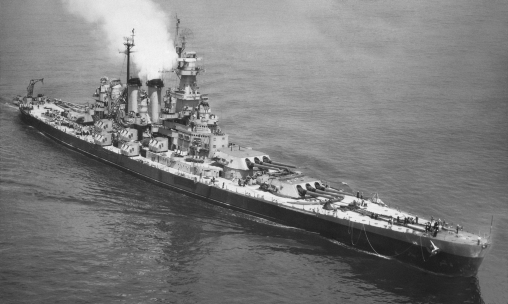

**北卡罗萊纳级战列舰技术数据**
| 数据项 | 数据 |
| :---: | :---: |
| 标准排水量 | 35,000 吨 |
| 满载排水量 | 44,800 吨 |
| 全长 | 222 米 |
| 全宽 | 32.98 米 |
| 吃水 | 11.6 米（最大） |
| 动力 | 4 台复式减速齿轮传动涡轮机   8 台锅炉 4轴推进   输出功率 121,000 马力 |
| 续航距离 | 16,320 海里（15 节）   5,740 海里（25 节） |
| 乘员 | 1,880 人 / 2,339 人(战时) |
| 武器装备 | 3 座三联装 16 英寸 / 45 倍口径主炮   10 座双联装 5 英寸 / 38 倍口径高平两用炮   15 座四联装博福斯 40 毫米高射炮（1945 年）   36 门厄利孔 20 毫米机炮（1945 年） |
| 装甲 | 装甲带 305 毫米（15 度倾斜）   甲板最厚 196 毫米   炮塔正面 406 毫米   指挥塔最厚 406 毫米 |
| 舰载机 | 3架 |

**服役情况**

太平洋战争爆发后，1942 年北卡罗来纳级两舰相继加入美国海军太平洋舰队。1942 年 8 月美军在瓜达尔卡纳尔岛登陆，北卡罗来纳号成为当时为美国快速航空母舰舰队护航的唯一一艘战列舰。1942 年 11 月 14 日，华盛顿号在第二次瓜达尔卡纳尔海战中，利用雷达的引导攻击日本海军雾岛号战列舰，命中其 9 枚 16 英寸炮弹，迫使其自沉于瓜岛水域（也有记录称雾岛号是因为无法控制进水而被击沉）。1944 年华盛顿号在一次碰撞事故中舰艏撞毁并更换了新舰艏。在太平洋战争期间北卡罗来纳级两舰参加了大部分重大战斗，主要为航空母舰舰队提供防空火力保护，以及沿岸炮击行动。

北卡罗来纳号于 1947 年退役，并在 1960 年除籍。在民间组织筹募足够经费后，海军在 1961 年将北卡罗来纳号捐赠到北卡罗来纳州威尔明顿，作博物馆舰。华盛顿号也于 1947 年退役，并在 1960 年除籍，最后于 1961 年出售拆解。

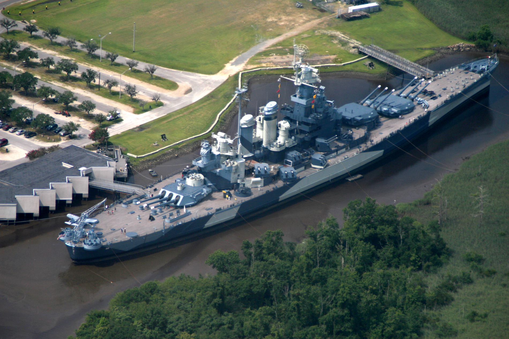

---

### 日本战列舰

### 德国战列舰

### 法国战列舰

### 意大利战列舰

