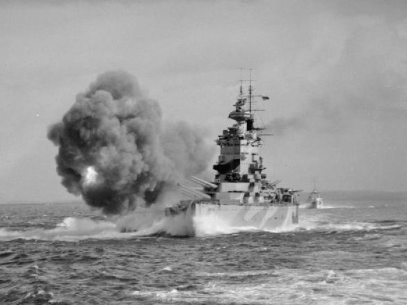
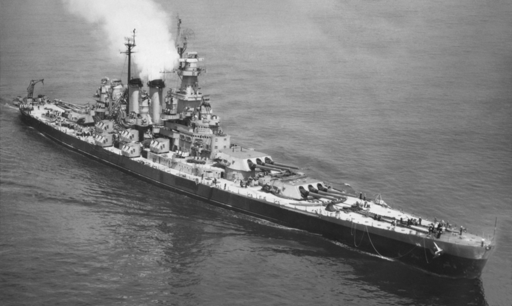
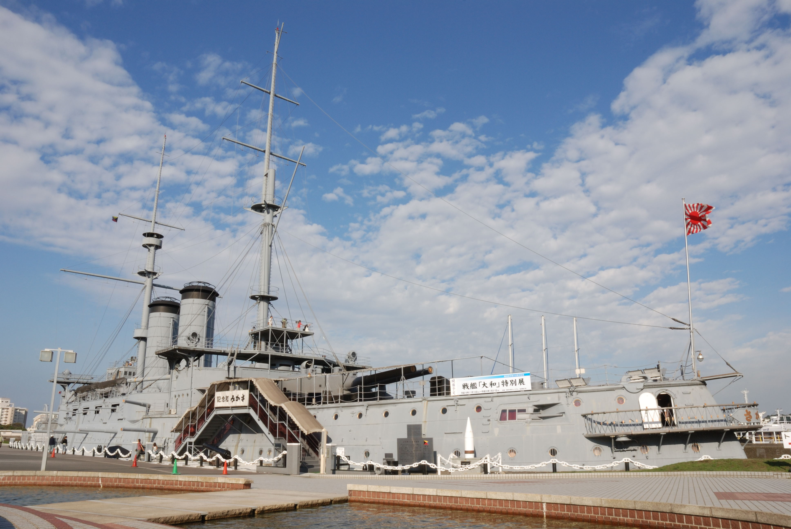

---
aliases:
  - 
tags:
  - ship
  - batteship
---
# 战列舰

战列舰（英语：battleship），美国军规常用代号为 BB，是装有厚重装甲和大口径主炮的大型军舰，是人类创造的最庞大和复杂的武器系统之一，大舰巨炮主义时代的极致产物。19 世纪末到第二次世界大战期间，战列舰作为海军中最大的武装舰艇，是一个国家海军力量的标志，故常作为「主力舰」（capital ship）或旗舰（flag ship）使用。随着潜艇技术日渐成熟，及空中优势破坏战力平衡和精确制导武器的开发，战列舰已不再被认为是建立海上优势所必须的装备，因此已经全部退役。

---

## 目录
* [战列舰简介](#bb_introduction)
  * [前无畏舰](#pre-dreadnought)
  * [无畏舰](#dreadnought)

* [各国战列舰](#bb_country_list)
  * [英国](#bb_en)
    * [英国战列舰列表](#bb_en_list)
    * [英国部分战列舰介绍](#bb_en_info)
  * [美国](#bb_us)
    * [美国战列舰列表](#bb_us_list)
    * [美国部分战列舰介绍](#bb_us_info)
  * [日本](#bb_jp)
    * [日本战列舰列表](#bb_jp_list)
    * [日本部分战列舰](#bb_jp_info)
  * [德国](#bb_de)
  * [法国](#bb_fr)
  * [意大利](#bb_ita)

---

## 战列舰介绍

「战列舰」此一称呼，源自大航海时期的风帆舰（全称 ship of the line of battle，简称 ship of the line 或 line-of-battle ship）——自 17 世纪中叶至 19 世纪中叶，主要排成战列线进行侧舷炮战的大型风帆军舰。随着蒸汽机、爆破弹和钢铁装甲的发展，19 世纪后期出现了称为 **铁甲舰**（Ironclads）的蒸汽装甲舰，即是后来铁甲战列舰和装甲巡洋舰的前身。1906 年服役的 **无畏号**（HMS Dreadnought）标志着战列舰「全装重型火炮」的革命，后来所有按这个概念设计的战列舰均称为 **无畏舰**，与之相对，之前的战列舰称为 **前无畏舰**。不久，出现了比无畏号更强大的战列舰，称为 **超无畏舰**。

为了占据海权优势，列强争相建造更大的战列舰引起了长期的全球性军备竞赛。第一次世界大战中爆发了战列舰对决的日德兰海战。战后，各海军大国通过限制海军军备条约对缔约国战列舰的数量和性能作出限制。条约生效期间称为「海军假日」。条约失效后，出现了最后一波建造战列舰的热潮，出现了大和号等排水量超过 60,000 吨的超级巨舰。即使如此，战列舰的价值一直受到质疑，更小、更廉价的潜艇、鱼雷和飞机都能对战列舰造成严重伤害。第二次世界大战期间的作战经验得出航空母舰将取代战列舰成为海战的主导力量。战后，尚存的战列舰纷纷走上退役道路，原有的建造计划被取消，只有美国海军曾在几次战争中重新将数艘旧战列舰当作海上炮台投入使用。

美国最后两艘战舰威斯康辛号（BB-64）和密苏里号（BB-63）参与 1990 年海湾战争，是战列舰最后参与的大型战役。战争结束后，两舰先后于 1991 年和 1992 年退役，并分别在 2006 年和 1995 年除役。现在只有美国和日本保留了数艘退役战列舰，作为浮动博物馆使用。

### 前无畏舰

1892 年，英国建成世界首艘全金属战列舰君权号（HMS Royal Sovereign）。其将主炮塔设置于中轴线上的设计令君权号成为世界上首艘前无畏舰，成为随后各国彷照的样板。此后战列舰的设计建造进入前无畏时代，即以全金属建造舰体，口径可达 305 毫米（12 英寸）的主炮设置于中轴线，200-300 毫米的防护装甲和 12,000 吨的满载排水量，航速可达 16-18 节。战列舰的 **主炮口径**、**装甲厚度**、**航速** 和 **排水量** 成为各国公认的四大要素指标。 此时期的战列舰大多装设两种倍径的主炮，动力多为燃煤往复式蒸汽机。直至 1906 年英国无畏号战列舰出现前，世界各国的海军纷纷建造或进口大批前无畏舰，前无畏舰也成为此时期各国海军的主力舰船。

**前无畏舰** 介于铁甲舰和无畏舰之间。较铁甲舰增加排水量至 1 万吨以上，标配 2 至 4 门 12 寸左右的重型火炮为主炮，仍在舷侧配有大量一种以上中口径火炮为副炮；技术上，因电动或液压系统的普及，沉重的主炮得以安装更沉重的封闭式装甲旋转炮塔，和机械辅助装填，而非铁甲舰包括操舵仍依赖众多人力操作；船体完全采用钢结构，而非钢木混合结构；动力采用燃煤蒸汽机，而非机帆混合动力。较无畏舰，则主炮数量较少，仍类似风帆战舰时代以接舷近战战术为主导思想，而非无畏舰以远距离重炮跨射作战为主要作战手段。

在 1890 年代，各国海军开始以英国庄严级战舰作为蓝本建造新型战舰。典型的前无畏舰演进过程经历了英国特拉法加级铁甲舰 -->皇家主权级战舰 -->庄严级战舰至最后的纳尔逊勋爵级战舰过程，随后进入无畏舰时代。主要技术革新集中在炮塔上；从开始的固定露天炮台人力火炮旋转，演化至一体化炮塔机械力旋转；从梨形炮座，提弹机位于炮塔座圈之外，演化至炮塔轴心提弹机，全方向供弹。当这些千奇百怪的新技术在实战的尝试中稳定成型为各国采用后，最终促成了无畏型战列舰的诞生。

以意大利、德国、日本和美国等新兴海军强国以前无畏舰为骨干，大力扩充舰队。面对新兴力量的威胁，英国、法国和俄罗斯亦以扩充舰队作为回应。因此，在 1890 年代，新建战舰数量大增，新战舰的外表亦十分相似。

---

### 无畏舰

1906 年，英国皇家海军的「无畏号」下水服役，由于其技术与设计之先进远超过同时代的战列舰，故以其为名自成一种新型战列舰的类别——「无畏舰」，而落伍的旧式战列舰则全部被归为「前无畏舰」，意指「无畏舰」出现前设计者。

「无畏舰」具两种革命性的创新设计，一为采取「全重炮」武装配置，其装备的大口径火炮数远超过以往的战列舰，二为使用蒸汽涡轮发动机作为推进系统。随着「无畏舰」逐渐成为海上力量、乃至于国力的重要指标，各国展开了规模巨大的「无畏舰」建造竞赛，遍及欧洲、亚洲和美洲国家，尤其是英国与德国最为激烈、建造数量最多。「无畏舰」造舰竞赛一定程度上促成了第一次世界大战的爆发，并一直持续到开战当年，在仅仅五年造舰技术迅速发展的时间里，「无畏舰」在火炮口径、吨位、装甲和推进力都有了飞跃性的提高，甚至出现了在前述的技术指标上发展到极致的「超无畏舰」，而原先领先全球的「无畏号」反而在开战后成了落伍的二线战列舰。一次大战结束后，世界海军列强为避免再因造舰竞赛重起战端，召开了「华盛顿裁军会议」，以此限制各国海军军舰的吨位和武装，但许多艘「超无畏舰」依旧服役到第二次世界大战。

尽管在 20 世纪初世界各国耗费大量资源、争相建造「无畏舰」，但历史上却只在 1916 年爆发过一次「无畏舰」舰队间的大规模交战——「日德兰之战」，为英国与德国的主力舰队于日德兰半岛附近海域进行的一次海战，尽管双方兵力投入之多，却没有产生什么决定性的结果。第一次世界大战后，由于后来建造的军舰皆全部具备了「无畏舰」的技术概念，故该名词也不再作为特定舰种之类别而无再使用，另外「无畏舰」一词亦可用于具备其特征、在「无畏舰革命」展开后出现的新式战列舰类型——战列巡洋舰之上。

---

## 各国战列舰

### 英国战列舰

#### 各时期战列舰列表

##### 无畏舰（1906-1910）

| 船名（中文） | 船名（英文） | 级别 | 下水年份 | 服役年份 |
|:-:|:-:|:-:|:-:|:-:|
| 无畏号 | HMS Dreadnought | 无畏级 | 1906 | 1906 |
| 柏勒洛丰号 | HMS Bellerophon | 柏勒洛丰级 | 1907 | 1909 |
| 壮丽号 | HMS Superb |	柏勒洛丰级 | 1907 | 1909 |
| 鲁莽号 | HMS Temeraire |	柏勒洛丰级 | 1907 | 1909 |
| 圣文森特号	|HMS St.Vincent	|圣文森特级	|1908	|1909|	
| 科林伍德号	| HMS Collingwood | 圣文森特级 | 1908 | 1910 |
| 前卫号 | HMS Vanguard | 圣文森特级 | 1909 | 1910 |
| 涅普顿号 | HMS Neptune | 涅普顿级 | 1909 | 1911 |
| 巨像号 | HMS Colossus | 巨像级 | 1910 | 1911 |
| 赫丘利斯号 | HMS Hercules | 巨像级 | 1910 | 1911 |

##### 超无畏舰（1910-1945）

* **俄里翁级战列舰**（Orion class）（1910-1911）（同级舰 4 艘）
  * 俄里翁号（HMS Orion）
  * 君主号（HMS Monarch）
  * 征服者号（HMS Conqueror）
  * 雷神号（HMS Thunderer）
* **英王乔治五世级战列舰** （1911 年）（King George V class）（1911-1912）（同级舰 4 艘）
  * 英王乔治五世号（HMS King George V）
  * 百夫长号（HMS Centurion）
  * 大胆号（HMS Audacious）
  * 埃阿斯号（HMS Ajax）
* **铁公爵级战列舰**（Iron Duke class）（1912-1913）（同级舰 4 艘）
  * 铁公爵号（HMS Iron Duke）
  * 马尔博罗号（HMS Marlborough）
  * 本鲍号（HMS Benbow）
  * 印度皇帝号（HMS Emperor of India）
* **爱尔兰号战列舰**（HMS Erin）（1913）
* **加拿大号战列舰**（HMS Canada）（1913）
* **伊丽莎白女王级战列舰**（Queen Elizabeth class）（1913-1915）（同级舰 5 艘）
  * 伊丽莎白女王号（HMS Queen Elizabeth）
  * 厌战号（HMS Warspite）
  * 巴勒姆号（HMS Barham）
  * 英勇号（HMS Valiant）
  * 马来亚号（HMS Malaya）
* **复仇级战列舰**（Revenge class）（1914-1916）（同级舰 5 艘）
  * 复仇号（HMS Revenge）
  * 皇家橡树号（HMS Royal Oak）
  * 君权号（HMS Royal Sovereign）
  * 决心号（HMS Resolution）
  * 拉米利斯号（HMS Ramillies）
  * **纳尔逊级战列舰**（Nelson class）（1925）（同级舰 2 艘）
  * 纳尔逊号（HMS Nelson）
  * 罗德尼号（HMS Rodney）
* **英王乔治五世级战列舰** （1936 年）（King George V class）（1939-1940）（同级舰 5 艘）
  * 英王乔治五世号（HMS King George V）
  * 威尔士亲王号（HMS Prince of Wales）
  * 约克公爵号（HMS Duke of York）
  * 安森号（HMS Anson）
  * 何奥号（HMS Howe）
* **前卫号战列舰**（HMS Vanguard）（1944）

---

#### 英国部分战列舰介绍

##### 无畏号

> 无畏号（英语：HMS Dreadnought），英国皇家海军的一种划时代设计的战列舰。它出现了很多现代军舰的特征，远优于同时期的同类军舰，而之后的火力改进，更在 20 世纪初期导致了列强之间的海军军备竞赛。

**无畏号 技术数据**
| 数据项 | 数据值 |
| :---: | :---: |
|**排水量**| 18120 长吨（18410 公吨）（标准）   20730 长吨（21060 公吨）（满载） |
|**全长**| 527 英尺（160.6 米）|
|**全宽**| 82 英尺 1 英寸（25.0 米）|
|**吃水**| 29 英尺 7.5 英寸（9.0 米）（满载）|
|**动力**| 4 轴   帕森斯直接驱动蒸汽涡轮发动机|
|**最高速度**| 21 节 |
|**续航距离**| 以 10 节速度航行时为 6,620 海里
|**乘员**| 700 人－810 人|
|**武器装备**|	5×双联装 BL 12 英寸 Mk X 主炮   27×单管 QF 12 磅 18 英寸 Mk I 副炮   5×18 英寸（450 毫米）鱼雷发射管|
|**装甲**| 水线装甲带：4～11 英寸（102～279 毫米）  甲板：0.75～3 英寸（19～76 毫米）  炮座：4～11 英寸（102～279 毫米）  炮塔：3～12 英寸（76～305 毫米）  司令塔：11 英寸（279 毫米）  水密舱壁：8 英寸（203 毫米）|

**设计特点**

无畏号为长艏楼船型，取消一般战列舰的船艏水下撞角。其最大不同是「全装重型火炮（All-Big-Gun）」，十门主炮都是 12 英寸口径，分成五座双联装炮塔。艏艉各一座，舯部舰体中心线一座，在锅炉舱后方；两舷对称各一座，在二个锅炉舱之间。因此，单侧舷火力最大为主炮八门，向前火力最大为主炮六门，各主炮射击性能一致并配合火力控制系统，无畏号整体攻击火力大幅提升。副炮口径仅 3 英寸以下，用以防御小型鱼雷艇等（注：「艏」音同首，造船工程学的船首；「舯」音同中，指船中央部分；「艉」音同尾，指船尾部）。5 门鱼雷发射管装设在吃水线下方，并在船侧身加挂钢制防鱼雷网。

无畏号是第一个使用了 4 台蒸汽涡轮推进机组的大型战舰，功率大于旧式往复式蒸汽机组，其 21 节的最高航速超过既有的任何战列舰，使得虽有的巨大吨位，在追逐与躲避仍能十分灵活。长时间高速行驶的可靠性也很好，恶劣天气也能出海作战，并对官兵的工作和生活环境条件都有了明显的改善，确保了人员的士气与战力。无畏号的设计也获得了更加强的生存力，该舰种安装的内外防护工程均经过设计，全面防御能力不下于任何战舰，装甲以表面硬化处理，重要部位的厚度高达 11 英寸。水线下的水密隔舱不设横向联络门，以加强水密结构，提高抗沉能力。

**服役生涯**

1907 年 12 月 3 日才正式服役，并担任英国皇家海军各本土舰队的旗舰，直到 1912 年。

第一次世界大战中的 1916 年 3 月 18 日，无畏号在北海撞沉德国 U-29 号潜艇，由于入坞维修而错过了日德兰海战。1916－1918 年派往泰晤士河口巡逻。1919 年转入后备役。1921 年出售拆毁。

**影响**

> 无畏号革新武备、动力、防护等各方面的传统观念，其火力和动力装置的设计更具革命性，可以说是近代造船工业化经验与成就指标，当时各海军强国非常重视，纷纷把旧战列舰快速更新换代，比照而建成新型战列舰舰队，产生新一轮海军军备竞赛。无畏号代表战列舰技术的重要分水岭，是 19 世纪列强海军不断演进的集大成者，一般通称其同类为「无畏舰」，之前的战列舰则称作「前无畏舰」。

---

##### 俄里翁级战列舰

1909 年英国为应付与德国之间海军造舰竞赛的压力，通过开工 8 艘主力舰的庞大追加预算，回应德国海军的挑战。英国皇家海军全新设计的四艘猎户座级战列舰于 1909 年 11 月 29 日 -1910 年 4 月开工，重点提升了火力，与以往英国建造的战列舰完全不同，在英国被称为「超级无畏级」战列舰，并成为后续英国超级无畏舰乔治五世国王级战列舰、铁公爵级战列舰的设计蓝本（也被称为 1909 型战列舰）。为保持英国海军在火力方面的优势地位，安装 10 门新的 13.5 英寸口径主炮取代原先的 12 英寸口径，并用更重的炮弹。之前的 12 英寸/ 50 倍口径长身管的主炮存在散布大以及相当大的烧蚀的问题。首次在英国皇家海军无畏舰上采用主炮塔全部沿舰体纵向中轴线布置的形式，5 座双联装主炮主炮塔，炮塔舰体艏艉呈背负式各布置两座，舯部一座，便于全部主炮发扬同舷侧射火力。猎户座级进一步加强了要害区域的防御装甲。为控制重量，猎户座级取消了以往英国战列舰标志性的后部主桅杆，相比后续的英国超级无畏舰前部主桅截然不同的置于前烟囱之后。

1912 年英国皇家海军在雷神号战列舰上首次安装了「中央火力控制系统」，由皇家海军军官珀西·斯科特爵士发明的射击指挥仪安装在主桅杆的平台上。在主炮齐射时可以集中观测校正弹着点、统一解算射击诸元，火炮根据指令调整方向对准目标变得相对容易，命中率成倍提高。1912 年 11 月在猎户座号和雷霆号之间进行射击对比试验，安装了射击指挥方位盘的雷霆号命中率为猎户座号的 6 倍。

**俄里翁级 技术数据**

| 数据项 | 数值 |
| :---: | :---: |
| 舰型 | 超无畏舰 |
| 排水量 | 22,000 长吨（标准）    25,870 长吨（满载） |
| 全长 | 581 英尺（177.1 米）|
| 全宽 | 88 英尺（26.8 米）|
| 吃水 | 24 英尺（7.3 米）|
| 动力来源 | 主机输出功率 27000 马力 |
| 速度 | 21 节（38.9 千米每小时）|
| 续航距离 | 10 节 续航 6,730 海里 |
| 乘员 | 750–1100|
| 武器装备 | 10 × BL 13.5 英寸 /45 倍径 Mk V 主炮 (5×2)   16 × BL 4 英寸 Mk VII 副炮 (16×1)   3 × 21 英寸（533 毫米）水下鱼雷管 |
| 装甲 | Belt: 12 英寸（305 mm）  防水舱: 10 英寸（254 mm）  甲板: 4 英寸（102 mm）  炮塔: 11 英寸（279 mm）  炮座: 10 英寸（254 mm）|

**同级舰**

| 舰名	|建造商	|下水	|服役|
| :---: | :---: | :---: | :---: |
| 俄里翁号 HMS Orion	| 朴次茅斯海军基地	| 1910 年 8 月 20 日	| 1912 年 1 月 2 日 |
| 君主号 HMS Monarch	| 阿姆斯特朗 - 惠特沃斯 | 1911 年 3 月 30 日 | 1912 年 4 月 27 日 |
| 征服者号 HMS Conqueror	| 博德摩尔船厂 | 1911 年 5 月 1 日 | 1912 年 12 月 1 日 |
| 雷神号 HMS Thunderer	| 泰晤士钢铁 | 1911 年 2 月 1 日 | 1912 年 6 月 15 日 |

**服役生涯**

「俄里翁」级的四艘姐妹战舰都参与了日德兰海战，在开战后，俄里翁级四艘舰被编入了大舰队，在日德兰海战爆发时，「俄里翁」号作为第二战列舰分舰队的第二战列舰中队旗舰，同其他三艘俄里翁级组成了第二战列舰分舰队的第二战列舰中队。

一战结束后，根据《华盛顿海军条约》的规定而报废。其中君主号担任了炮击和轰炸的目标靶舰，雷神号曾作为训练舰从 1922 年至 1926 年报废。

---

##### 伊丽莎白女王级战列舰

20 世纪初期第一次世界大战前夕，各海军强国围绕建造无畏舰展开海军军备竞赛，各国海军正计划建造安装更大口径主炮和加强装甲防护的超级无畏级战列舰；在 1905 年后英德海军造舰竞赛日趋白热化，研发更新更好造更多的战舰成为显学，英国人声称德国额外每增加建造一艘主力舰英国就将造两艘作为回应。

英国皇家海军在 1912 年研发出成功的第五型 13.5 英寸舰炮，装备在俄里翁级战舰以后服役的战舰上，但是英国得知马肯森级战斗巡洋舰将装备 35 公分（13.8 英寸）舰炮。为巩固皇家海军在战舰火力上的优势地位，海军大臣丘吉尔极力主张为 1912 年即将开工的新战舰开发更强大的 15 英寸舰炮，海洋军事部（英语：Admiralty）评估研发新炮需要 1-2 年的时间，过去的经验是先开发出火炮再兴建可使用的战舰，并没有同时造舰兼开发的往例，假如研发延宕，即有可能让斥资钜额的战舰面临困境，不过开发单位不负上层所望达成需求。新型炮出于保密，对外声称口径为 14 英寸。

伊丽莎白女王级原始布局是效仿铁公爵级战舰，配备 5 座双连装炮塔，极速 21 节。但是在狮级战斗巡洋舰研发经验中，英国工程师了解到取消船体中央的 Q 炮塔可以为整个轮机系统争取到更多可用空间，并让战舰获得额外动力去增强防御，且 15 吋炮的弹头投射能量足以取代一座双连装炮塔，因此主炮采用 4 座双联装，布局采用艏艉对称在舰体中心线上呈背负式各布置两座。

除了火炮设计思维的变更，伊丽莎白女王级同时也是英国皇家海军首批次运用 **全重油锅炉动力** 设计的战舰。皇家海军建设指挥部提供的评估报告认为全重油锅炉设计技术上已可行，海军上将费舍尔也赞成未来战舰运用石油作为轮机动力的概念；相较煤炭，同体积的石油蕴含更大的能量密度，后勤补给较为简便，同时也比较不会产生浓烈的燃烧黑烟；只是在 1910 年代不产石油的英伦三岛要如何确保维持战舰操作的燃料储备是个较考验高层手腕的问题；丘吉尔因此介入英伊石油公司合约，确保战争时皇家海军石油来源无虑。使用全重油推进的伊丽莎白女王级因此获得 25 节极速，接近当时战列巡洋舰的航行速度；英国海军战舰编组上原先是 3 艘主力战舰配合 1 艘战斗巡洋舰，借由战斗巡洋舰的高速争取在海战时抢位优势；因为伊丽莎白女王级具有比当时战舰更加优势的航速，因此在这批订单中直接采购了 4 艘本级舰，不再搭配战斗巡洋舰编组。新建五号舰是因为马来亚自治领提供造舰预算，并不在原订计划当中；在皇家海军的文书资料中已经排入六号舰，该舰将命名为阿金科特，但造舰预算并无着落，最后六号舰的计划在 1914 年取消，而阿金科特号战舰这个舰名则给予征收自为奥斯曼帝国承造的苏丹奥斯曼一世号战舰。

**伊丽莎白女王级 技术数据**

|   **数据项**   |              数据         |
|:-:|:-:|
| **满载排水量** |         33020 吨   改装后 36300 吨          |
|    **全长**    |                195 米                      |
|    **全宽**    |              27.4 米 (改装后 31.7 米)            |
|    **吃水**    |                  9.2 米                       |
|    **燃料**    |                   柴油                       |
|    **锅炉**    |                24 台锅炉 (改装后 8 台)           |
|    **功率**    |            75000 马力 （改装后 85000 马力）       |
|  **最高速度**  |               25 节 （改装后 23.5 节）            |
|  **续航距离**  |                8,600 海里/12.5 节                 |
|    **乘员**    |            925 人 （改装后 1124 人）                |
|  **武器装备**  | 4 座双联装 15 英寸/ 42 倍口径主炮（共 8 门）  12 门 6 英寸 / 45 倍口径副炮   2 门 76 毫米炮   533 毫米鱼雷发射管 4 具   40 毫米和 20 毫迈克尔射炮众多   伊丽莎白女王号、勇士号 1937 年改装中拆除副炮改装 4.45 英寸口径双联装高平炮 10 座 |
| **装甲** | 侧舷装甲带（最大）13 英寸   主甲板 2.5-5 英寸   炮塔（正面）13 英寸   炮座 10 英寸   司令塔 11 英寸   装甲总重 8100 吨 |

**服役历程**

一战:

一号舰伊丽莎白女王号 1912 年 10 月 21 日开工，各舰在 1912 年 10 月至 1913 年期间相继开工，单舰造价大约 240 万英镑。原来计划伊丽莎白女王级安装 16 门炮郭式 6 英寸副炮，伊丽莎白女王号建成后发现位于后部炮塔舰体两舷的 4 门炮位置比较低（炮位比其他 6 英寸副炮降低一层甲板），易受海浪冲刷而无法使用，完工不久就拆除了，其他各舰均未安装。

1915 年 2 月 25 日伊丽莎白女王号参加了对土耳其苏都巴哈土军阵地的轰击。这次对岸炮击行动是英国海军第一次在实战中使用 381 毫米火炮，1916 年 5 月 22 日进入干船坞进行大修。

1916 年 5 月 31 日在日德兰海战中，4 舰同级舰（伊丽莎白女王号回国入坞维修，错过参战）编成第 5 战舰中队（指挥官休·埃文·托马斯海军少将，旗舰巴勒姆号战舰），海战中支援前卫，迎战由弗朗兹·冯·希佩尔将军指挥的德国海军第 1 侦查集群；就德国公海舰队司令赖因哈德·舍尔陈述：「她们以绝佳的速度与准确性开火」。

海战中，第 5 战舰中队重创了吕佐号战斗巡洋舰、塞德利茨号战斗巡洋舰等舰艇，15 英寸舰炮足够在德国战舰射程外优先开火，让德方陷入被动；不过第 5 战舰中队除旗舰外仍受到轻重不等的创伤，其中受创最重者为厌战号战舰，她因操舵装置失灵卡死右转，因此在海战中曾开入德国舰队射程内，遭到德国舰队击火重创，至少被击中 15-18 发大口径炮弹。海战结束后受伤各舰均在两个月内修复。1916 年 11 月伊丽莎白女王号接替铁公爵号战舰成为皇家海军大舰队旗舰。

二战:

第二次世界大战中该级舰被广泛使用，战争前期该级舰长期在地中海海域作战。尤其是厌战号多次受创伤而最终安然无恙，成为二战中英国海军的传奇战舰。即使是现代化改装项目较少的马来亚号也曾经吓阻过德国肖恩霍斯特号和格奈森瑙号对英国船队的袭击。1940 年 4 月，厌战号调回英国参加挪威战役，在纳尔维克率领驱逐舰围歼了一支德国驱逐舰分舰队。1940 年 7 月，厌战号在地中海卡拉布里亚海战中，命中 26400 码外的意大利战列舰，这是经确认的战列舰最远距离炮击命中纪录。1941 年 3 月马塔潘角海战中，厌战号、英勇号、巴勒姆号为首的英国舰队夜战中击沉了意大利 3 艘重巡洋舰。1941 年马来亚号、厌战号先后受创，根据租借法案开往美国（美国尚未参战）修理。巴勒姆号 1941 年 11 月在地中海被德国潜艇发射 3 枚鱼雷击中沉没。在太平洋战争爆发后，1942 年 1 月厌战号一度加入英国远东舰队成为旗舰。

1941 年 12 月，伊丽莎白女王号和英勇号在亚历山大港内遭到意大利海军蛙人袭击坐沉海底，打捞修复后于 1943 年先后加入英国远东舰队参加对日本作战。1943 年厌战号、英勇号参加了在西西里岛与意大利本土的登陆战役，9 月厌战号在萨莱诺被无线电遥控滑翔炸弹击中丧失了战斗力。1944 年 6 月，厌战号、马来亚号参加了诺曼底登陆战役。

战争结束之后，伊丽莎白女王级战列舰于 1947 年 -1948 年相继退役解体。

**同级舰列表**
| 舰名 | 舷号 | 建造商 | 下水日期 | 服役日期 | 备注 |
|:---:|:---:|:---:|:---:|:---:|:---:|
| 伊丽莎白女王号   HMS Queen Elizabeth | 00 | 朴资茅斯海军船坞 | 1913 年 10 月 16 日 | 1914 年 12 月 22 日 | 1948 年被拆解 |
| 厌战号   HMS Warspite | 03 | 朴资茅斯海军船坞 | 1913 年 11 月 26 日 | 1915 年 3 月 8 日 | 1950 年被拆解 |
| 英勇号   HMS Valiant | 02 | Fairfield | Shipbuilding | 1914 年 11 月 4 日 | 1916 年 1 月 13 日 | 1948 年被拆解 |
| 巴勒姆号   HMSBarham | 04 | John | Brown | 1914 年 10 月 31 日 | 1915 年 10 月 19 日 | 1941 年 11 月被德军潜艇发射鱼雷击沉 |
| 马来亚号   HMS Malaya | 01 | 阿姆斯特朗 - 威特沃斯 | 1915 年 3 月 18 日 | 1916 年 2 月 1 日 | 1948 年被拆解 |

---

##### 纳尔逊级战列舰

英国在华盛顿海军条约限制下建造的一型 35000 吨级、装备 16 英寸主炮的战列舰。也是过去放弃的 N3 级战舰之缩小改良版，该型共有纳尔逊号、罗德尼号两艘。

**服役历程**

第一次世界大战结束后，英国曾计划建造 N3 型战列舰，因《华盛顿海军条约》签定而夭折。1922 年英国在条约规定的吨位内开始建造纳尔逊级战列舰。纳尔逊级采用平甲板船型，不再是以往英国战舰常用的艏楼船型。根据日德兰海战的经验教训着重提升装甲防护水准，首次采用倾斜布置水线装甲带，是当时舷侧装甲最厚的战舰。受条约规定 35000 吨的限制，纳尔逊级采用 3 座三联装主炮炮塔全部在舰桥之前，而动力机舱集中配置在舰体后部这种非常规的布局，目的是将有限的重装甲防护区最大限度集中在重点部位，但是这样的设计造成主炮存在后方死角的缺陷，且密集排列的主炮一旦下方弹药库失火，连锁反应也令人担忧。受条约规定排水量的限制，决定在一定程度上牺牲动力性能，航速较慢 (比较伊丽莎白女王级战列舰)。纳尔逊级安装 16 英寸口径主炮，全炮塔化的双联装 6 英寸口径高平两用副炮。但其高速轻弹在实战中被证明效率低下，其使用的 Mark I 16 寸炮弹在远距存速急剧下降导致炮弹贯穿力不足，远距离贯穿深度只相当于旧式的 Mark I 15 英寸舰炮和新式的 Mark VII 14 英寸舰炮，更无法和同期的美国 Mark I 16 英寸舰炮、日本三年式 410 毫米舰炮相比。并且该舰 23 节的最大速度在二战中不合适伴随高速部队如航母编队等行动，适航性、稳定性也不理想。因而在英国海军中地位不高，甚至低于一战前动工的伊丽莎白女王级战列舰。同级舰：纳尔逊号（Nelson）、罗德尼号（Rodney）。

两艘纳尔逊级战列舰 1927 年完工。纳尔逊级战列舰与日本的两艘长门级战列舰、美国的三艘科罗拉多级战列舰等 7 艘拥有最大口径火炮的战列舰，被各国海军人士称为「七巨头」（Big Seven）。第二次世界大战时，除罗德尼号参加了围歼德国俾斯麦号战列舰的海战外，该级舰大多是执行护航和为登陆行动提供火力支援的任务。1944 年纳尔逊号参加了诺曼底战役。1945 年纳尔逊号开赴印度洋参加针对日本的作战行动，纳尔逊号见证了日军在印度尼西亚群岛的受降行动。战后，两艘纳尔逊级战列舰先后退役拆解。

_profile_drawing.png)

**纳尔逊级 技术数据**
| 数据项 | 数据 |
| :----: | :----: |
| **标准排水量**  | 33,950 吨 |
| **满载排水量**   | 38,000 吨 |
| **全长** | 216.5 米 |
| **全宽** |32.3 米 |
| **动力** | 两座寇蒂斯蒸汽轮机 双轴驱动 |
| **功率**   | 45,000 匹马力                       |
| **最高速度** | 23.8 节 |
| **续航距离**   | 7,000 海里（16 节）5,500 海里（23 节） |
| **乘员** |  1,314-1,640 人            |
| **武器装备**| 3 座三连装 45 倍径 16 英寸主炮   6 座二连装 50 倍径 6 英寸副炮   6 门单装 4.7 英寸高射炮   8 门 40 毫米机炮   2 门 622 毫米鱼雷发射管   二战时   3 座三连装 45 倍径 16 英寸主炮   6 座二连装 50 倍径 6 英寸副炮   6 门单装 4.7 英寸高射炮   6 座 8 连装 40 毫米砰砰机炮   4 座 4 连装 40 毫米波佛斯机炮   2 门 622 毫米鱼雷发射管 |
| **装甲** | 水线装甲带：356 毫米（倾斜 18-22 度） 甲板：152 毫米  炮塔（正面）406 毫米（第三炮塔 457 毫米）（侧面） 229 毫米   炮座 381 毫米   舰桥 330 毫米|

**同型舰**

| 船名 | 旗号数 | 制造厂 | 下水日期 | 服役日期 | 结局 |
| :----: | :----: | :----: | :----: | :----: | :----: |
| 纳尔逊号战舰 | 28 | 阿姆斯特朗 - 威特沃斯 | 1925 年 9 月 3 日 | 1927 年 8 月 15 日 | 1949 年被拆卸 |
| 罗德尼号战舰 | 29 | 卡梅尔 - 赖德	1925 年 12 月 17 日 | 1927 年 11 月 10 日 | 1948 年被拆卸 |

---

##### 英王乔治五世级战列舰 （1936 年）

英国于 1930 年代末建造的一级战列舰，也是二战前英国建造的最后一级战列舰。其设计遵守 1936 年第二次伦敦海军条约（限制战列舰的标准排水量不超过 35000 吨，主炮口径不大于 14 英寸即 356 毫米）的规定，是典型的条约型战列舰。同级舰有英王乔治五世号（HMS King George V ）、威尔士亲王号（HMS Prince of Wales）、约克公爵号（HMS Duke of York）、安森号（HMS Anson）、豪号（HMS Howe）5 艘。

**建造背景**

第一次世界大战结束后，英国、法国、美国、日本、意大利等国先后签订了华盛顿海军条约与伦敦海军条约，保证将新战列舰的建造冻结到 1936 年 12 月。1936 年初，美、英、法等国签署了第二次伦敦海军条约，规定战列舰的标准排水量不超过 35000 吨，主炮口径不大于 14 英寸，但不再限制战列舰的数量。于是，各海军强国又出现了建造战列舰的热潮。

虽然面临造价问题、针对战列舰是否过时的争论和调集人力、物力上的问题，英国皇家海军仍然认为需要拥有与潜在对手相当的战列舰。为了新的战列舰能赶在 1937 年初开始建造，1940 年服役，英国海军参考谈判进展，取消了建造装备 15 英寸以上口径主炮战列舰的计划，决定推荐排水量 35000 吨，安装 3 座四联装 356 毫米口径主炮，航速 26 节的战列舰方案。1936 年，英国海军部批准了建造 5 艘英王乔治五世级战列舰的方案。

1936 年，日本宣布退出裁军会议，意大利也未在条约上签字，美国则宣布只有在日本遵守条约限制的情况下美国才不会突破条约限制。结果 1937 年初匆忙开工的英王乔治五世级战列舰的 356 毫米（14 英寸）主炮口径是同时代战列舰中最小的，弹丸重量最轻，威力最低。而在建造时由于设计排水量限制节省重量的原因，最终主炮数量由 12 门又减少为 10 门，数量上的优势也消失了。但是该级舰的水线装甲带仅次于日本大和级。

**英王乔治五世级（1936） 技术数据**

| 数据项 | 数据 |
| :---: | :---: |
| **排水量**   | 标准排水量 35000 吨   满载排水量 40580 吨 |
| **全长**     | 227 米 水线长 225.5 米                     |
| **全宽**     | 31.4 米                                 |
| **吃水**     | 10.8 米                                 |
| **燃料柴油** | 锅炉八具三鼓蒸气锅炉                   |
| **动力**     | 四轴三叶螺旋桨 125,000 马力            |
| **最高速度** | 29 节                                   |
| **续航距离** | 15000 海里/ 10 节                         |
| **乘员**     | 1,314 - 1,631 人                        |
| **侦搜系统** | 雷达                                   |
| **武器装备** | 10 门 14 英寸/ 45 倍口径主炮（两座四联装炮塔，一座双联装炮塔）  16 门 133 毫米/ 50 倍口径高平两用炮   32-48 门双联装 40 毫米及 20 毫米高射炮   大量 12.7mm 机枪 |
| **装甲** | 舷侧装甲带：13.7-14.7 英寸 艏艉水线 4.4-5.4 英寸   甲板 7 英寸   炮塔（正面）13 英寸   炮座 13 英寸   装甲总重：12612 吨 |
| **舰载机** | 四架海象侦察机 |

_at_Devonport,_March_1945.jpg)

**服役历程**

**英王乔治五世号**

英王乔治五世号 1937 年 1 月 1 日于维克斯·阿姆斯特朗船厂开工，1939 年 2 月 21 日下水，1940 年 12 月 11 日服役。服役后担任英国皇家海军本土舰队旗舰。

1941 年 5 月 22 日，参加对德国俾斯麦号战列舰的搜寻。5 月 27 日与其交火并命中。当日俾斯麦号战沉。在交火中它和威尔士亲王一样受到机械故障和不熟练水兵的错误操作的困扰：在 284 雷达的指引下,它在 0853-0913 时的 34 次齐射中取得了 14 次跨射,而从 0920 时一个炮塔失灵,最后每门炮都由于防焰锁定机构的问题经历过一次错过齐射。10 门炮中有 5 门变得无法发射直到最后,而 A 炮塔 3 号炮两次失控开火因此被关闭了半小时。

1941 年 10 月～1942 年 5 月，为前往苏联的护航运输队护航。

1944 年 10 月～1945 年 9 月，加入英国太平洋舰队，参加对日作战。

1945 年 10 月～1946 年 12 月，作为本土舰队旗舰。

后改为训练舰，1950 年转预备役，1957 年拆毁。

**威尔士亲王号**

1937 年 1 月 1 日在卡梅尔·赖德船厂开工，1939 年 5 月 3 日下水，1941 年 3 月 31 日服役。

1941 年 5 月，在尚未完成测试调试时，就和胡德号战列巡洋舰一起参加了堵截德国海军俾斯麦号战列舰的行动。1941 年 5 月 24 日在丹麦海峡海战中，开火命中俾斯麦号，造成后者航速下降及燃油流失。胡德号被击沉后，被命中 7 弹且受主炮故障困扰的威尔士亲王号退出战斗。

1941 年 8 月，威尔士亲王号运载首相丘吉尔到纽芬兰，签署了著名的《大西洋宪章》。

1941 年，同反击号战列巡洋舰一起加入英国远东舰队（Z 舰队），12 月 2 日到达新加坡。12 月 10 日在马来亚海域由于缺乏空中掩护被日军轰炸机击沉。威尔士亲王号被 6 枚鱼雷和 1 颗炸弹命中。

**约克公爵号**

1937 年 5 月 5 日在约翰·布朗造船厂开工，1940 年 2 月 28 日下水，1941 年 11 月 4 日服役。

1942 年 3 月～10 月，为前往苏联的护航运输队护航，之后参加火炬行动。

1943 年 12 月，在为前往苏联的护航运输队护航途中击沉德国肖恩霍斯特号战列巡洋舰。

1945 年 4 月，加入英国太平洋舰队，随后返回英国成为本土舰队旗舰。

1957 年拆毁。

**安森号**

1937 年 7 月 20 日在斯旺·亨特和怀姆·理查德森船厂开工，1940 年 2 月 24 日下水，1942 年 6 月 22 日服役。

1942 年 9 月起为前往苏联的护航运输队护航。

1944 年 4 月，参加围歼德国提尔皮茨号战列舰的“钨素行动”。

1945 年 4 月，加入英国太平洋舰队。

1949 年转预备役，1957 年拆毁。

**何奥号**

1937 年 6 月 1 日在费尔菲尔德船厂开工，1940 年 4 月 9 日下水，1942 年 8 月 20 日服役。

1942 年 12 月～1943 年 5 月，编入本土舰队。

1943 年 7 月，参加入侵意大利。

1944 年，成为英国太平洋舰队的旗舰，参加对日作战。

1946 年转为训练舰，1951 年转后备役，1958 年拆毁。

---

### 美国战列舰

美国的战列舰大致上可以粗分为前无畏舰、无畏舰、第一至第二次世界大战过渡时期，与第二次世界大战四个不同时期的舰种。唯一的例外是缅因号与德克萨斯号，这两艘战列舰并无法归类至前述四种类型中。

**命名规则**

美国军舰的命名是由美国海军部长亲自决定的。1898 年 5 月 4 日通过的一项法令规定：美国海军所有一等战列舰和浅水重炮舰应以联邦各州的州名命名，不得以任何城市名、地名或人名来命名，除非备选的州名已全部使用完毕，且这些城市名、地名或人名不会和现有的州名混淆 [1]。唯一的例外是奇沙治号（USS Kearsage BB-5），是以南北战争期间非常活跃的北军战斗用单桅纵帆船（Sloop-of-war）奇沙治号为命名来源，至于后者则是以新罕布什尔州境内的奇沙治山作为命名。美国的 50 个州中不曾“拥有”战列舰的州有是蒙大拿州、阿拉斯加州及夏威夷州。由于二战结束且战列舰在海军的地位已逐渐被航空母舰取代，蒙大拿级战列舰的建造项目仅在纸上规划的阶段就遭到中止，从未被制造出来过。阿拉斯加及夏威夷则在停止建造战列舰后的 1959 年才正式成为美国州份。

每年，美国海军历史中心通过指挥链为海军作战部长提供一批主选和备选的舰名，随后由作战部长将该年度造船计划可用的舰名以备忘录的形式推荐给海军部长，由其从中挑选合适的名字命名新建造的战列舰。总体而言，美国战列舰舰名的选择没有严格的规律，但从 1901 年的伊利诺伊号战列舰开始，如果每级内有两艘，则以梅森 - 迪克森线南北各一个州来命名。如 1941 年的北卡罗来纳级战列舰中的华盛顿号源北方州、北卡罗来纳号源自南方州；如果每级内有三艘、四艘或六艘，也必定至少包含一艘以南方州命名的战列舰。如新墨西哥级战列舰中的密西西比号、科罗拉多级战列舰中的西弗吉尼亚号和马里兰号、以及衣阿华级战列舰中的密苏里号等，都是源于南方州。

#### 美国战列舰列表

| 船舰编号 | 舰名 | 级别 |
| :---: | :---: | :---: |
| 无编号 | Maine 缅因号 | 无级别 |
| 无编号 | Texas 德克萨斯号 | 二等战列舰 |
| BB-1 | Indiana 印第安纳号 | 印第安纳级 |
| BB-2 | Massachusetts 马萨诸塞号 | 印第安纳级 |
| BB-3 | Oregon 俄勒冈号 | 印第安纳级 |
| BB-4 | Iowa 衣阿华号 | 印第安纳级 |
| BB-5 | Kearsarge 奇沙治号 | 奇沙治级 |
| BB-6 | Kentucky 肯塔基号 | 奇沙治级 |
| BB-7 | Illinois 伊利诺伊号 | 伊利诺伊级 |
| BB-8 | Alabama 亚拉巴马号 | 伊利诺伊级 |
| BB-9 | Wisconsin 威斯康辛号 | 伊利诺伊级 |
| BB-10 | Maine 缅因号 | 缅因级 |
| BB-11 | Missouri 密苏里号 | 缅因级 |
| BB-12 | Ohio 俄亥俄号 | 缅因级 |
| BB-13 | Virginia 弗吉尼亚号 | 弗吉尼亚级 |
| BB-14 | Nebraska 内布拉斯加号 | 弗吉尼亚级 |
| BB-15 | Georgia 佐治亚号 | 弗吉尼亚级 |
| BB-16 | New Jersey 新泽西号 | 弗吉尼亚级 |
| BB-17 | Rhode Island 罗德岛号 | 弗吉尼亚级 |
| BB-18 | Connecticut 康涅狄格号 | 康涅狄格级 |
| BB-19 | Louisiana 路易斯安那号 | 康涅狄格级 |
| BB-20 | Vermont 佛蒙特号 | 康涅狄格级 |
| BB-21 | Kansas 堪萨斯号 | 康涅狄格级 |
| BB-22 | Minnesota 明尼苏达号 | 康涅狄格级 |
| BB-23 | Mississippi 密西西比号 | 密西西比级 |
| BB-24 | Idaho 爱达荷号 | 密西西比级 |
| BB-25 | New Hampshire 新罕布什尔号 | 康涅狄格级 |
| BB-26 | South Carolina 南卡罗来纳号 | 南卡罗来纳级 |
| BB-27 | Michigan 密歇根号 | 南卡罗来纳级 |
| BB-28 | Delaware 拉伐尔号 | 拉伐尔级 |
| BB-29 | North Dakota 北达科他号 | 拉伐尔级 |
| BB-30 | Florida 佛罗里达号 | 佛罗里达级 |
| BB-31 | Utah 犹他号 | 佛罗里达级 |
| BB-32 | Wyoming 怀俄明号 | 怀俄明级 |
| BB-33 | Arkansas 阿肯色号 | 怀俄明级 |
| BB-34 | New York 纽约号 | 纽约级 |
| BB-35 | Texas 德克萨斯号 | 纽约级 |
| BB-36 | Nevada 内华达号 | 内华达级 |
| BB-37 | Oklahoma 俄克拉何马号 | 内华达级 |
| BB-38 | Pennsylvania 宾夕法尼亚号 | 宾夕法尼亚级 |
| BB-39 | Arizona 亚利桑那号 | 宾夕法尼亚级 |
| BB-41 | New Mexico 新墨西哥号 | 新墨西哥级 |
| BB-42 | Mississippi 密西西比号 | 新墨西哥级 |
| BB-42 | Idaho 爱达荷号 | 新墨西哥级 |
| BB-43 | Tennessee 田纳西号 | 田纳西级 |
| BB-44 | California 加利福尼亚号 | 田纳西级 |
| BB-45 | Colorado 科罗拉多号 | 科罗拉多级 |
| BB-46 | Maryland 马里兰号 | 科罗拉多级 |
| BB-47 | Washington 华盛顿号 | 科罗拉多级 |
| BB-48 | West Virginia 西弗吉尼亚号 | 科罗拉多级 |
| BB-49 | South Dakota 南达科他号 | 南达科他级 |
| BB-50 | Indiana 印第安纳号 | 南达科他级 |
| BB-51 | Montana 蒙大拿号 | 南达科他级 |
| BB-52 | North Carolina 北卡罗来纳号 | 南达科他级 |
| BB-53 | Iowa 衣阿华号 | 南达科他级 |
| BB-54 | Massachusetts 马萨诸塞号 | 南达科他级 |
| BB-55 | North Carolina 北卡罗来纳号 | 北卡罗来纳级 |
| BB-56 | Washington 华盛顿号 | 北卡罗来纳级 |
| BB-57 | South Dakota 南达科他号 | 南达科他级 |
| BB-58 | Indiana 印第安纳号 | 南达科他级 |
| BB-59 | Massachusetts 马萨诸塞号 | 南达科他级 |
| BB-60 | Alabama 亚拉巴马号 | 南达科他级 |
| BB-61 | Iowa 衣阿华号 | 衣阿华级 |
| BB-62 | New Jersey 新泽西号 | 衣阿华级 |
| BB-63 | Missouri 密苏里号 | 衣阿华级 |
| BB-64 | Wisconsin 威斯康辛号 | 衣阿华级 |
| BB-65 | Illinois 伊利诺伊号 | 衣阿华级 |
| BB-66 | Kentucky 肯塔基号 | 衣阿华级 |
| BB-67 | Montana 蒙大拿号 | 蒙大拿级 |
| BB-68 | Ohio 俄亥俄号 | 蒙大拿级 |
| BB-69 | Maine 缅因号 | 蒙大拿级 |
| BB-70 | New Hampshire 新罕布什尔号 | 蒙大拿级 |
| BB-71 | Louisiana	路易斯安那号 | 蒙大拿级 |

---

#### 美国部分战列舰介绍

##### 内华达级战列舰

内华达级战列舰是美国建造的一种超无畏舰。

内华达级战列舰采用了当时颇具争议的被称为「All or Nothing Armor Scheme」的装甲防护设计（称为「重点防护」），因为美国海军认为战列舰传统防护体系的中等厚度装甲无法防御无畏型战列舰不断加大口径的主炮穿甲弹。这是美国海军战列舰防护设计上的重大革新。其主要设计特点是，战舰的非重要部位减少或没有装甲防护，而重要部位（主炮塔、轮机舱、指挥塔等要害部位）则得到最大限度的装甲防护。其设计思想被其他各国海军所借鉴。安装 10 门 14 英寸口径主炮，双联装和三联装主炮炮塔各两座，采用艏艉对称的布置形式。

同级舰两艘，首舰内华达号（ BB-36 ）1916 年 3 月服役。另一艘是俄克拉何马号战列舰（ BB-37 ）。

1930 年两舰进行中期改装，加宽舰体增加浮力和改善对鱼水雷的防护能力，彻底改造舰桥和前后主桅。改装三脚主桅并增设桅楼。1941 年 12 月 7 日日本海军偷袭珍珠港，俄克拉荷马号至少承受了 5 枚鱼雷和数枚小型炸弹的攻击，致使该舰倾覆沉没。而内华达号是港中唯一得以开动的战列舰，企图驶出港口，在日军第二波进攻中成为主要目标，为避免在港口出口沉没抢滩搁浅。其后在西海岸进行现代化改装，改建上层建筑，撤去全部旧式副炮，改装高平双用炮。战争中内华达号往来于太平洋和欧洲战区之间，参加了诺曼底战役、硫磺岛战役和冲绳岛战役。战争结束后，内华达号 1946 年参与比基尼岛原子弹的试验。1948 年 7 月作为靶船被击沉。

2020 年 5 月美国《海军时报》报道，在珍珠港的西南约 70 海里，深度超过 15400 英尺或者 3 英里的海域发现了内华达号战列舰残骸。

**内华达级（1936） 技术数据**

| 数据项 | 数据值 |
| :---: | :---: |
| 标准排水量 | 28,400 吨（改装后 30,500 吨）|
| 全长 | 177.8 米 |
| 全宽 | 29.6 米（改装后 32.9 米） |
| 吃水 | 9.9 米 |
| 功率 | 26,500 马力（改装后 31,500 马力）|
| 最高速度 | 20.5 节 |
| 续航距离 | 15,700 浬（10 节）|
| 乘员 | 1,300 人 |
| 武器装备 | 10 门 356 毫米/ 45 倍径主炮（双联装和三联装炮塔各两座）   21 座 127 毫米副炮（第一次改装拆除 9 座）   16 门 127 毫米高平两用炮（第二次改装，双联装八座）   太平洋战争中：   加装 40 毫米高射炮 40 门，20 毫米高射炮 45 门  
| 装甲 | 侧舷水线（最大）13.5 英寸   炮塔（正面）18 / 16 英寸   指挥塔 16 英寸 |

**同级舰**

**内华达号**（舷号：BB-36）是本级舰首舰，1912 年 12 月开工，1914 年 7 月下水，1916 年 3 月服役。最初内华达号曾在太平洋和大西洋舰队服役。1927 年到 1930 年进行现代化改装，而后一直在太平洋舰队服役。1941 年 12 月 7 日日本海军偷袭珍珠港，内华达号停泊在珍珠港瓦胡岛战列舰群的末尾。在第一波空袭中，内华达号率先投入反击，并且是港中还能开动的战列舰，内华达号试图开出珍珠港，为此她成为第二波袭击的主要目标。在第二波空袭中，内华达号被命中了 6 枚以上的炸弹后，为避免在港口出口沉没，内华达号在福特岛的西南抢滩搁浅。其后在西海岸进行现代化改装，重新改建上层建筑，撤去全部旧式副炮，改装高平双用炮。内华达号于 1943 年 5 月加入北太平洋收复阿留申群岛的火力支援任务。

1942 年改装后的内华达号
1943 年 6 月，内华达号再次回纽约进行改装。改装后 1944 年，内华达号在大西洋参加了诺曼底登陆战役的火力支援。任务完成后，又返回太平洋。1945 年 3 月，内华达号参加了硫磺岛战役和冲绳岛登陆战的登陆火力掩护任务。被神风自杀飞机击中。内华达号是一艘战功卓著的战舰，第二次世界大战中共获得 7 枚战斗之星勋章。战后，1946 年，作为靶船参与比基尼岛的原子弹的试验。1948 年 7 月，作为 " 衣阿华 " 号的靶舰被击沉 。

**俄克拉荷马号**（舷号：BB-37），是内华达级的 2 号舰。1912 年 10 月开工，1914 年 3 月下水，1916 年 5 月服役。第一次世界大战中，与其姊妹舰内华达号参与护送美国军队去欧洲参战，而后参与护送总统赴巴黎和会。第一次世界大战后，俄克拉荷马号交替在大西洋和太平洋舰队服役，完成了各种训练和显示武力的使命。1927 年至 1929 年，俄克拉荷马号进行了现代化改装。改装后，俄克拉荷马号继续带着海军学院的学员和预备役人员在各大洋训练。在 1936 年西班牙内战期间，参与了人员的撤离任务。而后一直在太平洋服役。1941 年 12 月 7 日晨，俄克拉荷马号由于停泊在马里兰号战列舰的外侧，而至少承受了 5 条鱼雷。由于俄克拉荷马号的气密性问题，致使该舰在进攻开始 20 分钟后向左倾覆。当时舰长和许多高级军官均在岸上，有 410 多人随舰体沉入了大海，只有其中 30 几人获救。1943 年，俄克拉荷马号被打捞上来，但已无维修价值，该舰即从太平洋舰队注销。1944 年，在拖曳回美国西海岸解体途中沉没。因为珍珠港的战斗，俄克拉荷马号得到一枚战斗之星勋章。

_capsized_at_Pearl_Harbor.jpg "俄克拉荷马号横翻")

---

##### 宾夕法尼亚级战列舰

宾夕法尼亚级战列舰（Pennsylvania-class）是美国建造的其中一型战列舰。有宾夕法尼亚号和亚利桑那号两条。

美国海军 1913 年开工建造内华达级战列舰的改进型——宾夕法尼亚级战列舰。宾夕法尼亚级增加了主炮数量，采用四座三联装 14 英寸主炮的炮塔替换了内华达级的双联装主炮塔，使用 12 门 14 英寸口径火炮，相对同期日本的战列舰主炮布局，节约了重装甲防护面积。全新的动力系统，全面采用蒸汽轮机，是美国海军首批全部使用燃油锅炉的战列舰，但是航速提高有限。同型舰：宾夕法尼亚号（BB 38）、亚利桑纳号（BB 39）。

1930 年代宾夕法尼亚级进行中期改装，前后主桅改为三脚桅并增设桅楼，改良防护性能，撤去部分副炮改装高射炮。

1941 年 12 月 7 日日本海军偷袭珍珠港时，宾夕法尼亚号是太平洋舰队的旗舰，因正在船坞中修理而未受到鱼雷攻击。而亚利桑纳号的命运与其姊妹舰却有天壤之别，亚利桑纳号被 1 颗 800 公斤炸弹引燃水上机弹射器的黑火药并引起舰艏弹药库发生大爆炸，迅速沉没，舰上共有 1177 人丧生。1942 年宾夕法尼亚号进行现代化改装，拆除后主桅，改建舰桥，撤去全部旧式副炮，改装高平两用炮。1943 年之后至 1945 年在进攻日本的作战中，宾夕法尼亚号参加了历次两栖登陆作战，成为美国海军战功卓著的战舰。战后 1946 年作为靶舰参加比基尼岛原子弹实验。

1962 年美国政府在亚利桑纳号舰体水下原位建立了一个水上纪念馆。

**宾夕法尼亚级战列舰数据**

| 数据项 | 数据值 |
| :---: | :---: |
| 标准排水量 | 32,440 吨 / 34,400 吨（1941 年） |
| 满载排水量 | 39,224 吨（1941 年）/ 40,605 吨（1945 年） |
| 全长 | 185.3 米 |
| 全宽 | 29.6 米 (现代化改装后 32.4 米) |
| 吃水 | 10.2 米 |
| 动力 | 蒸汽轮机带动发电机驱动 |
| 功率 | 31,500 马力（现代化改装后 35,200 马力） |
| 续航距离 | 6070 海里 / 12 节（现代化改装后 7310 海里 / 18 节） |
| 乘员 | 915 人－1300 人 |
| 武器装备 | 12 门 356 毫米 / 45 倍口径主炮   22 座 127 毫米口径副炮（第一次改装拆除 14 座）   宾夕法尼亚号 1943 年改装 127 毫米口径高平炮 (8×2)   波佛斯 40 毫米高射炮 40 门   厄利孔 20 毫米机炮 49 门 |
| 装甲 | 侧舷水线（最大）13.5 英寸   炮塔（正面）18 英寸,（侧面） 9 英寸   司令塔（最大）16 英寸 |
| 舰载机 | 无 |

**服役历程**

宾夕法尼亚号并没有参加第一次世界大战的作战，原因是以燃油为燃料不适合与当时的其它战舰编队。随后宾夕法尼亚号一直作为所在舰队的旗舰参与训练和演习。1930 年代宾夕法尼亚号进行了现代化改装。1941 年太平洋战争爆发时，宾夕法尼亚号是太平洋舰队的旗舰。1943 年后至 1945 年在进攻日本的作战中，宾夕法尼亚号参加了历次两栖登陆作战，成为美国海军战功卓著的战舰。宾夕法尼亚号共获得了 8 枚战斗之星勋章。1946 年宾夕法尼亚号退役，同年作为靶舰参加原子弹实验，在夸贾林岛击沉。

1941 年 12 月 7 日，日本海军偷袭珍珠港时，宾夕法尼亚号是太平洋舰队的旗舰，因正在船坞中修理而未受到鱼雷攻击。而亚利桑纳号的命运与其姊妹舰却有天壤之别，亚利桑纳号被 1 颗炸弹穿透前甲板并引起舰艏弹药库发生大爆炸，迅速沉没，舰上共有 1177 人丧生。亚利桑那号因为珍珠港战斗获得了一枚战斗之星勋章。1962 年 5 月，美国总统肯尼迪指定亚利桑那号沉没处为国家陵园，并在沉没处的水上建立了一座亚利桑那纪念馆。

_burning_after_the_Japanese_attack_on_Pearl_Harbor_-_NARA_195617_-_Edit.jpg "亚利桑纳号沉没")

_on_10_December_1941.jpg "亚利桑纳号")

---

##### 新墨西哥级战列舰

新墨西哥级战列舰于 1914 年开工建造，相对宾夕法尼亚级战列舰的设计进行了一些较大的改进，采用「飞剪」型舰艏，提高在大浪中行驶时的稳定性（后来这种舰艏成为美国海军舰船的一种特征）。改用蒸汽轮机—发电机驱动电动机的动力装置，动力系统虽然有改进，但航速提高有限。改用 50 倍口径身管的 14 英寸口径主炮，主炮炮塔的布局与宾夕法尼亚级相同。加强水平甲板的防御装甲。同级舰：新墨西哥号（BB40）、密西西比号（BB41）、爱达荷号（BB42）

该级舰 1930 年代改装中，拆除笼式主桅改建塔式舰桥，改良动力系统，并拆除部分旧式副炮，加装防空火炮。 第二次世界大战爆发时新墨西哥级均在大西洋舰队服役，1941 年新墨西哥号开始参加中立巡逻。珍珠港事件后，新墨西哥级战列舰于 1942 年先后调动到太平洋战区，1943 - 1944 年进行现代化改装。该级舰参加了太平洋战区的数次两栖作战，包括苏里高海峡夜战。新墨西哥号曾在冲绳岛战役中接任美国海军第五舰队司令雷蒙德·斯普鲁恩斯的旗舰。 战争结束后，密西西比号 1946 年开始作为火炮、导弹靶船，1956 年退役被拆毁。该级其它各舰于 1947 年拆毁。

**新墨西哥级战列舰数据**
| 数据项 | 数据 |
| :---: | :---: |
| 标准排水量 | 32,000（改装后 35,000 吨） |
| 满载排水量 | 33,000（改装后 40,181 吨） |
| 全长 | 190.3 米 |
| 全宽 | 29.6 米（改装后 32.4 米） |
| 吃水 | 10.4 米 |
| 动力 | 蒸汽轮机带动发电机驱动 |
| 功率 | 32,000 马力（改装后 44,000 马力）   最大航速：22 节 |
| 续航距离 | 6400 海里 / 12 节（改装后 12,750 海里 / 18 节） |
| 乘员 | 1084 人－1930 人 |
| 武器装备 | 12 门 356 毫米 / 50 倍口径主炮   22 座 127 毫米口径副炮（第一次改装拆除 12 - 14 座）  第二次改装 16 门 127 毫米高平炮 8×2   波佛斯 40 毫米高射炮 40 - 52 门   厄利孔 20 毫米机炮 40 门  
| 装甲 | 侧舷水线（最大）13.5 英寸   炮塔（正面）18 英寸   司令塔 16 英寸   甲板 3.5 英寸（改装后 6 英寸）|
| 舰载机 | 无 |

---

##### 田纳西级战列舰

田纳西级战列舰是新墨西哥级战列舰的改进型，1917 年开工。根据日德兰海战的经验，舰体划分多层隔舱，水下防御性能比美国海军以往建造的战列舰有很大改进，并加强了舰体水平防御装甲。该级舰采用与新墨西哥级相同的电气推进动力系统。提高主炮仰角，延长了射程。在其前后主桅上架设安装大型火控设施的桅楼（部分前期建造的战列舰也实施了此项改装）。 同级舰：田纳西号（BB43）、加利福尼亚号（BB44）

加利福尼亚号 1921 年竣工服役时被用作太平洋舰队的旗舰。

1941 年 12 月 7 日日本海军偷袭珍珠港，并排停靠的西弗吉尼亚号沉没阻挡了内侧的田纳西号，附近亚利桑纳号战列舰爆炸后的残骸和火灾给田纳西号造成很大损害。加利福尼亚号被三枚鱼雷击中舰体沉入水中。田纳西级两舰在 1942 年进行彻底的现代化改装，撤去旧式副炮，舰体上层建筑改建成与南达科他级战列舰类似的式样，加强防空和防鱼雷的能力。改装完成的田纳西号、加利福尼亚号 1944 年相继投入太平洋战场，参加了之后包括莱特湾海战、冲绳岛战役在内的大部分的登陆战役。战后，加利福尼亚号、田纳西号于 1947 年和 1959 年退役。

**田纳西级战列舰数据**

| 数据项 | 数据 |
| :---: | :---: |
| 标准排水量 | 33,190 吨 |
| 满载排水量 | 36,455 吨 / 40,950 吨（改装后） |
| 全长 | 190.3 米 |
| 全宽 | 29.7 米（现代化改装后 32.9 米） |
| 吃水 | 9.2 米 |
| 动力 | 2 台威斯丁豪斯式蒸汽机轮（「加利福利亚」号 GE 式）+2 台发电机   8 座巴布科克 - 威尔考克斯式燃油锅炉，功率 27200 马力   航速 21 节   载重油 4656 吨（改装后 4893 吨）|
| 功率 | 28,600 马力（现代化改装后 30,900 马力） |
| 续航距离 | 5240 海里 / 12 节（现代化改装后 9,700 海里 / 18 节） |
| 乘员 | 1500 人－2200 人 |
| 武器装备 | 12 门 356 毫米 / 50 倍口径主炮    14 门 127 毫米口径副炮（现代化中改装拆除）   现代化改装 16 门 127 毫米口径高平炮 8×2   波佛斯 40 毫米高射炮 40 - 56 门   厄利孔 20 毫米机炮 40 门 |
| 装甲 | 侧舷水线（最大）13.5 英寸   炮塔（正面）18 英寸，（侧面）9 英寸   司令塔 16 英寸   甲板 5 英寸（现代化改装后 7 英寸） |
| 舰载机 | 无 |

**服役动态**

**田纳西号**

1941 年 12 月 7 日日本海军偷袭珍珠港时，田纳西号停泊在西弗吉尼亚号的内侧，空袭开始 5 分钟后，田纳西号舰上的高射炮开火，田纳西号外侧的西弗吉尼亚号在被多条鱼雷击中后坐沉，阻塞了田纳西号移动的路线。随后，田纳西号也被几颗炸弹击中，但损伤并不严重，真正给田纳西号造成重大损害的是亚利桑那号爆炸后残骸和燃油火灾。田纳西号上的火势不久得到控制。对比其他舰只的损伤，田纳西号伤势较轻。在西海岸进行了维修和改装。

1942 年 3 月，田纳西号与马里兰号、科罗拉多号重新返回战场，在中途岛海战期间田纳西号编入后备部队。

1942 年 8 月，田纳西号再次回西海岸进行现代化改装。改装中舰体田纳西号的上层建筑拆除重建，增加了对空和对鱼雷的防御能力，这使其适应其护航的任务。
1943 年 5 月之后，田纳西号参加了参加了太平洋大部分的两栖登陆作战，包括北太平洋收复阿留申群岛、马绍尔群岛、塞班岛、关岛、菲律宾战役。
1944 年 10 月 24 日，田纳西号和其它 5 艘战列舰参加了夜间的苏里高海峡海战。其中由于田纳西、加利福尼亚号和西弗吉尼亚号装有较现代化的火控系统，所以较其他战列舰有一定的优势，田纳西号共发射 69 发 14 英寸口径炮弹。随后，田纳西号进行小改装。
1945 年后，田纳西号继续参加了硫磺岛和冲绳岛的两栖登陆战役。

**加利福尼亚号**

1929 年至 1930 年，加利福尼亚号进行了现代化改装，改装内容包括安装各种防空火炮。

1944 年 5 月，加利福尼亚号参加了进攻马里亚纳群岛的战役。

1944 年 10 月，开始收复菲律宾的作战中，莱特湾海战中加利福尼亚号参加苏里高海峡夜战。

1945 年 1 月，加利福尼亚号被神风飞机击中，舰上 44 人丧生，加利福尼亚号再次返回本土修理。

1945 年 6 月，参加冲绳岛登陆战。

---

##### 科罗拉多级战列舰

美国在得到日本建造长门级战列舰的情报后，更改田纳西级战列舰的设计，主要改进火力和防护力，8 门 16 英寸（406 毫米）口径主炮取代了 14 英寸口径主炮。由于火力加强，防御也相应加厚来抵御敌方相同口径炮弹的攻击。科罗拉多级继承了当时美国战列舰的标准风格，包括笼式主桅；飞剪型舰艏；副炮安装在艏楼甲板以上；

科罗拉多级采用电气推进的动力系统。该级的航行速度同当时的所有美国战列舰一样没有得到相应的重视，最大航速只有 21 节。在该级舰建造时美国海军要求不得将蓝图作改动，因为 1917 年海军法案要求建造 16 艘战列舰和 6 艘战列巡洋舰，这样做可以减少建造时间。

科罗拉多级战列舰计划建造 4 艘，但三号舰华盛顿号（BB-47）因华盛顿海军条约的规定终止建造。建成的同级舰三艘：科罗拉多号（BB-45）、马里兰号（BB-46）、西弗吉尼亚号（BB-48）。二号舰马里兰号首先于 1917 年开工，1921 年率先服役，因此也有人将科罗拉多级称为马里兰级。在华盛顿条约有效时期，科罗拉多级和英国的两艘纳尔逊级战列舰、日本的两艘长门级战列舰被各国海军人士称为「big seven」。

_New_York_1932.jpg)

**科罗拉多级战列舰数据**

| 数据项 | 数据 |
| :---: | :---: |
| 标准排水量 | 32,600 吨（科罗拉多、马里兰）  33,590 吨（西弗吉尼亚） |
| 满载排水量 | 37,500 吨   改装后 38,400 吨 |
| 全长 | 190.2 米 |
| 全宽 | 29.7 米   改装后 32.9 米 |
| 吃水 | 11.6 米（标准） |
| 动力 | 4 螺旋桨   两座蒸汽轮机带动发电机驱动 |
| 功率 | 最大 28,900 马力 |
| 续航距离 | 8,000 海里 / 10 节   5200 海里 / 12 节 |
| 乘员 | 1,080 人 |
| 武器装备 | 8 门 16 英寸 / 45 倍口径主炮（双连装）   12 或 14 门 5 英寸 / 51 倍口径副炮（单管）  改装后增加：  8 门 5 英寸 / 25 倍口径高炮   40 毫米高炮 32-44 门   20 毫米高炮 60 门 |
| 装甲 | 侧舷水线（最大）13.5 英寸   炮塔正面 18 英寸   炮塔侧面 10 英寸    指挥塔 16 英寸   甲板 3.5 英寸 |
| 舰载机 | 无 |

**服役情况**

科罗拉多级建成后均在太平洋舰队服役，是第二次世界大战前美国最强大的战列舰。该级舰在 1930 年代进行了现代化改装，加强防空火力并加装 5 英寸高炮。1941 年 12 月 7 日日本海军偷袭珍珠港时，科罗拉多号正在西海岸的圣迭戈维修从而逃过一劫。马里兰号被两颗炸弹穿透上层甲板，舰体发生纵向倾斜。西弗吉尼亚号由于停泊在福特岛外侧，左舷被多枚鱼雷命中，因其水密性较好并且及时打开右侧注水阀门进行反注水而避免倾覆，但舰体严重受损并沉入水中。

1942 年科罗拉多号、马里兰号拆除后部主桅进行现代化改装，大大加强了防空火力。西弗吉尼亚号在 1943 年打捞出水进行改装，拆除前后主桅，舰体上层建筑拆除并彻底重建，使其于田纳西级更加相像。马里兰号随后支援了塞班岛登陆战役并被一枚鱼雷击中受损。1944 年西弗吉尼亚号与马里兰号参加了莱特湾海战并同其他 4 艘老式战列舰一起击沉了扶桑号战列舰和山城号战列舰。这是战争中最后一次的战列舰炮战。其后该级舰参加了包括冲绳岛战役在内的美军登陆作战。

科罗拉多级于 1947 年相继退役，1959 年全部解体。

---

##### 南达科他级战列舰 (1920 年)

南达科他级战列舰（South Dakota Class）是美国海军在第一次世界大战后的「三年造舰计划」中，计划建造的最高级别的战列舰，在 1920 年时起造。该级战列舰在 1922 年华盛顿海军条约签订后（即「海军假日」时期）取消建造。

---

##### 北卡罗萊纳级战列舰

北卡罗莱纳级战舰是美国海军根据第二次伦敦海军条约于 1937 年开工建造的一种新型战舰，用于取代先前建造的旧式战列舰。

北卡罗来纳级是美国海军建造的第一种快速战列舰，标准排水量 35000 吨，满载排水量 44800 吨，符合伦敦条约对战列舰的规定。最初的主炮设计方案是安装 3 座 4 联装 50 倍口径 14 英寸（356 毫米）主炮，但考虑到由于日本退出第二次伦敦海军条约，主炮口径和数量在开工建造后作了变更，修改为 3 座三联装 45 倍口径 16 英寸（406 毫米）主炮，舰桥前部 2 座，后部 1 座。主炮是在科罗拉多级战列舰的主炮基础上的轻量化改进型，发射重型穿甲弹。副炮为 10 座双联装 38 倍口径 5 英寸（127 毫米）高平两用炮（每舷 5 座），其中 6 座配置在主甲板上，另 4 座配置在上层甲板上。高炮最初采用 28 毫米和 12.7 毫米机枪，但在建成后随即换成盟军制式的 20 毫米及 40 毫米机炮。

北卡罗来纳级的动力装置为 8 座重油锅炉，4 台蒸汽轮机，功率 121,000 马力，蒸汽压力 40.8 千克 / 平方厘米，蒸汽温度 450 摄氏度，最高航速 27 节，达到当时战列舰的较高水平。续航力较强，15 节航速时为 16,320 海里。舰艉装水上飞机弹射器 2 台，舰载飞机 3 架。防御装甲按照防御 14 英寸口径炮弹的标准设计，舷侧装甲采用倾斜布置，舷侧主装甲带，舰体舷侧水下防护包括五层隔舱，采用三层舰底结构。考虑到空中威胁日益增强以及远距离炮战呈大落角炮弹，特别加强了水平防御装甲。装甲总重 14,350 吨。此外，北卡罗来纳级还安装有当时比较先进的火控雷达，远距离主炮命中率显著提高。北卡罗来纳级同级舰两艘：北卡罗来纳号（BB-55）、华盛顿号（BB-56）。1937 年 10 月 27 日北卡罗来纳号开工，1941 年 4 月 9 日服役。华盛顿号于 1938 年 6 月 14 日开工，1941 年 5 月 15 日服役。

**北卡罗萊纳级战列舰技术数据**

| 数据项 | 数据 |
| :---: | :---: |
| 标准排水量 | 35,000 吨 |
| 满载排水量 | 44,800 吨 |
| 全长 | 222 米 |
| 全宽 | 32.98 米 |
| 吃水 | 11.6 米（最大） |
| 动力 | 4 台复式减速齿轮传动涡轮机   8 台锅炉 4 轴推进   输出功率 121,000 马力 |
| 续航距离 | 16,320 海里（15 节）   5,740 海里（25 节） |
| 乘员 | 1,880 人 / 2,339 人 (战时) |
| 武器装备 | 3 座三联装 16 英寸 / 45 倍口径主炮   10 座双联装 5 英寸 / 38 倍口径高平两用炮   15 座四联装博福斯 40 毫米高射炮（1945 年）   36 门厄利孔 20 毫米机炮（1945 年） |
| 装甲 | 装甲带 305 毫米（15 度倾斜）   甲板最厚 196 毫米   炮塔正面 406 毫米   指挥塔最厚 406 毫米 |
| 舰载机 | 3 架 |

**服役情况**

太平洋战争爆发后，1942 年北卡罗来纳级两舰相继加入美国海军太平洋舰队。1942 年 8 月美军在瓜达尔卡纳尔岛登陆，北卡罗来纳号成为当时为美国快速航空母舰舰队护航的唯一一艘战列舰。1942 年 11 月 14 日，华盛顿号在第二次瓜达尔卡纳尔海战中，利用雷达的引导攻击日本海军雾岛号战列舰，命中其 9 枚 16 英寸炮弹，迫使其自沉于瓜岛水域（也有记录称雾岛号是因为无法控制进水而被击沉）。1944 年华盛顿号在一次碰撞事故中舰艏撞毁并更换了新舰艏。在太平洋战争期间北卡罗来纳级两舰参加了大部分重大战斗，主要为航空母舰舰队提供防空火力保护，以及沿岸炮击行动。

北卡罗来纳号于 1947 年退役，并在 1960 年除籍。在民间组织筹募足够经费后，海军在 1961 年将北卡罗来纳号捐赠到北卡罗来纳州威尔明顿，作博物馆舰。华盛顿号也于 1947 年退役，并在 1960 年除籍，最后于 1961 年出售拆解。

---

##### 南达科他级战列舰 (1941 年)

南达科他级战列舰（South Dakota class battleship）是美国海军在北卡罗莱纳级战列舰基础上改进设计的一种战列舰。

因为北卡罗来纳级战列舰只能防御 14 英寸炮，显得攻强守弱，于是南达科他级战列舰诞生了。南达科他级战列舰的设计排水量、火力与北卡罗莱纳级相同，重点加强防护力，因此尽可能的减轻一些不必要的重量重点优化装甲防护。由于排水量受华盛顿海军条约限制及试用了一些未经全面测试的革新性新技术而使该级舰并不是十分成功，而且没有安装空调，但仍被公认为攻防比较平衡的、最优秀的条约型战列舰。该级保持与北卡罗来纳级相同的最大舰宽，缩小水线长度，动力舱室更加紧凑，造成航速略为降低，转弯半径较北卡罗莱纳级稍大；采用单烟囱，增加侧舷装甲带倾斜角度以及甲板装甲厚度，防护水平得到了明显的提高；采用球鼻型舰艏以降低舰体阻力，并增大了主机功率。该级舰于 1938 年 5 月批准建造，同级四艘：南达科他号（BB57）、印第安纳号（BB58）、马萨诸塞号（BB59）、亚拉巴马号（BB60），均于 1942 年间服役。由于长宽比小，所以南达科他级战列舰（1941）是美国唯一一级长宽比保持在 6.5 以下新式战列舰。

_anchored_in_Hvalfjörður,_Iceland,_on_24_June_1943_(NH_97265).jpg "USS_South_Dakota 1943")

**南达科他级战列舰技术数据**

| 数据项 | 数据 |
| :---: | :---: |
| 标准排水量 | 35,000 吨 |
| 满载排水量 | 45,200 吨 |
| 全长 | 207.4 米（水线 203 米） |
| 全宽 | 33 米 |
| 吃水 | 10.5 米（最大） |
| 动力 | 重油锅炉，4 轴 |
| 功率 | 130,000 马力 |
| 最高速度 | 27 节 |
| 续航距离 | 17,000 海里（15 节） |
| 乘员 | 1793 人/2346 人（战时） |
| 武器装备 | 3 座三连装 16 英寸 45 倍口径主炮   10 座双连装 5 英寸 38 倍口径高平两用炮   （南达科他号仅有 8 座高平两用炮）   18 座四连装 40 毫米高射炮   35 门 20 毫米机炮 |
| 装甲 | 水线 310 毫米   甲板 134.6 毫米   炮塔正面 457 毫米   侧面 241.3 毫米   顶部 190.5 毫米   副炮 292-444.5 毫米   指挥塔 406 毫米 |
| 舰载机 | 3 架「翠鸟」型侦查飞机 |

**技术特点**

* 设计特点

  南达科他级战列舰由于重量欺骗（条约对标准排水量下载油比例，弹药搭载比例等作了严格的定义，因此美国不得不减少设计搭载量，而考虑到战时需要。设计师预留了一些空舱，在战时这些空舱负责搭载那些比设计更多的弹 药，燃油等物资 ）的原因其实际吃水更大，因而该级舰成为了美国海军有史以来吃水最大的一级战列舰，在最大载重下吃水超过 11 米。当然这和其缩短舰体的设计是分不开的。该规定倾中心高度在排水量 43178 吨时为 2.72 米，44519 吨时为 2.89 米，这样的高度在美国海军的无畏舰中仅次于「田纳西」级位列第二。保证了其优秀的稳定性。该舰设计最大输出功率为 13 万轴马力，最高航速 27.5 节。由于「南达科他」级秉承了美国战列舰大续航力的设计思想，该级舰拥有高达 15000 海里 / 15 节的设计续航力，同样由于重量欺骗的原因，其实际载油量还要大一些。以该级战舰本身的舰体而论，该舰的横向稳定性不错，但适航性却很成问题，尤其是在战争当中加装了众多防空和电子设备之后这样的问题显得尤其突出。另外，出于节省空间等原因，人员住舱面积与先前的战列舰相比有所缩水，甚至连空调系统也不得不被取消，其居住性能因此在一向以战舰居住条件极佳而著称的美国海军中臭名昭著，这对兵员士气或多或少也是一种损耗。 

  南达科他级战列舰与北卡罗来纳级由于设计时间接近，很多设计仍然参考了其前辈北卡罗来纳级。在设计时，海军设计师制定了一系列方案，其中最主要的问题在于如何在保持吨位限制的同时，找到改进北卡罗来纳级战列舰弱点的的方案。北卡罗来纳级的装甲仅仅能够抵御 14 英寸口径炮弹的攻击，显得攻强守弱，因此南达科他级在设计时被要求在吨位、火力不变的情况下加强防护力，因此尽可能的减轻一些不必要的重量，重点优化装甲防护，其设计方案被定为「1939 式战列舰」。

* 舰型结构

  南达科他级战列舰与北卡罗来纳级具有相同的最大舰宽，减少舰体水线长度，以节省结构重量；拥有单个烟囱是在外形上与北卡罗来纳级战列舰最明显的区别；精心设计了船型，采用球鼻型舰艏降低了阻力；将副炮的位置提高，改善射界； 增加了甲板装甲厚度以及加大侧舷装甲带的倾斜角度（倾斜角 19 度），提高装甲区抗攻击能力。南达科他级增大了主机功率，动力舱室更加紧凑，造成航速略为降低，转弯半径较北卡罗莱纳级稍大；虽然舰体长度与北卡罗来纳级相比大大减少，但是通过对轮机舱结构的改进使得其仍能保持与后者基本相同的 27 节航速。

* 武器系统

  1913 年，美国就开始 406 毫米火炮搭载舰的设计论证，后来由于对于交战距离的错误判断转而改进其 356 毫米炮。到 1921 年，美国又开始了重型长身管 457 毫米火炮的研制，这便是后来的 Mk1 型 48 倍径 457 毫米舰炮，其开发时间虽晚于英国，但开发目的自始至终都是为装备战列舰而服务的，而不像英国那样为装备大型轻巡洋舰被迫采用了较短的 40 倍径身管。然而由于后来签订的《华盛顿条约》规定了战列舰主炮口径的上限为 406 毫米，因此还未研制成功的 MK1 便不得不更换内膛改成了 406 毫米炮，即后来的 Mk4 型 56 倍径 406 毫米舰炮。以当时的冶金技术水平，Mk4 型发射 40 发炮弹就需要更换内膛，这几乎限制了其一切有价值的实战应用。尽管如此，Mk1 型 457 毫米炮在后来却仍然成为美国战列舰设计方案中的常规备选主炮之一，一直持续到了依阿华级战列舰的设计工程中。到了北卡罗来纳级设计工作开始的 1935 年，其设计宗旨最初仍然偏向于传统的主力舰队战列舰，即最大航速 23 节的重炮重甲主力舰。对于前卫分队快速战列舰最也有提及，但绝非主要。因此对于火力的重视依旧没有改变。然而无论如何，出于对未来战斗模式的不确定，很多的指标都没有被明确下来，因此总委员会对设计部门的标准定位多次改变，后者最终不得不事先为每一种可能的情况做好准备，这也给当时的设计工作带来了不小的麻烦。

  由于第二次伦敦海军条约试图将主炮口径限制在 356 毫米以下，虽然在日本拒绝签字后理论上这个限制可以放宽到 406 毫米，各国却都不敢轻易触动这个开关。这使得加强火力的选择面更窄，唯一的做法就是增加火炮数量，以便在非常有限的范围内增加其威力。至于美国所设想的解决方式，一是采用四联装炮塔，这点在 1935 年新型战列舰设计论证阶段还未完全显现出来，但在之后发展的大量计划中则开始更多的出现。值得注意的是，与此同时，设计方案中航速在 30 至 30.5 节的高速战列舰计划突然占据了方案数量上的压倒性优势，并且分化为两种设计九门 356 毫米主炮，对自身主炮 19 至 30 千米的免疫区，以及 12 门主炮，24 至 30 千米免疫区。另外也稍带提下，在这一时期的设计案中已经出现了 406 毫米搭载舰的设计，开始的 C.D.E 方案以及后来的 V 方案均采用了 406 毫米炮。虽然后来美国战列舰确实采用了 406 毫米主炮，但这四个计划并没有被采用，实际上南达科他级和北卡罗来纳级的最终设计都是从搭载 356 毫米主炮的 XVI 方案直接更换炮塔而来。 

**服役情况**

1942 年 10 月 26 日，南达科他号同两艘约克城级航空母舰一起参加圣克鲁斯群岛战役，在海战中击落 32 架日本飞机，创造了一艘战舰一天内击落飞机的纪录。 同年 11 月 8 日，马塞诸塞号参加了北非的「火炬」登陆行动，炮击停泊在卡萨布兰卡港的法国让·巴尔号战列舰，16 英寸大炮显示了强大的威力，法国战列舰被命中 5 枚炮弹，丧失了战斗力。2 艘法国驱逐舰亦被击沉。这是战争中美国军舰第一次发射 16 英寸炮弹。 1942 年 11 月 14 日夜间，南达科他号与华盛顿号战列舰在瓜岛海域和日本海军雾岛号战列舰编队遭遇，随后的战斗即为瓜达尔卡纳尔海战。南达科他号在电路故障的情况下遭到日本舰队集中攻击，被 1 枚 14 英寸炮弹及 40 余枚其他炮弹击中，上层建筑损伤严重，但舰体并没有受到大的损坏。这是史上唯一一次确认的被敌人战列舰击中的美国战列舰。随后南达科他号进厂大修 62 天并换掉一门主炮。 南达科他级各舰随后参加了包括菲律宾海海战、莱特湾海战、冲绳岛战役等其他盟军大型行动，大多为快速航空母舰特混舰队提供强大的防空火力掩护，以及为两栖登陆作战提供强大的对岸火力支援等。

战后 1947 年该级舰开始陆续退役，1962 年至 1965 年相继报废处理。1965 年马萨诸塞号成为马萨诸塞州的一个纪念馆开始对公众开放。亚拉巴马号也作为博物馆予以保留。

**同型舰**
* 南达科他号（BB-57）
* 印第安那号（BB-58）
* 马萨诸塞号（BB-59）
* 亚拉巴马号（BB-60）

---

##### 依阿华级战列舰

依阿华级战列舰（Iowa-class Battleship），是美国海军建成的排水量最大也是最新锐的一级战列舰。这一级战列舰因日本帝国投降签字仪式于其 3 号舰密苏里号上进行而名扬万里，同时，首舰依阿华号因美国总统富兰克林·罗斯福的需要，而成为历史上唯一一艘有浴缸的战列舰。此外，依阿华级战列舰也是世界上最晚退役（1990 年代）的战列舰，4 艘同型舰仍保存至今。

由于依阿华级的继承舰——蒙大拿级的取消建造，使得这一级战列舰成为美国海军实际上的最后一级战列舰。

_at_anchor,_30_May_1944_(80-G-453313).jpg "USS_Wisconsin_1944")

**历史**

衣阿华号在 1940 年按照第二次文森法案（Second Vinson Act），于布鲁克林造船厂开始建造，在 1942 年下水，并在 1943 年服役，其时美国已参与第二次世界大战多时。衣阿华号首项任务是乘载并护送美国总统小罗斯福往返德黑兰会议，然后才转入太平洋战区。接着衣阿华号先后参与吉尔伯特及马绍尔群岛战事、马里亚纳群岛及帕劳战事及莱特湾海战。海战后衣阿华号遭到眼镜蛇台风正面吹袭，使其中一轴螺旋桨损毁，而要返国维修。维修后衣阿华号重返战场，并在战争末段炮击了东京工业设施。日本投降后，衣阿华号协助美军占领日本，并在东京湾见证日本签字投降仪式。接着衣阿华号参与魔毯行动（Operation Magic Carpet），接载美军返国。

战后衣阿华号因海军经费不足，而在 1949 年退役。一年后朝鲜战争爆发，海军经费逐步恢复，且极需前线舰炮火力支援，而衣阿华号则因此在 1951 年重返现役，并主要炮击朝鲜运输路线及工业重镇。朝鲜战争结束后，衣阿华号调回大西洋，并参与包括反击行动（Operation Strikeback）在内的北约海军演习。1958 年衣阿华号再次退役封存。1960 年代越战时期，衣阿华号亦没有重新服役。

1981 年，里根当选新任美国总统，并提出「六百舰队」（600-ship Navy）扩军计划，大规模扩充海军，以压抑苏联。衣阿华号因而重新复修，并进行大规模现代化改建，包括装设战斧巡航导弹及鱼叉导弹发射器，以及密集阵近程武器系统。1984 年衣阿华号再次重返现役，并集中在大西洋、地中海与波斯湾巡航。1987 年两伊战争期间，衣阿华号参与挚诚意志行动（Operation Earnest Will），协助保护科威特的油船免遭两伊攻击。1989 年，衣阿华号的其中一门主炮在演习中意外爆炸，造成 47 人死亡。衣阿华号受损的舰炮自此未再复修，而 1990 年 8 月爆发的海湾战争，衣阿华号亦没有参与。

1990 年 10 月，衣阿华号最后一次从海军退役，一度在 1995 年除籍。其时国会忧虑海军将在四艘衣阿华级退役后丧失舰炮火力支援能力，故通过法案，限令海军至少保留两艘衣阿华级于船籍之内。海军起初选择保留新泽西号及威斯康辛号，不过到 1999 年，新泽西号因要捐赠予民间团体作博物馆舰，海军因而将衣阿华号重新列入船籍。2006 年，当时美国海军部长以行政权力将衣阿华号除籍，使其可用作捐赠，但海军与地方政府及民间组织一直未能达成捐赠共识。要到 2011 年，衣阿华号的捐赠计划才得以落实，并在 2012 年 5 月由拖船拖到洛杉矶圣佩德罗停泊。同年 7 月 7 日，衣阿华号正式向公众开放参观。

衣阿华号分别在二战及朝鲜战争获得九枚及二枚战斗之星。

**衣阿华级技术数据**

| 数据项 | 数据 |
| :---: | :---: |
| 标准排水量 | 45,000 吨 |
| 满载排水量 | 58,000 吨 |
| 全长 | 270.4 米 （水线 262.5 米） |
| 全宽 | 32.92 米 |
| 吃水 | 11 米（最大） |
| 动力 | 8 座 M 型重油锅炉   4 座西屋公司蒸汽涡轮发动机   4 轴推进 |
| 最大功率 | 212,000 匹马力 |
| 最高速度 | 32.5 节   全功率：33 节   轻负载：35.2 节 |
| 续航距离 | 16,600 海里（15 节）   9,600 海里（25 节） |
| 乘员 | 2,700 人（二战至越战时期）   1,800 人（冷战及海湾战争时期） |
| 武器装备 | 二战至越战时期   3 座三连装 Mk 7 型 16 吋 / 50 倍径舰炮   10 座双连装 Mk 12 5 英寸 / 38 倍径舰炮（分别装于十座 Mk.28 双联装炮塔内）   20 座四连装博福斯 40 毫米高射炮   49 门厄利孔 20 毫米机炮   冷战及海湾战争时期   3 座三连装 Mk 7 型 16 吋 / 50 倍径舰炮   6 座双连装 Mk 12 5 英寸 / 38 倍径舰炮   32 枚 BGM-109 战斧巡航导弹   16 枚 RGM-84 鱼叉反舰导弹   4 座 20 mm Phalanx CIWS 密集阵近程武器系统 |
| 装甲 | 侧舷装甲带 307 毫米（倾斜角 19 度）  水密隔舱装甲 287 毫米   甲板装甲 190 毫米   炮塔正面装甲 500 毫米   炮塔座装甲 295 至 439 毫米 |
| 舰载机 | 3 架水上飞机（二战时期）   3 架直升机（朝鲜战争、越战时期）   8 架无人驾驶侦察机|

**设计**

* 动力

  该级战列舰在保持南达科他级防护水平的基础上重点提高航速，搭载更大功率的动力装置。巴布柯克 & 威尔科斯公司的 M 型锅炉可提供每平方英寸 600 磅的压力（4,137 kPa; 42 kgf/cm²）、过热器提供最高温度华氏 875 度（摄氏 468 度），依阿华级的高压锅炉输出的动力效益与稳定度是二战战列舰中之首，在平常状态仅需 4 具锅炉便可达到 27 节航速，全功率下航速高达 33 节，是历史上主机功率最大、航速最高的战列舰。

  为了新型舰炮与雷达所需电力，依阿华级四座蒸汽涡轮主机舱间内都装设了 2 具西屋公司制造的船用涡轮发电机，船上共装设 8 具机组，涡轮动力来源由锅炉提供；每座发电机提供 1.25 百万瓦特（1.25 MW）电力，最大输出电力可到 10 MW。

* 船体

  为了能够通过巴拿马运河船闸，便于大西洋和太平洋之间的快速调动，采用限制船体最大宽度，拉长舰体的措施，细长的舰艏曲线与日本海军的大和级战列舰相似。舰长达到 270.4 米，舰体长宽比 8.18：1，水线长宽比 7.96：1，而当时其它战列舰的长宽比大多不足 7。但长舰体在有效提高航速时亦会影响适航性能，尤其是在主炮齐射时，船身稳定性问题尤为突出。（巴拿马运河最高只能通过 33 米宽，是造成依阿华级战列舰长宽比过大的主要原因）

* 武备

  武装方面，安装 3 座三联装主炮塔，舰桥前呈背负式安装两座，烟囱后安装一座。采用 Mk 7 型 16 吋 / 50 倍径舰炮，发射的穿甲弹为 Mk 8 型，在 14.5 海里的距离上可穿透 570 毫米的垂直装甲。该炮射速为 2 发 / 分，高于当时大多数战列舰主炮。副炮为 10 座双联装 Mk 12 5 英寸 / 38 倍径舰炮高平两用炮，配备无线电近炸引信，对空射程 6 海里，由 Mk.37 舰炮火控系统 （Mark 37 Fire Control System）指挥射击。此外装备大量盟军制式的博福斯 40 毫米高射炮和厄利孔 20 毫米机炮。

* 装甲

  依阿华级整体防护水平在南达科他级的标准上有所加强，舷侧采用倾斜装甲，加强舰体水下防御能力，并进一步增强了水平装甲。

  

**同型舰**

* 依阿华号（BB-61）

  首舰依阿华号 1939 年 7 月 1 日下单，1940 年 6 月 27 日开工，1942 年 8 月 27 日下水并于次年 3 月 22 日服役。1943 年 2 月 24 日，依阿华号从切萨皮克湾出发，沿着大西洋海岸线进行试航。8 月 27 日，由于有提尔皮茨号战列舰出现在挪威水域的报告，依阿华号开往较为接近挪威的纽芬兰，以应对提尔皮茨号的威胁。10 月 25 日返回诺服克维修。1944 年移师太平洋并加入太平洋舰队，期间参与马绍尔战役、马里亚纳群岛战役、莱特湾海战等战役；1950 年代参与过朝鲜战争，战后作为训练舰使用，不久进入预备役；1980 年代重新启用，在 1989 年 4 月 17 日，依阿华号发生炮塔爆炸事故，造成 47 名水兵丧生；1990 年，依阿华号接到退役通知；2006 年 3 月 17 日从现役军舰名单中除名，并转移至萨斯湾的国防后备舰队（NDRF）的封存舰只中，并被宣布将会成为一座浮动博物馆。2012 年 7 月 4 日，依阿华号战列舰于洛杉矶正式成为依阿华号战列舰浮动博物馆，并于 7 月 7 日正式对公众开放。这座浮动博物馆也是美国本土西海岸首座浮动博物馆。

  _firing_her_406_mm_guns_at_North_Korean_coastal_defenses_in_1952.jpg "USS Iowa North Korean")

* 新泽西号（BB-62）

  2 号舰新泽西号于 1940 年 9 月 16 日开工，1942 年 12 月 7 日下水，1943 年 5 月 23 日服役。试航行动在西大西洋和加勒比海完成，并加入太平洋舰队参与太平洋战争。在莱特湾海战中担任第三舰队总旗舰，炮击过硫磺岛、冲绳岛；1950 年代的朝鲜战争中负责炮击岸上目标，战后也作为训练舰使用，随后进入预备役封存；1968 年重启并参加越南战争，战后又进入预备役；1980 年代响应“600 艘军舰”计划再次启用，直至 1991 年 2 月 8 日接到退役通知。最后新泽西号从现役军舰名单中除名并抵达新泽西州卡姆登，成为一座新泽西号战列舰浮动博物馆。另外由于新泽西号参与了多场冷战期间的区域冲突跟战事，她是同型舰中得到最多奖章的一艘。

* 密苏里号（BB-63）

  3 号舰密苏里号于 1940 年 6 月 12 日下单，1941 年 1 月 6 日动工，1944 年 1 月 29 日下水，同年 6 月 11 日服役，在纽约对开海域和切萨皮克湾完成海试并加入太平洋舰队。太平洋战争中参与过硫磺岛战役和冲绳战役，并炮击过本州岛和北海道；1945 年 9 月，日本投降代表团在其上签署了著名的降伏文书，宣告日本正式投降；二战战后作为训练舰使用，直到朝鲜战争后 1956 年进入预备役封存；1984 年重新服役，1991 年的海湾战争中，向伊拉克的军事目标发射了 28 枚“战斧”和 759 枚 16 英寸炮弹；1992 年退役，随后转移至夏威夷珍珠港，1998 年成为浮动博物馆，在珍珠港事件与遭日军偷袭沉没的亚历桑纳号战列舰纪念馆相互辉映，共同见证了太平洋战争的开始与结束。本舰在 1992 年后也进行过数次大维护，最近一次在 2009 年 10 月。

_begins_its_2-mile_journey_back_to_Ford_Island.jpg "USS_Missouri")

_Tomahawk.jpg "USS Missouri Tomahawk")

* 威斯康星号（BB-64）

  4 号舰威斯康星号于 1942 年 1 月 25 日动工，1943 年 12 月 7 日下水，次年 4 月 16 日服役，在切萨皮克湾完成海试并加入太平洋舰队，主要为盟军舰队提供强大的火力支援，参与过进攻日本的多次战役，炮击过日本本土；朝鲜战争中负责炮击岸上目标，1956 年与艾登号驱逐舰相撞导致船首损毁，1958 年进入预备役，保存于费城海军船坞，直到 1986 年复出。在 1991 年的海湾战争中，共向伊拉克发射了 24 枚「战斧」和 319 枚 16 英寸炮弹；1991 年 9 月 30 日退役，移至国防后备舰队直到 2006 年 3 月 17 日被除名。目前在弗吉尼亚州诺福克的瑙蒂格斯海事博物馆中。

_underway_at_sea,_circa_1988-1991_(NH_97206-KN).jpg "USS Wisconsin circa 1988-1991")

_preps.jpeg "USS Wisconsin")

---

### 日本战列舰

19 世纪 90 年代至 20 世纪 40 年代，大日本帝国海军为扩充舰队大量建造战列舰。大日本帝国过去极少从外国购买铁甲舰，并一度接受绿水学派海军思想，注重成本低廉的鱼雷艇和破交战，对抗造价昂贵的重型装甲船。19 世纪 90 年代初，造船技术和能力远远不足的日本为对抗中国北洋水师从英国订造两艘富士级战列舰。1894 至 1895 年的甲午战争令日本海军认定绿水学派思想站不住脚，为此制订十年海军建设计划，共需六艘战列舰和六艘装甲巡洋舰（人称「六六舰队」）。两艘敷岛级战列舰、朝日号战列舰与三笠号战列舰也是从英国购买。日本海军深知建设能力不可能追上英国与美国，决定海军舰船始终立足更好的质量，抵消数量劣势。

俄罗斯帝国与日本在 20 世纪初因朝鲜和满洲控制权之争关系紧张，俄罗斯增强太平洋舰队，日本也在 1903 年订造两艘香取级战列舰，此后该国再也没有从海外订造战列舰。为抢在舰船完工前确保舰队继续强化，日本 1904 年突袭旅顺口区的俄军基地，拉开日俄战争序幕。战争开始后不久，日本海军订造两艘萨摩级战列舰，是该国首批国产战列舰。1904 年结束时，大日本帝国陆军已占领旅顺口，俘获太平洋舰队残余舰只。俄军派大部分波罗的海舰队收复旅顺口，但 1905 年 5 月赶到朝鲜海峡后基本在对马海峡海战被日本海军全歼。日军此役俘获五艘俄国前无畏舰，并在修复后编入日本舰队，其中两艘还在第一次世界大战期间卖回俄国，此时两国已成盟友。对马海峡海战大获全胜促使日本海军高层认为现代战争只有主力舰队的水面作战能决定战局，配有最大口径舰炮的战列舰是胜负关键。

日俄战争结束后，日本迅速把关注重心转到英国和美国身上，要争取太平洋统治地位，日本只剩这两个对手。日本深信至少会与其中一国开战，在 1907 年的帝国防御政策要求建造现代战列舰与战列巡洋舰各八艘，这便是「八八舰队」的原型，由 16 艘主力舰构成战线核心。1906 年英国皇家海军无畏号战列舰下水，第二年又下水无敌号战列巡洋舰，两舰代表当时海军舰船的技术巅峰，其他舰只都远远不能相比。日本不得不加大投资，重启「八八舰队」计划建造无畏舰和战列巡洋舰。1907 年河内级战列舰率先订造，接下来是 20 世纪 10 年代的扶桑级战列舰和伊势级战列舰。日本订造的第七和第八艘无畏舰都是 1916 和 1917 年的长门级战列舰。

1919 年，美国总统伍德罗·威尔逊宣布恢复 1916 年海军建设计划，日本随即订造纪伊级战列舰和十三号级巡洋战列舰共八艘高速战列舰。为避免三国陷入新一轮成本高昂的军备竞赛，美国、英国、日本签署《华盛顿海军条约》，同意把三国战列舰吨位比限制在 5:5:3。条约迫使日本海军废置所有前无畏舰和最老的无畏舰，已经开建的舰只能拆除或充当靶舰击沉。此外，条约还规定今后十年禁止新造战列舰。《华盛顿海军条约》的反对派及其继承人在此期间控制日本海军高层位置，把金刚级战列巡洋舰改造成高速战列舰，同时现代化改造现有舰船。再加上日本军国主义兴起和军方在政府占据的领导地位，日本政府决定在 1936 年条约到期时退出。日本海军军令部为条约失效后制订的计划从 1934 年开始，包括五艘配有九门 460 毫米舰炮的大型战列舰，即后来的大和级战列舰。20 世纪 30 年代后期大和级战列舰建造期间，日本海军开始设计下一代旗舰，即配备 510 毫米舰炮的超大和级战列舰，但日本为战争所需必须优先建造其他舰只，超大和级战列舰始终没有开建。

#### 日本战列舰列表

##### 前无畏舰

* **富士级** （富士型戦艦）
  * 富士号
  * 八岛号
* **敷岛级**
  * 敷岛号
  * 初濑号
  * 朝日号
  * 三笠号
* **香取级**
  * 香取号
  * 鹿岛号
* **萨摩级**
  * 萨摩号
  * 安艺号

##### 无畏舰

* **河内级**
  * 河内号
  * 摄津号

##### 超无畏舰

* **扶桑级**
  * 扶桑号
  * 山城号
* **伊势级**
  * 伊势号
  * 日向号
* **长门级**
  * 长门号
  * 陆奥号
* **土佐级**
  * 土佐号
  * 加贺号        （后改造成航母）
* **纪伊级**
  * 纪伊号
  * 尾张号
  * 第十一号舰      （取消建造）
  * 第十二号舰      （取消建造）
* **十三号级**      （取消建造）
  * 第十三号舰
  * 第十四号舰
  * 第十五号舰
  * 第十六号舰
* **金刚级**
  * 金刚号
  * 比叡号
  * 雾岛号
  * 榛名号
* **大和级**
  * 大和号
  * 武藏号
  * 信浓号          （改成航母）
  * 111 号舰         （建造时拆解）
* **超大和级**        （未建造）
  * 第七九八号舰
  * 第七九九号舰

---

#### 日本部分战列舰

##### 富士级战列舰

富士级战列舰（日语：富士型戦艦）包含「富士号」与「八岛号」，是 19 世纪 90 年代大日本帝国海军订造的前无畏舰，也是日本首批战列舰，因国内造船设施和技术不足而在英国建造。富士级是以当年在建的英国皇家海军战列舰为蓝本设计。

两舰投身 1904 至 1905 年的日俄战争，包括 1904 年 2 月的旅顺口海战、此后一个月两度炮轰旅顺口。八岛号 5 月在旅顺口近海触雷，数小时后在拖向基地时倾覆。富士号 8 月参与黄海海战，后在 1905 年 5 月的对马海峡海战轻伤。1910 年富士号划归岸防舰，此后一直充当训练船。1922 年富士号解除武装并改造成宿舍船并配有教室，最后在 1948 年拆解。

**技术数据**

| 数据项 | 数据 |
| :---: | :---: |
| 舰型 | 前无畏舰 |
| 排水量 | 12426 至 12734 吨 |
| 全长 | 125.6 米 |
| 全宽 | 22.3 至 22.5 米 |
| 吃水 | 8 至 8.1 米 |
| 动力输出 | 1.01 万千瓦 十台圆柱形锅炉 |
| 动力来源 | 双传动轴，两台三胀往复式蒸汽机 |
| 速度 | 18.25 节 |
| 续航距离 | 10 节航速 4000 海里 |
| 乘员 | 650 人 |
| 武器装备 | 两门双联装 305 毫米舰炮   十门单装 152 毫米舰炮   14 门单装 47 毫米 3 磅舰炮   十门单装 47 毫米 2.5 磅舰炮   五具 450 毫米鱼雷管 |
| 装甲 | 哈维装甲 装甲带：356 至 457 毫米   甲板：64 毫米   炮座：127 至 356 毫米   炮塔：152 毫米   司令塔：356 毫米   水密舱壁：356 至 305 毫米 |

**历史背景**

19 世纪下半叶，大日本帝国海军在战略上遵循法国军事顾问、船舶工程师白劳易推荐的绿水学派激进海军哲学，注重成本低廉的鱼雷艇和破交战（Commerce raiding），对抗造价昂贵的重型装甲船。1885 年，中国北洋水师从德国购买两艘定远级铁甲舰，威胁日本在朝鲜半岛的利益。中国军舰 1891 年初造访日本，迫使日本政府认识到本国海军需要类似的武装装甲船对抗铁甲舰，从法国订购的三艘松岛级防护巡洋舰空有强力舰炮，但装甲薄弱无法与铁甲舰对抗。国内造船技术和能力远远不足，日本海军决定从英国订造两艘最新战列舰。

日本政府为战列舰拨款的过程充满曲折。内阁总理大臣松方正义 1891 年首次递交申请，但因政治内斗被日本国会删除。松方正义再度申请遭拒后被迫解散内阁，继任内阁总理大臣伊藤博文 1892 年同样申请资金未果，引发明治天皇非比寻常的亲自干预。1893 年 2 月 10 日，天皇提出自行出资建造两艘战列舰，削减每年宫内厅的开支，还呼吁所有政府官员降薪一成。国会不久通过富士级战列舰的预算法案，舰艇原计划 1899 年交付，但 1894 年铺设龙骨前不久爆发的甲午战争促使日本政府要求提前两年完成。

**服役历史**

两艘富士级战列舰都在 1898 年 2 月结束前抵达日本。1904 年日俄战争爆发之际，富士号与八岛号划入第一舰队第一战队。2 月 9 日，东乡平八郎海军中将率第一舰队偷袭旅顺口近海停泊的俄国太平洋舰队。东乡平八郎决定用主炮攻击对方沿海防御，副炮和敌舰交手。事实证明分散火力决策失误，日军的 203 毫米和 152 毫米舰炮对俄国军舰损伤很小，对方把所有火力向日本舰船集中。双方都命中对手大量军舰，但东乡平八郎铩羽而归时日军已伤亡 60 人，俄军仅 17 人。战斗期间没有火力命中八岛号，富士号两度中弹导致两人阵亡，十人受伤。

3 月 10 日，两舰从辽东半岛西南侧的鸽子湾盲炸旅顺口，两地相距 9.5 千米，基本没造成破坏。俄军随后部署海岸炮，俄方军舰还派观察员监视鸽子湾。3 月 22 日八岛号与富士号再度开炮时遭海岸炮和军舰反击，富士号被 305 毫米炮弹命中后日军停战转移。

4 月 13 日，东乡平八郎引出太平洋舰队两艘战列舰，富士号和八岛号随同行动。俄军发现第一战队的五艘战列舰后掉头逃回旅顺口，但彼得罗巴甫洛夫斯克号战列舰撞上日军前一晚布下的水雷并引爆弹药库，该舰在两分钟内沉没。大胜的东乡平八郎又开始远距离轰炸，促使俄军继续布雷。

5 月 14 日，初濑号、敷岛号与八岛号战列舰联合笠置号防护巡洋舰、龙田号通报舰接替旅顺口近海的日军封锁部队。次日早上舰队触及俄军布下的雷区，初濑号上午 11 点 10 分左右触雷导致无法转向，八岛号上前救助时也撞上两枚水雷。日军把八岛号拖离雷区，舰体此时进水失控，船员约在五小时后弃舰。笠置号继续拖船，但八岛号倾斜幅度越来越大并在约三小时倾覆。

八月黄海海战期间，俄军集中攻击东乡平八郎的领队旗舰三笠号战列舰，富士号未受损伤。第二年五月，富士号在对马海峡海战中弹十余次，最严重的打穿后方炮座防护罩，引燃裸露推进火药导致八人死亡，九人受伤。扑灭着火的弹药后，炮座左炮继续开火，显然命中弹药库给予俄军博罗季诺号战列舰（Borodino）致命一击。

1908 年 10 月 23 日，富士号接待美国驻日本大使托马斯·奥布莱恩（Thomas J. O'Brien）与环游世界的“大白舰队”高级军官。1910 年，舰上圆柱形锅炉换成宫原式水管锅炉（Water-tube boiler），主炮换成国产。同年富士号划归一等岸防舰，用于各种训练直到 1922 年解除武装。此后舰体充当浮动营房，是横须贺市的训练中心直到 1945 年。1945 年 7 月 18 日，富士号在美军发动的横须贺空袭受损，战争结束后倾覆，最后在 1948 年拆解。

---

##### 敷岛级战列舰

敷岛级战列舰（しきしまがたせんかん）是日本海军的战列舰，在英国设计和建造。 同级舰为「敷岛」、「朝日」、「初濑」、「三笠」共 4 只。本级是日本海军在甲午战争后为对抗俄罗斯海军而在英国订购的战列舰，并在 1900 年至 1902 年间陆续竣工。敷岛级战列舰为当时世界最大的战列舰。（再者，有资料将朝日、三笠作为准同级舰，她们有共同的规格，但是它有一个完全不同的设计。）

**背景**

在甲午战争中的作战经验令日本海军认清了绿水学派海军哲学的弱点，并开始采购最新的战列舰以现代化其舰队。与早先富士级战列舰一样，日本缺乏技术和能力建造自己的战列舰，并且再次依赖英国。敷岛和朝日在 1896 年被订购，初濑则在 1897 年。

航速为 18 节多少比富士级低下。 四艘舰共同参加日俄战争。「初濑」在 1904 年 5 月 15 日于旅顺港外触雷沉没，而其余 3 只则参加了黄海海战、对马海峡海战。其后「三笠」成为纪念舰、「敷岛」为练习舰、「朝日」为工作舰并参加太平洋战争。「朝日」在 1942 年 5 月 26 日被美军潜水艇击沈，而「敷岛」在终战时于海军仍然在籍。

现在展示的「三笠」在太平洋战争后，因受美国士兵破坏、掠夺了其备品及装备等，所以现在所见到的炮塔及烟突等均为复制品，并不是当时的物件。

**敷岛级战列舰技术数据**

| 数据项 | 数据 |
| :---: | :---: |
| 标准排水量 | 14,850 吨 |
| 全长 | 133.5 米 |
| 全宽 | 23 米 |
| 吃水 | 8.3 米 |
| 最高速度 | 18 节 |
| 乘员 | 838 人 |
| 武器装备 | 40 口径 30.5 厘米连装炮 2 座   40 口径 15.2 厘米单装炮 14 座   40 口径 7.6 厘米单装炮 20 座   47 毫米单装炮 12 座   45 厘米水上鱼雷发射管 1 门   45 厘米水中鱼雷发射管 4 门 |
| 装甲 | 水线：10-229 毫米首尾处 102 毫米   甲板：102 毫米   炮塔：50-254 毫米   炮塔座甲板以上以下：356 / 203 毫米   副炮：152 毫米   司令塔：75-356 毫米 |

###### 三笠号战列舰

三笠（みかさ）是大日本帝国海军的战列舰，为敷岛级战列舰四号舰，以奈良县的三笠山命名。同级舰有敷岛、初瀬、朝日。

在 1904 年（明治 37 年）日俄战争中，担任联合舰队旗舰、联合舰队司令长官东乡平八郎大将座舰。现在于横须贺市的三笠公园以纪念舰形式保存。

1894 年至 1895 年期间的中日甲午战争，日本在俄罗斯帝国的压力下被迫归还辽东半岛给中国。

而遭受此等屈辱后，为对抗俄罗斯帝国并加强日本帝国在亚洲的干涉力量，日本海军开始进行一系列加强军事力量的计划。敷岛级战列舰在其中的「六六舰队计划」（配备战列舰 6 艘、装甲巡洋舰 6 艘的计划）中开始兴建。

1899 年 1 月 24 日，三笠号在英国动工，1900 年 11 月 8 日完工下水，耗时三年、耗资八百八十万日元。

「六・六舰队」计划因为需要庞大金额，日本海军的债务虽然在甲午战争以前就已着手重组、改善，但该计划所需的金额仍就超出海军预算，要完成计划就只有非法挪用预算这个违反宪法的方法。在「六・六舰队」计划的提议人山本权兵卫跟协助者西乡从道的商量时，西郷说：「山本先生，无论如何一定要买（军舰）。要挪用预算，那当然是违反宪法的。如果议会追究违宪责任，就在二重桥切腹吧。如果死两个人就能买到军舰，也算死得其所了。」于是三笠号在非法挪用预算下完成。

**三笠号 技术特点**

三笠交舰之时，是当时科技最先进的战列舰，火力和防护力史无前例地组合，改良了英国皇家海军最新的莊嚴級戰艦设计，增加了吨位（由 14,900 吨增至 15,140 吨），改善速度（由 17 节改善至 18 节），轻微地加强军备（增加两门十五厘米炮），和更强的装甲：保留了同样的装甲厚度但使用了高性能克虏伯钢（Krupp armour）装甲，防御力大约较莊嚴級所采用的哈威钢（Harvey armour）加强 50%。

三笠的主炮被编组在中央的舰桥装甲，使得全舰能均匀地受重克虏伯防护钢板保护。由于这设计，三笠能承受大量直接命中的炮弹：在 1904 年 8 月 10 日的黄海海战被击中 20 发炮弹、对马海峡海战被击中 30 发炮弹，但只受到有限的损伤。高度训练的日本炮兵充分地利用了三笠的高火力和高射程主炮。

**历史**

三笠是六・六舰队的最后一只舰，1899 年 1 月 24 日在威格士造船厂动工。1900 年 11 月 8 日进水。1902 年 1 月 15 日至 20 日公开测试，3 月 1 日在修咸顿举行交接仪式交予日本海军。船身建造费为 88 万英磅，兵器费 32 万英磅。3 月 13 日在英国普利茅斯启航，经苏伊士运河在 5 月 18 日到达横须贺。初代舰长是早崎源吾大佐。在横须贺整备后 6 月 23 日出航，7 月 17 日到达本籍港舞鹤。

1903 年 12 月 28 日，三笠成为联合舰队旗舰。1904 年 2 月 6 日加入日俄战争。8 月 10 日加入黄海海战。12 月 28 日驶入吴港修理。1905 年 2 月 14 日、驶出吴港，经江田岛、佐世保，21 日进驻朝鲜半岛的镇海湾。之后以该地为据点，在对马海峡进行训练。5 月 27 日、28 日在对马海峡海战与俄罗斯的波罗的海舰队交战。

三笠在对马海峡海战带领日本联合舰队在历史上进入一场最果断的海战，俄国舰队几乎全灭：俄国丧失 38 艘船，21 艘沉没，7 艘遭日本海军掳获，6 艘解除武装，对马海峡海战中共有 4,545 名俄国军人死亡，6,106 人遭俘。

另一方面，日本海军只丧失了 116 名士兵与 3 艘鱼雷艇。日本海军组建时是根据英国皇家海军的高度专业标准所组织训练；反观俄国波罗的海舰队不仅组织力较低且经过万里跋涉，到达东北亚时已师老兵疲。

日俄战争终结之后紧接的 1905 年 9 月 11 日，三笠在佐世保港内因为后部弹药库的爆炸事故而沉没了，这个事故中死者共 339 名。

当时在水兵间流行在弹药库前玩「点燃信号用酒精并吹熄后，就着臭味饮用」的恶作剧，在恶作剧的进行中，有一说是有水兵不留神翻倒了有火的洗脸盆，另一说是下濑火药的变质。这个爆炸沉没事故被认为是秋山真之少佐埋头于宗教研究的原因之一。10 月 23 日，海军凯旋式敷岛号战列舰替换三笠成为旗舰。

事故当时，联合舰队司令长官东乡平八郎大将在岸上因此平安无事。同时，刚到任舰队附属军乐队的瀬户口藤吉海军军乐长在事故当时也不在船上，因此逃过一劫。不过，很多军乐兵由于该事故殉职。

三笠成为预备舰，1906 年 8 月 8 日打捞起到佐世保工厂修理，1908 年 4 月 24 日，回到第 1 舰队旗舰再次就役。

1914 年 8 月 23 日，日本参加第一次世界大战初期三笠在日本海等从事警备活动。

此后从 1918 年开始至 1921 年之间，为从东面牵制大战中诞生的社会主义国苏联，日本出兵支援西伯利亚（参加前实施防寒工事，飞机实行临时搭载）。

1921 年 9 月 1 日三笠成为一等海防舰，不过，9 月 16 日在海参崴港（Vladivostok）外海峡中航行时在浓雾中触礁。离礁后在海参崴港（Владивосток）入船坞修理，11 月 3 日归投舞鹤。

根据华盛顿海军条约使三笠决定废舰。1923 年 9 月 1 日因为关东大地震使三笠撞到码头、浸水，9 月 20 日于帝国海军除籍。

根据华盛顿海军条约废舰后，由于日本国民对三笠的保存运动非常勃兴，日本将解体的地方作为三笠公园。1925 年 1 月内阁会议决定把不能复归现役状态做为条件的特别认可去保存三笠，作为纪念舰在横须贺保存，同年 6 月 18 日开始保存的工程，把船头固定转向皇宫。11 月 10 日工程完成，11 月 12 日进行保存式。

三笠在第二次世界大战当中遭到美国陆军航空军（USAAF）轰炸，太平洋战争战败后，同盟国军占领日本期间，苏联要求将三笠号进行拆毁，但在思想较亲日的尼米兹上将和陆军威洛比少将的奔走下而幸免于难。舰上为了美军而在军官室设置了「东条夜总会」等娱乐设施，上部兵装和上层结构全被撤除，能拆下的金属类（铜和黄铜等）被拿走，大部分煤气切断，柚木制甲板也因需要柴火和建材而被拆除，三笠就此荒废。

英国人约翰·S·鲁宾（John S. Rubin）见三笠如此惨状，气愤地向《日本时报》（Japan Times）投稿，引起极大回响。美国海军五星上将尼米兹因忧虑三笠的状况著书出版，且为了保存三笠而推动捐款运动等，开始显示大众对复原三笠的重视。 由于美国通过预算的支持和尼米兹的直接介入，复原工作于 1958 年开始进行，1961 年 5 月 27 日完成，共花 10 亿 8000 万日元。大量的遗失零配件由智利政府以当时在日本解体的智利战列舰拉托雷海军上将号（Almirante Latorre）作为赠礼提供。。三笠与位在英国朴次茅夫的胜利号与在美国波士顿的宪法号，被选定为世界三艘伟大历史军舰之一。三笠号现在是防卫省名下的国有财产。

---

##### 香取级战列舰

香取级战列舰共有两艘，是日本在海外建造的最后一批战列舰，设计在英国皇家海军英皇爱德华七世级战列舰（King Edward VII-class）的基础上改进。两舰交付时日俄战争已经结束，从未参与实战。香取号战列舰副炮炮塔 1907 年发生重大火灾夺走 34 条人命，另有 8 人受伤。两舰没有参与第一次世界大战，但在 1918 年参与日军干涉西伯利亚的行动。1921 年，香取级两舰搭乘储君裕仁访问欧洲，与英王乔治五世会面。《华盛顿海军条约》生效后，两舰均在 1923 至 1925 年解除武装并拆解。

**概要**

日本海军在日俄战争时，为了补充初瀬及八岛于日俄战争早期损失的战力，因而向英国订造新型战列舰－香取级。尽管日进及春日等装甲巡洋舰在危急的对马海峡海战时守住了战线，但装甲巡洋舰在规模与火力方面与战列舰相比显得不足。由于日本海军预计最少需要一队六艘的战列舰才能面对来自中国、俄罗斯或美国的潜在威胁，因此向英国下了订单制造。虽然香取级战列舰的设计很大程度上只是根据以前的敷岛级战列舰三笠而仓促建造，但两艘舰却只能在日俄战争完结后才能交付。

竣工之后，英国最新型的无畏舰已经下水，本级已沦为过时舰级。及后一直作为主力舰，直至 1923 年由于华盛顿海军条约使两舰一同成为废舰，及后被解体。

**香取级战列舰 技术数据**

| 数据项 | 数据 |
| :---: | :---: |
| 排水量 | 常备：15,950 吨（香取）  常备：16,400 吨（鹿岛） |
| 全长 | 全长：143.3 米   水线长：139 米 |
| 全宽 | 23.8 米 |
| 吃水 | 平均：8.2 米（香取）  平均：8.1 米（鹿岛） |
| 燃料 | 煤：750～2,150 吨 |
| 锅炉 | 20 座 |
| 动力 | 往复式蒸气引擎 2 座、2 轴 |
| 功率 | 16,000 匹（11930 千瓦） |
| 最高速度 | 18.5 节（34.26 公里每小时） |
| 续航距离 | 10,000 浬（10 节、1857 吨煤） |
| 乘员 | 864 人 |
| 武器装备 | 305 毫米 45 口径连装炮 2 门   254 毫米 45 口径单装炮 4 门   152 毫米 45 口径单装炮 12 门   76 毫米 40 口径单装炮 16 门   47 毫米单装炮 3 门   457 毫米水上鱼雷发射管 1 门   457 毫米水中鱼雷发射管 4 门 |
| 装甲 | 舷侧（水线下）：229 毫米   舷侧（水线上）：150 毫米   前舷：100 毫米   后舷：60 毫米   主炮炮座：305 毫米   主炮防盾：230 毫米   甲板：76 毫米   指挥塔：229 毫米 |

**设计**

香取级战列舰的设计是英国皇家海军的英皇爱德华七世级战列舰的修改版本，该级战列舰比起前代在武装及動力系統上引进了若干创新之处。

船体形状为典型的平甲板型，前部采取高舰舷使之有效破开海浪、适合航行，舰首仍然保留着冲角。舰首开始为主炮楔形的炮塔、后为包括司令塔的操舵舰桥、单脚式的前部桅杆、设有细小通风筒于两侧的烟囱、往后为放置舰载艇的位置、救生艇起重机、单脚式的后部桅杆、后部舰桥、到舰尾的 2 号主炮。

香取级战列舰前后各装有 1 门 1904 年型埃尔斯维克军备公司新设计的 305 毫米 45 口径连装主炮，这比起三笠的 305 毫米 40 口径主炮以及前代的战列舰有更强大的火力。该炮塔可以左右 150 度转动，炮管能在仰角 15 度、俯角 5 度之间上下移动，386 千克重的炮弹能以 1 分钟 1 发的间隔射击。

副炮为 4 门 1905 年型威格士造船厂出品的 254 毫米 45 口径单装炮。该炮塔可以左右 160 度转动，炮管能在仰角 30 度、俯角 5 度之间上下移动，235 千克重的炮弹能以 2 分钟 3 发的间隔射击，射程达 24,600 米。甲板两侧更配备了共 12 门 1900 年型埃尔斯维克军备公司出品的 152 毫米 45 口径单装速射炮去对付鱼雷艇，而分散的设计是为了避免因单一命中而破坏掉密集的速射炮。上甲板的炮塔都有装甲保护，使其不容易被破坏。

辅助兵装包括 16 门 1894 年型埃尔斯维克军备公司出品的 76 毫米 40 口径单装速射炮、3 门用作高射炮的 47 毫米 40 口径机炮、4 门 457 毫米水中鱼雷发射管、1 门 457 毫米水上鱼雷发射管。

香取级战列舰采用克虏伯镍铬钢作为材料制造装甲，水线下舷侧及主炮防盾用了 229 毫米、炮座用上了 305 毫米、副炮用上 178 毫米及甲板用上了 76 毫米厚的装甲。

本级使用 2 座 2 轴的往复式引擎，包括 20 个燃煤水管式锅炉及直立型四气筒三段膨张式蒸汽引擎。喷油机的使用允许蒸气压力快速上升，使本级舰能够有更大的加速度。但是，由于设计内在的不稳定性问题，使本级舰难以在直线航行中保持高速。在试验中，香取仅能够维持 8 个小时刚刚超过 20 节的速度。续航距离在 10 节时为 10,000 英浬。

---

##### 萨摩级战列舰

萨摩级战列舰（さつまがたせんかん）是大日本帝国海军的战列舰型式，且为日本最初的国产战列舰。

萨摩级战列舰分「萨摩号」与「安艺号」两艘，是日本国内建造的首批战列舰，属战列舰设计过渡时期作品。

两舰之间各有不少差异，但基本上仍为同级。当本舰在 1905 年铺设龙骨时，原计划成为世界首艘「全大口径火炮」战列舰，比英国的无畏舰战列舰更早。-- 姐妹舰原计划各配 12 门 305 毫米舰炮，但因材料短缺、成本高昂重新设计，改成四门 305 毫米舰炮和 12 门 254 毫米舰炮。如按原计划完工，萨摩级将是世界上首批「全巨炮」（All big-gun）战列舰。萨摩号采用两台传统的三胀往复式蒸汽机驱动，安艺号是日本第一艘采用蒸汽涡轮发动机的战列舰。

1906 年面世的无畏号战列舰令还在建造的萨摩级沦为明日黄花，安艺号同年 11 月 15 日下水，萨摩号次年 4 月 15 日跟进。一战爆发后，萨摩号是松村龙雄海军少将的旗舰，1914 年 10 月随第二南遣枝队攻陷德国控制的加罗林群岛和帕劳群岛。1916 年萨摩号在佐世保海军工厂改装，一战剩下几年在第一战队服役。安艺号先划入第一战队，1918 年转入第二战列舰分舰队。1924 年，两舰都充当靶舰由长门号战列舰和陆奥号战列舰击沉。

**萨摩型战列舰技术数据**

| 数据项 | 数据 |
| :---: | :---: |
| 排水量 | 萨摩：19372 吨（常备）/ 20100 吨（满载）   安艺：19700 吨（常备）/ 21800 吨（满载） |
| 航速 | 萨摩：18.25 节   安艺：20 节 |
| 主火力 | 萨摩：2 座双联装阿姆斯特朗式 305 毫米 L / 45 炮   6 座双联装维克斯式 254 毫米 L / 45 炮   安艺：2 座双联装阿姆斯特朗式 305 毫米 L / 45 炮   6 座双联装维克斯式 254 毫米炮   8 座单装阿姆斯特朗式 152 毫米速射炮 |
| 副火力 | 萨摩：12 座单装阿姆斯特朗式 120 毫米 L / 40 速射炮   4 座单装阿姆斯特朗式 76 毫米 L / 40 速射炮   4 座单装阿姆斯特朗式 76 毫米 L / 28 速射炮   安艺：8 座单装阿姆斯特朗式 76 毫米 L / 40 速射炮   4 座单装阿姆斯特朗式 76 毫米 L / 28 速射炮   鱼雷发射管 457 毫米 × 5 |
| 装甲防护 | 舷侧 229 毫米   甲板 51 毫米   主炮塔 254 毫米   司令塔 254 毫米 |
| 动力 | 萨摩：2 台直立三段鼓胀往复式蒸汽机，20 座宫原式燃煤锅炉，17300 马力   安艺：2 台直结式齿轮减速机，15 座宫原式燃煤锅炉，24000 马力 |

---

##### 河内级战列舰

**河内级战列舰**（かわちがたせんかん）是日本海军的准无畏舰舰之一（虽然主炮一律采用同口径的大口径火炮，但倍径不同，无法统一指挥，因此不完全属于无畏舰）。同级舰有「河内」及「摄津」 2 艘，同于 1912 年竣工。「河内」在 1918 年 7 月 12 日德山湾爆炸事故中沉没（沉没地点：北纬 34°0 分 东经 131° 46 分，现在的海图有沉船表示）。「摄津」在第一次世界大战后解除武装成为靶舰，于 1945 年 7 月 24 日被美军航空部队空袭而受严重破坏。

本级舰为日本海军在第一次世界大战前竣工的前无畏战列舰舰级。本级的基本计划编号为「A-30」，河内是「伊号战列舰」，摄津为「吕号战列舰」。

河内级战列舰整体沿袭了日本海军前无畏舰的一些形制特征。船体为平甲板船型，舰首大体为垂直艏（摄津号建造中实验采用飞剪型船艏），司令塔位于操舵舰桥内。主炮布置与德国的拿骚级战列舰、赫尔戈兰级战列舰布置方式相似。

河内号是垂直型舰首，摄津则是上部突出的曲线型。此舰舰型是日本海军中最早出现三脚桅杆和三座烟囱的配置，因为轮机布置的原因，烟囱距离较大。

**主炮配置**

主炮塔的配置特色为不考虑单座炮塔射界的六边形式，即不考虑舰炮的倍径，如德国海军的「拿骚级」及「赫尔戈兰级」主炮配置同样。 而同世代的战列舰如英国海军的「海神级」及「巨人级」、美国海军的「德拉瓦级」和「佛罗里达级」为全舰舷侧均可瞄准，亦可进行复旧。

其优点是，在与敌方舰队作战时，当敌舰绕到自己的另一方并进行攻击时，船舰可以立即作出反应。

舰体艏艉中心线各一座双联炮塔，左右两舷各两座双联炮塔，可以保证每舷有 8 门主炮同时开火，虽然该级舰因搭载统一 305 毫米口径主炮而被称为「日本的第一级无畏舰」，但实际上搭载的是 45 倍口径的 MK X 型和 50 倍口径的 MK XI 型两种身管长度不同的 305 毫米主炮。最初计划全部 305 毫米口径主炮身管长度为 45 倍口径，开工前，位于艏艉部的 305 毫米口径主炮身管长度改为 50 倍口径（增加艏艉两座主炮身管长度以增加射程的建议据说是东乡平八郎大将提出来的），显然是考虑到增强艏艉部的火力。与无畏号战列舰引用「全重型火炮（All-Big-Gun）」概念相背（后来有资料将其归类为准无畏舰）。

限于当时战列舰火控水平，对主炮统一射击控制尚未运用实践而未得到重视。虽然河内级战列舰装备统一口径的主炮，但是火炮身管长度不一致，作战时对校正、集中火力难免产生影响。实际使用中为与其他 45 倍口径主炮保持相同射程通常采用 50 倍口径主炮减装发射药的射击方式。

**副炮配置**

副炮为日本战列舰中初次采用的「1910 年型 15.2 厘米（45 倍径）炮」，二号甲板下方的舷侧炮塔配置为每边舷 5 门。其他的装备包括对鱼雷艇用的「1908 年型 12 厘米（40 倍径）炮」12 门、「7.6 厘米（40 倍径）炮」单装炮 16 门、45 厘米水中鱼雷发射管 5 座。

**装甲配置**

河内级的水线装甲带使用了克鲁伯胶结钢，船体中部最大厚度为 12 英寸（305 毫米），船尾两侧锥形厚度为 5 英寸（127 毫米）。大约 1.93 米（6 英尺 4 英寸）的装甲带在水线以上，1.95 米（6 英尺 5 英寸）在水线以下。

**河内级战列舰技术数据**

| 数据项  | 数据 |
| :---: | :---: |
| 标准排水量 | 20800 吨  |
| 满载排水量  | 21443 吨  |
| 全长 | 河内：160.3 米   摄津：162.5 米 |
| 全宽	| 25.6 米 |
| 吃水 | 8.2 米 |
| 燃料 | 燃煤 2300 吨   重油 400 吨|
| 动力 |	宫原式混烧锅炉 16 座   柯帝士·布朗式直结涡轮引擎 2 座 2 轴推进 |
| 功率 |	25000 匹（河内公试 30399 匹）|
| 航速 |	20 节（河内公试 21.024 节）
| 续航距离 | 18 节 2700 浬 |
| 乘员 | 999 名（河内新造时）  986 名（摄津新造时）|
| 武器装备 | 30.5 厘米（50 倍径）连装炮 2 座   30.5 厘米（45 倍径）连装炮 4 座   15.2 厘米（45 倍径）单装炮 10 座   12 厘米（40 倍径）单装炮 8 座   8 厘米（40 倍径）单装炮 12 座   45 厘米水中鱼雷发射管 5 座 |
| 装甲 |	舷侧装甲：  305 毫米（水线部舷侧炮塔间）  127 毫米（水线部）  229 毫米（水线上部）  甲板装甲：76 毫米   主炮塔装甲：   305 毫米（前盾）  279 毫米（50 口径侧盾）  254 毫米（45 口径侧盾）  279 毫米（后盾）  76 毫米（天盖）  炮座部：279 毫米   司令塔：254 毫米 |

---

##### 扶桑级战列舰

**扶桑级战列舰**（ふそうがたせんかん）是日本帝国海军引进金刚级战列舰后，在 1910 年代由日本国内首度设计建造的战列舰级别，也是日本海军第一款服役的超无畏舰。本级舰最显眼的特色有着极为高耸的塔型樯楼。

**历史及设计特点**

扶桑级战列舰是日本 **八八舰队** 计划的一部分，搭配战列巡洋舰争夺制海权。由于日本在 1905 年的日俄战争中击溃俄罗斯帝国，虽然获取中国东北地带的经营特权，但战争开销致使国家债台高筑；这时帝国海军中留英回国的将领佐藤铁太郎在日俄开战前向明治天皇献上了帝国国防论一书，强调海洋对日本国土防卫的重要性，后来的对马海战也证明了这项观点的前瞻。同时，他在书中也强调日本未来在亚洲的扩张中不免会和英国或美国其中一国发生利益摩擦，所以建立至少有对手七成战力、足以在日本近海击溃对手的海军成为必要规模，他的论点成为日本直到二战战败前建军的主导方向，也为日本海军的扩张提供了理论基础。

1907 年，日本帝国议会通过了八八舰队扩军方案，目标是建造 8 艘 2 万吨级的主力战列舰、8 艘 1 万 8 千吨级的战斗巡洋舰。然而无畏号战列舰及无敌号战斗巡洋舰的出现成为造舰思想的新典范对照组，让当时抢先建造的三型军舰甫推出即告落伍，加上财政问题，导致造舰进度暂时放缓。1911 年，日本批准「第三期海军舰艇扩张计划」中的「第三号战舰」（扶桑号）的建造计划，1912 年 3 月扶桑号开工；然而在扶桑号开工的同时后续舰艇的经费仍未有着落。要到 1912 年 12 月 21 日帝国议会才决定大正二年度军备补充预算增支 600 万日币作为兴建 3 艘战列舰（山城、伊势、日向）的初期预算，山城号得到这笔允诺经费才赶于 1913 年开工，但是这个决议实际上并没履行。山城号的动工以时间轴来看是在预算尚未拨列的状况下先行下订；预算真正入袋要到 1914 年编列的「大正 3 年度军舰制造费」拨付 650 万日币才得以让第四号（山城）到第六号战列舰正式开工。对日本帝国海军来说这个延宕可属幸运，由于后续舰开工延迟之故不至于一次造出 4 艘缺陷品，得以减少损失。

扶桑级设计的主设计师为造船中将近藤基树博士。初始方针是打算采 4 艘战列舰共同编队的方式作战。开工前，日本海军手头持有的资料有金刚级与无畏级的蓝图，日本海军也在观察当时世界战列舰的发展潮流，同时英国基于盟友立场也协助日本设计建议。而在一战前最先进者莫过于英国的铁公爵级战列舰及伊丽莎白女王级战列舰，与美国的纽约级战列舰和内华达级战列舰；这些战列舰有的共通特质就是主装甲带最大厚度超过 330 毫米，主炮超过 10 门，极速达到 23 节以上，这些规格成为日本想超越的目标。

为了帝国海军首艘超无畏舰计划，扶桑级设计草图有 35 种以上，从代号 A-47 到 A-57 均为本舰规划方案；最终，扶桑级以代号 A-64 设计案决定。

此设计的船身原型为河内级战列舰，但是也加入了金刚级战列舰船体设计哲学，以及部分当时最新设计思维建造一款具有飞剪式舰艏外观、长船首楼设计，总吨位 29000 长吨（29465 公吨），有着采用双连装炮塔的 12 门 14 英寸主炮，具备 23 节极速可压倒美国同行的战列舰。扶桑号于 1912 年 3 月开工，是旧日本海军历史上第 2 艘以「扶桑」命名的战舰（「扶桑」曾被用来命名旧日本海军历史上第一艘被类分为「战舰」的铁甲舰）。1915 年 11 月扶桑号完工服役，该级二号舰山城号 1913 年 11 月动工，到 1917 年 3 月完工服役。为当时世界上排水量最大、速度最快的战舰。

由于是日本海军第一次尝试自行设计建造无畏级战列舰，又过度要求武装的结果，扶桑级整体布局、建造技术以及经验不足，整体而言并不理想。扶桑级在开工前曾以缩尺模型在大型水槽内测试流体力学，并考虑了较好的耐浪船艏设计，却因为船舵设计没有与船体适切，导致扶桑级操舰稳定性是日本帝国海军战列舰中独树一格的烂；一般航行光要维持直线前进便相当困难，180 度转向时更会出现速度急降的停船状况。扶桑号在海试时发现的各种缺点在山城号上已经开始调整设计，但就结果来说毛病没有根治；所以第二批次的造舰计划取消，设计也重新返回绘图桌上改良缺陷，改良成果则为伊势级战列舰。扶桑级的设计缺陷让她服役过程实施多次改造，但基本布局不变结果改良效果有限，在二战爆发时扶桑级整体技术已属过时；在中途岛战役航舰大规模折损时曾经有提案将扶桑级改造为航空战列舰，并打算在 1943 年 6 月动工，最后因日向号炮塔爆炸意外让高层决定由伊势级战列舰实施改造，改装计划并未实行。

在「单舰优越主义下」，扶桑级最初便规划为一艘 12 门主炮的战列舰，但当时海军大国自身的造舰策略比较保守，只有在外销战列舰上才敢「因应顾客需求」做出某些设计突破，像是装设 7 座 12 英寸主炮的阿金科特号战列舰；所以即使是英国也没有堪称成熟的多主炮配置构思；要怎样配置如此数量的舰炮成为一大考验。

为此，舰政本部也向英国维克斯公司求教意见；英方除了传统双连装炮塔配置，也提出采美国与意大利战列舰的方式设计一型三连装主炮炮塔，但是日本海军以三连装主炮著弹散布界过广以及技术不成熟等理由，决定采 6 座双连装炮塔的配置。双联装主炮炮塔全部装备在舰体中心线，舰体前、后部各安装两座采用背负式，舰体中部在烟囱前后各安装一座。主炮口径当时无特别要求，因此采用了金刚级主炮，每座炮塔重 625 吨，采用以锅炉蒸气带动的蒸气泵提供水压动力；俯仰角为 -5~+20 度，旋转角度为中心线左右各 150 度，装填只能固定于仰角 5 度的状态下，比起金刚级的 25 度仰角及自由角度装填机能来说限制颇多，因此射速只能每分钟 1 发。由于主炮仰角限制，1910 年代的扶桑级射程仅有 22,500 米。

账面上，虽看起来扶桑级似乎火力优于列强战列舰，但是火炮射击不只看数量，还与当时的射击技巧、技术局限有关；从英国引进相关技术的扶桑级，当时主炮的制退复进机同样是使用水压动力，如果齐射舰上无法供给足够蒸气压力、会让制退机归位速度过迟，所以战列舰射击技巧是采 2 座主炮以交叉射击的方式取得最佳开火效率。扶桑级却没有设计第三个射击指挥平台，实务射击采 2-1.1-2 的火力配置模式，并没有善用炮塔增加后的优点。采用崭新的主炮布局问题也在海试时表露无遗：重装甲带防御部分延伸过长，可改造空间狭窄，火炮射击时会对上层建筑的产生冲击以及相互干扰，主炮齐射时炮口爆风会覆盖全舰。在前部射击指挥塔，P 炮塔在右侧 55 度、仰角 5 度时影响最为明显。

不过，炮口喷焰与暴风遮蔽问题并不会影响到舰炮的射击精度，由于扶桑级的长宽比较金刚级小，加上结构较厚实之故；无论是扶桑号还是山城号服役初射击演习时，命中率及散布界都是在合格标准，1915 年扶桑号火炮测试时也显示其舰桥射击震动现象要比金刚级战列舰要小，有利于观测；山城号在 1918 年 8 月 6 日对距离 18,800 米〜18,100 米目标射击测考，共射击了 69 发炮弹，齐射间隔 28 秒、炮弹散布界平均为 285 米、69 发炮弹中共有 7 发判定为第一有效弹、5 发判定为第二有效弹、11 发判定为第三有效弹。1926 年日军曾集中 6 艘战列舰（长门、扶桑、伊势、山城、雾岛、比叡）实施联合射击测考，扶桑号是测考舰中射击成绩最优秀的一艘。但是喷焰会影响到指挥所观测敌舰与方位盘计算为不争事实，对分秒必争的舰炮互射海战来说，极劣的操舰稳定性搭配极差的观测条件，对火力发扬都属不利要件。不仅如此，扶桑级设计时尚无考量军舰损管需求，主炮炮塔内部没有消防用洒水设备，炮塔如有毁损就有可能造成重大安全危机。

除了主炮，扶桑级当时还保留了水下固定式鱼雷管设计，6 具 21 吋（533 毫米）鱼雷管分别以 3-3 方式配置在舰体两侧。副炮则是与金刚级相同之四一式 15 公分舰炮，采当时普及的城廓式设计；虽然厚重的炮盾提供炮手防护，但是 152 毫米的炮弹重量超过日本军人体格负荷，单靠人力装弹的实战射速海军测试之后非常不满意，加上主炮喷焰遮蔽全舰的缺陷，扶桑级的副炮炮手要观测瞄准非常困难，命中率也难以指望。

扶桑级的装甲主要由维克斯渗碳装甲构成，装甲带设计为典型的前日德兰型战列舰配置，防御导向为针对 1 万米左右、入射角为 0 度的炮击而设计，对长距离大仰角弹防御力不佳，装甲总重量为 8726 吨，约占总排水量的 29%，比起前代河内级的 25% 略为增加。在 1910 年代初，日本的工业生产设施生产不出 12 英寸（305 毫米）以上厚度的装甲，这成为了扶桑级的防护设计最大限制；司令塔装甲 305 毫米，为全舰防御力最强之部位；主水线装甲带厚度 303 毫米，水线上侧面装甲 229 毫米；水线下装甲厚度 102 毫米；甲板装甲介于 32 - 51 毫米；主炮装甲炮盾 279.4 毫米（11 英寸），侧面 228.6 毫米（9 英寸），顶盖 114.5 毫米（4.51 英寸）；副炮炮盾厚 152 毫米；船只的水密隔舱有 737 个（水面上 163 个，水面下 574 个）。本舰设计也依循一次世界大战前战列舰概念，将煤仓设置在锅炉室左右舷外侧，充当防鱼雷隔舱使用，所以轮机系统并没有增设额外的防护装甲。

扶桑级的主炮过多，连带让装甲带过度延长，过长的装甲带在摊平吨位后，扶桑级的要害部位防御力在各国战列舰来说并不优异；扶桑级全舰有 6 成的长度设有主炮、有 5 成的长度内设有弹药库，而且因为多安装炮塔的结果导致舰体中段设计成弹药库 - 锅炉 - 弹药库 - 锅炉的高风险方式，一般军舰被击中轮机段顶多担心失去动力，但扶桑级还得担心锅炉带的高温可能诱爆弹药的危机。相比来说，金刚级全长中只有 33% 的比例为弹药库或主炮，轮机段也集中设置，即便被弹遭命中致命部位的可能性也较低。日军自己的实测也评估扶桑级的主装甲无法承受 14 英寸主炮以上的炮击，即使防御力优于金刚级，以战列舰互角的观点来说与裸奔没分别。1930 年代近代化改装时扶桑号的强化重点也在甲板装甲及水下防护，改良后的装甲总重量增加到 12395 吨，占总排水量 31%，但即便如此面对美军战列舰来讲仍不理想。

**扶桑级战列舰技术数据**

| 数据项  | 数据 |
| :---: | :---: |
| 标准排水量 | 29330 吨   34700 吨（改装后）  |
| 满载排水量  | 35900 吨   38536 吨（改装后）  |
| 全长 | 205.13 米 212.75 米，水线长 210 米（改装后） |
| 全宽	| 28.65 米   33.08 米（改装后） |
| 吃水 | 8.69 米   9.69 米（改装后） |
| 燃料 | 燃煤 5022 吨 重油 1026 吨   改装后 重油 5100 吨 |
| 锅炉 | 宫原式油煤混烧锅炉 24 台（完工初）  二号舰政本部重油锅炉 4 座，三号舰政本部式重油锅炉 2 座（第二次改装后）|

**服务历史**

扶桑号在 1915 年服务后编入第一舰队之第一战队。

一战期间扶桑级曾有段时间在中国沿海执行封锁同盟国船舰任务。

1930 年 第二次改装。

**太平洋战争** 爆发后，因为航速限制，均长期在本土泊地待机。

1942 年美军突袭东京后，留在本土的第一舰队曾授命追击美军航舰部队，扶桑级曾因此短暂出港；但是因为航速不足也无力追击，象征性地晃了几天后就回港。

1944 年 10 月，两艘扶桑级作为西村舰队主力一同参加 **莱特湾海战**，执行「捷号作战」，10 月 25 日凌晨在进入 **苏里高海峡** 时，遭美国海军埋伏的舰队群集火围歼。扶桑号遭鱼雷艇编队运用鱼雷集火命中，鱼雷炸断舰体致使它没没。山城号则在凌晨 3 点 52 分开始遭美军重巡洋舰、战列舰进行炮击战对决，双方进行 18 分钟的鄰后在毫无建树的情况下遭美军炮弹及鱼雷集火摧毁。本级两舰均于 1945 年 8 月 31 日除籍。

---

##### 伊势级战列舰

伊势级战列舰（日文汉字：伊势型戦舰，日文假名：いせがたせんかん，英文：Ise-class Battleship）是日本帝国海军隶下，于大正四年（1915 年）建造的超无畏级战列舰。

**历史及设计**

日俄战争结束后，日本通过了「八八舰队」计划，大力扩展海军。然而当时海军造舰技术发展迅猛，新型无畏舰和超无畏舰相继问世，极大缩短了主力舰的更新换代间隔。这延缓了日本海军的扩军速度。直到通过金刚级战列巡洋舰引进了最新的造舰技术后才重开建军计划，补充 4 艘主力战列舰。然而首批国产成品却出现诸多技术瑕疵，同时 1911 年度预算也只足够编列 3 艘，第 4 艘尚未编列，因此第二批国产主力舰建造计划被暂时推延以改进扶桑级的缺陷。在此空白期海军全面修改原计划为扶桑级 3、4 号舰的设计。最后一艘战列舰的预算则在 1914 年 7 月通过，这两艘战列舰便独立成级，成为伊势级战列舰。

2 艘伊势级战列舰在 1915 年 5 月分别在不同的民间造船厂开工，不过在完工时间上三菱的长崎造船厂略慢于川崎 5 个月。

作为扶桑级战列舰的改型，本级舰在设计上仍遵循海军“单舰优越主义”（单舰素质较舰队规模更重要）的方针，所以在武器装备上与前型相同。但舰政本部仍尽力解决扶桑级已知的设计缺陷，同时吸取了一战的海战经验教训。虽然伊势级的主要规格与前代相近，但其有着较平衡的性能。

相较前型主要改进了火炮布置方式，将 3-6 号主炮两两成组布置，更利于火控组织，同时为轮机舱预留了足够大的空间。本级舰为此缩短艏楼，将副炮集中布置在舰体中前部，减少火炮射击时对上层建筑的冲击以及炮口爆风对炮弹弹道的干扰。提升了主炮装填仰角，提高装填速度。动力系统布局也采用新的方案。考虑到日本人体力不如同时期的欧洲人，副炮采用了口径较欧洲同行小的三年式 140 mm 舰炮。但是由于艏楼缩短，压缩了舰体内部空间，恶化了居住舒适性。根据日德兰海战的经验，相对应地加厚水平装甲来防御大落角炮弹。本级舰共两艘：伊势号和日向号。伊势号 1917 年 12 月完工，日向号 1918 年 4 月完工。

---

### 德国战列舰

### 法国战列舰

### 意大利战列舰

