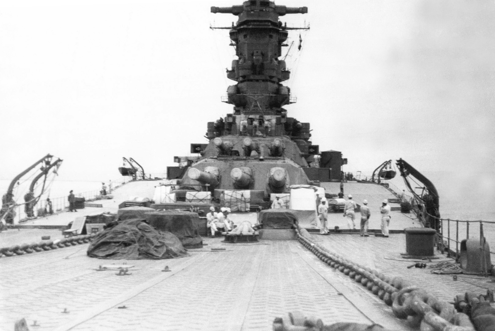

# 日本战列舰

---

## 简介

19 世纪 90 年代至 20 世纪 40 年代，大日本帝国海军为扩充舰队大量建造战列舰。大日本帝国过去极少从外国购买铁甲舰，并一度接受绿水学派海军思想，注重成本低廉的鱼雷艇和破交战，对抗造价昂贵的重型装甲船。19 世纪 90 年代初，造船技术和能力远远不足的日本为对抗中国北洋水师从英国订造两艘富士级战列舰。1894 至 1895 年的甲午战争令日本海军认定绿水学派思想站不住脚，为此制订十年海军建设计划，共需六艘战列舰和六艘装甲巡洋舰（人称「六六舰队」）。两艘敷岛级战列舰、朝日号战列舰与三笠号战列舰也是从英国购买。日本海军深知建设能力不可能追上英国与美国，决定海军舰船始终立足更好的质量，抵消数量劣势。

俄罗斯帝国与日本在 20 世纪初因朝鲜和满洲控制权之争关系紧张，俄罗斯增强太平洋舰队，日本也在 1903 年订造两艘香取级战列舰，此后该国再也没有从海外订造战列舰。为抢在舰船完工前确保舰队继续强化，日本 1904 年突袭旅顺口区的俄军基地，拉开日俄战争序幕。战争开始后不久，日本海军订造两艘萨摩级战列舰，是该国首批国产战列舰。1904 年结束时，大日本帝国陆军已占领旅顺口，俘获太平洋舰队残余舰只。俄军派大部分波罗的海舰队收复旅顺口，但 1905 年 5 月赶到朝鲜海峡后基本在对马海峡海战被日本海军全歼。日军此役俘获五艘俄国前无畏舰，并在修复后编入日本舰队，其中两艘还在第一次世界大战期间卖回俄国，此时两国已成盟友。对马海峡海战大获全胜促使日本海军高层认为现代战争只有主力舰队的水面作战能决定战局，配有最大口径舰炮的战列舰是胜负关键。

日俄战争结束后，日本迅速把关注重心转到英国和美国身上，要争取太平洋统治地位，日本只剩这两个对手。日本深信至少会与其中一国开战，在 1907 年的帝国防御政策要求建造现代战列舰与战列巡洋舰各八艘，这便是「八八舰队」的原型，由 16 艘主力舰构成战线核心。1906 年英国皇家海军无畏号战列舰下水，第二年又下水无敌号战列巡洋舰，两舰代表当时海军舰船的技术巅峰，其他舰只都远远不能相比。日本不得不加大投资，重启「八八舰队」计划建造无畏舰和战列巡洋舰。1907 年河内级战列舰率先订造，接下来是 20 世纪 10 年代的扶桑级战列舰和伊势级战列舰。日本订造的第七和第八艘无畏舰都是 1916 和 1917 年的 [长门级战列舰](#bb_jp_nagato)。

1919 年，美国总统伍德罗·威尔逊宣布恢复 1916 年海军建设计划，日本随即订造纪伊级战列舰和十三号级巡洋战列舰共八艘高速战列舰。为避免三国陷入新一轮成本高昂的军备竞赛，美国、英国、日本签署《[华盛顿海军条约](../Navy_Note.md#Washington_Naval_Treaty)》，同意把三国战列舰吨位比限制在 5:5:3。条约迫使日本海军废置所有前无畏舰和最老的无畏舰，已经开建的舰只能拆除或充当靶舰击沉。此外，条约还规定今后十年禁止新造战列舰。《华盛顿海军条约》的反对派及其继承人在此期间控制日本海军高层位置，把金刚级战列巡洋舰改造成高速战列舰，同时现代化改造现有舰船。再加上日本军国主义兴起和军方在政府占据的领导地位，日本政府决定在 1936 年条约到期时退出。日本海军军令部为条约失效后制订的计划从 1934 年开始，包括五艘配有九门 460 毫米舰炮的大型战列舰，即后来的大和级战列舰。20 世纪 30 年代后期大和级战列舰建造期间，日本海军开始设计下一代旗舰，即配备 510 毫米舰炮的超大和级战列舰，但日本为战争所需必须优先建造其他舰只，超大和级战列舰始终没有开建。

## 日本战列舰列表

### 前无畏舰

* **富士级** （富士型戦艦）
  * 富士号
  * 八岛号
* **敷岛级**
  * 敷岛号
  * 初濑号
  * 朝日号
  * 三笠号
* **香取级**
  * 香取号
  * 鹿岛号
* **萨摩级**
  * 萨摩号
  * 安艺号

### 无畏舰

* **河内级**
  * 河内号
  * 摄津号

### 超无畏舰

* **扶桑级**
  * 扶桑号
  * 山城号
* **伊势级**
  * 伊势号
  * 日向号
* **长门级**
  * 长门号
  * 陆奥号
* **土佐级**
  * 土佐号
  * 加贺号        （后改造成航母）
* **纪伊级**
  * 纪伊号
  * 尾张号
  * 第十一号舰      （取消建造）
  * 第十二号舰      （取消建造）
* **十三号级**      （取消建造）
  * 第十三号舰
  * 第十四号舰
  * 第十五号舰
  * 第十六号舰
* **金刚级**
  * 金刚号
  * 比叡号
  * 雾岛号
  * 榛名号
* **大和级**
  * 大和号
  * 武藏号
  * 信浓号          （改成航母）
  * 111 号舰         （建造时拆解）
* **超大和级**        （未建造）
  * 第七九八号舰
  * 第七九九号舰

---

## 日本部分战列舰

### 富士级战列舰

富士级战列舰（日语：富士型戦艦）包含「富士号」与「八岛号」，是 19 世纪 90 年代大日本帝国海军订造的前无畏舰，也是日本首批战列舰，因国内造船设施和技术不足而在英国建造。富士级是以当年在建的英国皇家海军战列舰为蓝本设计。

两舰投身 1904 至 1905 年的日俄战争，包括 1904 年 2 月的旅顺口海战、此后一个月两度炮轰旅顺口。八岛号 5 月在旅顺口近海触雷，数小时后在拖向基地时倾覆。富士号 8 月参与黄海海战，后在 1905 年 5 月的对马海峡海战轻伤。1910 年富士号划归岸防舰，此后一直充当训练船。1922 年富士号解除武装并改造成宿舍船并配有教室，最后在 1948 年拆解。

**技术数据**

| 数据项 | 数据 |
| :---: | :---: |
| 舰型 | 前无畏舰 |
| 排水量 | 12426 至 12734 吨 |
| 全长 | 125.6 米 |
| 全宽 | 22.3 至 22.5 米 |
| 吃水 | 8 至 8.1 米 |
| 动力输出 | 1.01 万千瓦 十台圆柱形锅炉 |
| 动力来源 | 双传动轴，两台三胀往复式蒸汽机 |
| 速度 | 18.25 节 |
| 续航距离 | 10 节航速 4000 海里 |
| 乘员 | 650 人 |
| 武器装备 | 两门双联装 305 毫米舰炮   十门单装 152 毫米舰炮   14 门单装 47 毫米 3 磅舰炮   十门单装 47 毫米 2.5 磅舰炮   五具 450 毫米鱼雷管 |
| 装甲 | 哈维装甲 装甲带：356 至 457 毫米   甲板：64 毫米   炮座：127 至 356 毫米   炮塔：152 毫米   司令塔：356 毫米   水密舱壁：356 至 305 毫米 |

**历史背景**

19 世纪下半叶，大日本帝国海军在战略上遵循法国军事顾问、船舶工程师白劳易推荐的绿水学派激进海军哲学，注重成本低廉的鱼雷艇和破交战（Commerce raiding），对抗造价昂贵的重型装甲船。1885 年，中国北洋水师从德国购买两艘定远级铁甲舰，威胁日本在朝鲜半岛的利益。中国军舰 1891 年初造访日本，迫使日本政府认识到本国海军需要类似的武装装甲船对抗铁甲舰，从法国订购的三艘松岛级防护巡洋舰空有强力舰炮，但装甲薄弱无法与铁甲舰对抗。国内造船技术和能力远远不足，日本海军决定从英国订造两艘最新战列舰。

日本政府为战列舰拨款的过程充满曲折。内阁总理大臣松方正义 1891 年首次递交申请，但因政治内斗被日本国会删除。松方正义再度申请遭拒后被迫解散内阁，继任内阁总理大臣伊藤博文 1892 年同样申请资金未果，引发明治天皇非比寻常的亲自干预。1893 年 2 月 10 日，天皇提出自行出资建造两艘战列舰，削减每年宫内厅的开支，还呼吁所有政府官员降薪一成。国会不久通过富士级战列舰的预算法案，舰艇原计划 1899 年交付，但 1894 年铺设龙骨前不久爆发的甲午战争促使日本政府要求提前两年完成。

**服役历史**

两艘富士级战列舰都在 1898 年 2 月结束前抵达日本。1904 年日俄战争爆发之际，富士号与八岛号划入第一舰队第一战队。2 月 9 日，东乡平八郎海军中将率第一舰队偷袭旅顺口近海停泊的俄国太平洋舰队。东乡平八郎决定用主炮攻击对方沿海防御，副炮和敌舰交手。事实证明分散火力决策失误，日军的 203 毫米和 152 毫米舰炮对俄国军舰损伤很小，对方把所有火力向日本舰船集中。双方都命中对手大量军舰，但东乡平八郎铩羽而归时日军已伤亡 60 人，俄军仅 17 人。战斗期间没有火力命中八岛号，富士号两度中弹导致两人阵亡，十人受伤。

3 月 10 日，两舰从辽东半岛西南侧的鸽子湾盲炸旅顺口，两地相距 9.5 千米，基本没造成破坏。俄军随后部署海岸炮，俄方军舰还派观察员监视鸽子湾。3 月 22 日八岛号与富士号再度开炮时遭海岸炮和军舰反击，富士号被 305 毫米炮弹命中后日军停战转移。

4 月 13 日，东乡平八郎引出太平洋舰队两艘战列舰，富士号和八岛号随同行动。俄军发现第一战队的五艘战列舰后掉头逃回旅顺口，但彼得罗巴甫洛夫斯克号战列舰撞上日军前一晚布下的水雷并引爆弹药库，该舰在两分钟内沉没。大胜的东乡平八郎又开始远距离轰炸，促使俄军继续布雷。

5 月 14 日，初濑号、敷岛号与八岛号战列舰联合笠置号防护巡洋舰、龙田号通报舰接替旅顺口近海的日军封锁部队。次日早上舰队触及俄军布下的雷区，初濑号上午 11 点 10 分左右触雷导致无法转向，八岛号上前救助时也撞上两枚水雷。日军把八岛号拖离雷区，舰体此时进水失控，船员约在五小时后弃舰。笠置号继续拖船，但八岛号倾斜幅度越来越大并在约三小时倾覆。

八月黄海海战期间，俄军集中攻击东乡平八郎的领队旗舰三笠号战列舰，富士号未受损伤。第二年五月，富士号在对马海峡海战中弹十余次，最严重的打穿后方炮座防护罩，引燃裸露推进火药导致八人死亡，九人受伤。扑灭着火的弹药后，炮座左炮继续开火，显然命中弹药库给予俄军博罗季诺号战列舰（Borodino）致命一击。

1908 年 10 月 23 日，富士号接待美国驻日本大使托马斯·奥布莱恩（Thomas J. O'Brien）与环游世界的“大白舰队”高级军官。1910 年，舰上圆柱形锅炉换成宫原式水管锅炉（Water-tube boiler），主炮换成国产。同年富士号划归一等岸防舰，用于各种训练直到 1922 年解除武装。此后舰体充当浮动营房，是横须贺市的训练中心直到 1945 年。1945 年 7 月 18 日，富士号在美军发动的横须贺空袭受损，战争结束后倾覆，最后在 1948 年拆解。

---

###  敷岛级战列舰 

敷岛级战列舰（しきしまがたせんかん）是日本海军的战列舰，在英国设计和建造。 同级舰为「敷岛」、「朝日」、「初濑」、「三笠」共 4 只。本级是日本海军在甲午战争后为对抗俄罗斯海军而在英国订购的战列舰，并在 1900 年至 1902 年间陆续竣工。敷岛级战列舰为当时世界最大的战列舰。（再者，有资料将朝日、三笠作为准同级舰，她们有共同的规格，但是它有一个完全不同的设计。）

**背景**

在甲午战争中的作战经验令日本海军认清了绿水学派海军哲学的弱点，并开始采购最新的战列舰以现代化其舰队。与早先富士级战列舰一样，日本缺乏技术和能力建造自己的战列舰，并且再次依赖英国。敷岛和朝日在 1896 年被订购，初濑则在 1897 年。

航速为 18 节多少比富士级低下。 四艘舰共同参加日俄战争。「初濑」在 1904 年 5 月 15 日于旅顺港外触雷沉没，而其余 3 只则参加了黄海海战、对马海峡海战。其后「三笠」成为纪念舰、「敷岛」为练习舰、「朝日」为工作舰并参加太平洋战争。「朝日」在 1942 年 5 月 26 日被美军潜水艇击沈，而「敷岛」在终战时于海军仍然在籍。

现在展示的「三笠」在太平洋战争后，因受美国士兵破坏、掠夺了其备品及装备等，所以现在所见到的炮塔及烟突等均为复制品，并不是当时的物件。

**敷岛级战列舰技术数据**

| 数据项 | 数据 |
| :---: | :---: |
| 标准排水量 | 14,850 吨 |
| 全长 | 133.5 米 |
| 全宽 | 23 米 |
| 吃水 | 8.3 米 |
| 最高速度 | 18 节 |
| 乘员 | 838 人 |
| 武器装备 | 40 口径 30.5 厘米连装炮 2 座   40 口径 15.2 厘米单装炮 14 座   40 口径 7.6 厘米单装炮 20 座   47 毫米单装炮 12 座   45 厘米水上鱼雷发射管 1 门   45 厘米水中鱼雷发射管 4 门 |
| 装甲 | 水线：10-229 毫米首尾处 102 毫米   甲板：102 毫米   炮塔：50-254 毫米   炮塔座甲板以上以下：356 / 203 毫米   副炮：152 毫米   司令塔：75-356 毫米 |

#### 三笠号战列舰

三笠（みかさ）是大日本帝国海军的战列舰，为敷岛级战列舰四号舰，以奈良县的三笠山命名。同级舰有敷岛、初瀬、朝日。

在 1904 年（明治 37 年）日俄战争中，担任联合舰队旗舰、联合舰队司令长官东乡平八郎大将座舰。现在于横须贺市的三笠公园以纪念舰形式保存。

1894 年至 1895 年期间的中日甲午战争，日本在俄罗斯帝国的压力下被迫归还辽东半岛给中国。

而遭受此等屈辱后，为对抗俄罗斯帝国并加强日本帝国在亚洲的干涉力量，日本海军开始进行一系列加强军事力量的计划。敷岛级战列舰在其中的「六六舰队计划」（配备战列舰 6 艘、装甲巡洋舰 6 艘的计划）中开始兴建。

1899 年 1 月 24 日，三笠号在英国动工，1900 年 11 月 8 日完工下水，耗时三年、耗资八百八十万日元。

「六・六舰队」计划因为需要庞大金额，日本海军的债务虽然在甲午战争以前就已着手重组、改善，但该计划所需的金额仍就超出海军预算，要完成计划就只有非法挪用预算这个违反宪法的方法。在「六・六舰队」计划的提议人山本权兵卫跟协助者西乡从道的商量时，西郷说：「山本先生，无论如何一定要买（军舰）。要挪用预算，那当然是违反宪法的。如果议会追究违宪责任，就在二重桥切腹吧。如果死两个人就能买到军舰，也算死得其所了。」于是三笠号在非法挪用预算下完成。

**三笠号 技术特点**

三笠交舰之时，是当时科技最先进的战列舰，火力和防护力史无前例地组合，改良了英国皇家海军最新的莊嚴級戰艦设计，增加了吨位（由 14,900 吨增至 15,140 吨），改善速度（由 17 节改善至 18 节），轻微地加强军备（增加两门十五厘米炮），和更强的装甲：保留了同样的装甲厚度但使用了高性能克虏伯钢（Krupp armour）装甲，防御力大约较莊嚴級所采用的哈威钢（Harvey armour）加强 50%。

三笠的主炮被编组在中央的舰桥装甲，使得全舰能均匀地受重克虏伯防护钢板保护。由于这设计，三笠能承受大量直接命中的炮弹：在 1904 年 8 月 10 日的黄海海战被击中 20 发炮弹、对马海峡海战被击中 30 发炮弹，但只受到有限的损伤。高度训练的日本炮兵充分地利用了三笠的高火力和高射程主炮。

**历史**

三笠是六・六舰队的最后一只舰，1899 年 1 月 24 日在威格士造船厂动工。1900 年 11 月 8 日进水。1902 年 1 月 15 日至 20 日公开测试，3 月 1 日在修咸顿举行交接仪式交予日本海军。船身建造费为 88 万英磅，兵器费 32 万英磅。3 月 13 日在英国普利茅斯启航，经苏伊士运河在 5 月 18 日到达横须贺。初代舰长是早崎源吾大佐。在横须贺整备后 6 月 23 日出航，7 月 17 日到达本籍港舞鹤。

1903 年 12 月 28 日，三笠成为联合舰队旗舰。1904 年 2 月 6 日加入日俄战争。8 月 10 日加入黄海海战。12 月 28 日驶入吴港修理。1905 年 2 月 14 日、驶出吴港，经江田岛、佐世保，21 日进驻朝鲜半岛的镇海湾。之后以该地为据点，在对马海峡进行训练。5 月 27 日、28 日在对马海峡海战与俄罗斯的波罗的海舰队交战。

三笠在对马海峡海战带领日本联合舰队在历史上进入一场最果断的海战，俄国舰队几乎全灭：俄国丧失 38 艘船，21 艘沉没，7 艘遭日本海军掳获，6 艘解除武装，对马海峡海战中共有 4,545 名俄国军人死亡，6,106 人遭俘。

另一方面，日本海军只丧失了 116 名士兵与 3 艘鱼雷艇。日本海军组建时是根据英国皇家海军的高度专业标准所组织训练；反观俄国波罗的海舰队不仅组织力较低且经过万里跋涉，到达东北亚时已师老兵疲。

日俄战争终结之后紧接的 1905 年 9 月 11 日，三笠在佐世保港内因为后部弹药库的爆炸事故而沉没了，这个事故中死者共 339 名。

当时在水兵间流行在弹药库前玩「点燃信号用酒精并吹熄后，就着臭味饮用」的恶作剧，在恶作剧的进行中，有一说是有水兵不留神翻倒了有火的洗脸盆，另一说是下濑火药的变质。这个爆炸沉没事故被认为是秋山真之少佐埋头于宗教研究的原因之一。10 月 23 日，海军凯旋式敷岛号战列舰替换三笠成为旗舰。

事故当时，联合舰队司令长官东乡平八郎大将在岸上因此平安无事。同时，刚到任舰队附属军乐队的瀬户口藤吉海军军乐长在事故当时也不在船上，因此逃过一劫。不过，很多军乐兵由于该事故殉职。

三笠成为预备舰，1906 年 8 月 8 日打捞起到佐世保工厂修理，1908 年 4 月 24 日，回到第 1 舰队旗舰再次就役。

1914 年 8 月 23 日，日本参加第一次世界大战初期三笠在日本海等从事警备活动。

此后从 1918 年开始至 1921 年之间，为从东面牵制大战中诞生的社会主义国苏联，日本出兵支援西伯利亚（参加前实施防寒工事，飞机实行临时搭载）。

1921 年 9 月 1 日三笠成为一等海防舰，不过，9 月 16 日在海参崴港（Vladivostok）外海峡中航行时在浓雾中触礁。离礁后在海参崴港（Владивосток）入船坞修理，11 月 3 日归投舞鹤。

根据华盛顿海军条约使三笠决定废舰。1923 年 9 月 1 日因为关东大地震使三笠撞到码头、浸水，9 月 20 日于帝国海军除籍。

根据华盛顿海军条约废舰后，由于日本国民对三笠的保存运动非常勃兴，日本将解体的地方作为三笠公园。1925 年 1 月内阁会议决定把不能复归现役状态做为条件的特别认可去保存三笠，作为纪念舰在横须贺保存，同年 6 月 18 日开始保存的工程，把船头固定转向皇宫。11 月 10 日工程完成，11 月 12 日进行保存式。

三笠在第二次世界大战当中遭到美国陆军航空军（USAAF）轰炸，太平洋战争战败后，同盟国军占领日本期间，苏联要求将三笠号进行拆毁，但在思想较亲日的尼米兹上将和陆军威洛比少将的奔走下而幸免于难。舰上为了美军而在军官室设置了「东条夜总会」等娱乐设施，上部兵装和上层结构全被撤除，能拆下的金属类（铜和黄铜等）被拿走，大部分煤气切断，柚木制甲板也因需要柴火和建材而被拆除，三笠就此荒废。

英国人约翰·S·鲁宾（John S. Rubin）见三笠如此惨状，气愤地向《日本时报》（Japan Times）投稿，引起极大回响。美国海军五星上将尼米兹因忧虑三笠的状况著书出版，且为了保存三笠而推动捐款运动等，开始显示大众对复原三笠的重视。 由于美国通过预算的支持和尼米兹的直接介入，复原工作于 1958 年开始进行，1961 年 5 月 27 日完成，共花 10 亿 8000 万日元。大量的遗失零配件由智利政府以当时在日本解体的智利战列舰拉托雷海军上将号（Almirante Latorre）作为赠礼提供。。三笠与位在英国朴次茅夫的胜利号与在美国波士顿的宪法号，被选定为世界三艘伟大历史军舰之一。三笠号现在是防卫省名下的国有财产。

---

### 香取级战列舰

香取级战列舰共有两艘，是日本在海外建造的最后一批战列舰，设计在英国皇家海军英皇爱德华七世级战列舰（King Edward VII-class）的基础上改进。两舰交付时日俄战争已经结束，从未参与实战。香取号战列舰副炮炮塔 1907 年发生重大火灾夺走 34 条人命，另有 8 人受伤。两舰没有参与第一次世界大战，但在 1918 年参与日军干涉西伯利亚的行动。1921 年，香取级两舰搭乘储君裕仁访问欧洲，与英王乔治五世会面。《华盛顿海军条约》生效后，两舰均在 1923 至 1925 年解除武装并拆解。

**概要**

日本海军在日俄战争时，为了补充初瀬及八岛于日俄战争早期损失的战力，因而向英国订造新型战列舰－香取级。尽管日进及春日等装甲巡洋舰在危急的对马海峡海战时守住了战线，但装甲巡洋舰在规模与火力方面与战列舰相比显得不足。由于日本海军预计最少需要一队六艘的战列舰才能面对来自中国、俄罗斯或美国的潜在威胁，因此向英国下了订单制造。虽然香取级战列舰的设计很大程度上只是根据以前的敷岛级战列舰三笠而仓促建造，但两艘舰却只能在日俄战争完结后才能交付。

竣工之后，英国最新型的无畏舰已经下水，本级已沦为过时舰级。及后一直作为主力舰，直至 1923 年由于华盛顿海军条约使两舰一同成为废舰，及后被解体。

**香取级战列舰 技术数据**

| 数据项 | 数据 |
| :---: | :---: |
| 排水量 | 常备：15,950 吨（香取）  常备：16,400 吨（鹿岛） |
| 全长 | 全长：143.3 米   水线长：139 米 |
| 全宽 | 23.8 米 |
| 吃水 | 平均：8.2 米（香取）  平均：8.1 米（鹿岛） |
| 燃料 | 煤：750～2,150 吨 |
| 锅炉 | 20 座 |
| 动力 | 往复式蒸气引擎 2 座、2 轴 |
| 功率 | 16,000 匹（11930 千瓦） |
| 最高速度 | 18.5 节（34.26 公里每小时） |
| 续航距离 | 10,000 浬（10 节、1857 吨煤） |
| 乘员 | 864 人 |
| 武器装备 | 305 毫米 45 口径连装炮 2 门   254 毫米 45 口径单装炮 4 门   152 毫米 45 口径单装炮 12 门   76 毫米 40 口径单装炮 16 门   47 毫米单装炮 3 门   457 毫米水上鱼雷发射管 1 门   457 毫米水中鱼雷发射管 4 门 |
| 装甲 | 舷侧（水线下）：229 毫米   舷侧（水线上）：150 毫米   前舷：100 毫米   后舷：60 毫米   主炮炮座：305 毫米   主炮防盾：230 毫米   甲板：76 毫米   指挥塔：229 毫米 |

**设计**

香取级战列舰的设计是英国皇家海军的英皇爱德华七世级战列舰的修改版本，该级战列舰比起前代在武装及動力系統上引进了若干创新之处。

船体形状为典型的平甲板型，前部采取高舰舷使之有效破开海浪、适合航行，舰首仍然保留着冲角。舰首开始为主炮楔形的炮塔、后为包括司令塔的操舵舰桥、单脚式的前部桅杆、设有细小通风筒于两侧的烟囱、往后为放置舰载艇的位置、救生艇起重机、单脚式的后部桅杆、后部舰桥、到舰尾的 2 号主炮。

香取级战列舰前后各装有 1 门 1904 年型埃尔斯维克军备公司新设计的 305 毫米 45 口径连装主炮，这比起三笠的 305 毫米 40 口径主炮以及前代的战列舰有更强大的火力。该炮塔可以左右 150 度转动，炮管能在仰角 15 度、俯角 5 度之间上下移动，386 千克重的炮弹能以 1 分钟 1 发的间隔射击。

副炮为 4 门 1905 年型威格士造船厂出品的 254 毫米 45 口径单装炮。该炮塔可以左右 160 度转动，炮管能在仰角 30 度、俯角 5 度之间上下移动，235 千克重的炮弹能以 2 分钟 3 发的间隔射击，射程达 24,600 米。甲板两侧更配备了共 12 门 1900 年型埃尔斯维克军备公司出品的 152 毫米 45 口径单装速射炮去对付鱼雷艇，而分散的设计是为了避免因单一命中而破坏掉密集的速射炮。上甲板的炮塔都有装甲保护，使其不容易被破坏。

辅助兵装包括 16 门 1894 年型埃尔斯维克军备公司出品的 76 毫米 40 口径单装速射炮、3 门用作高射炮的 47 毫米 40 口径机炮、4 门 457 毫米水中鱼雷发射管、1 门 457 毫米水上鱼雷发射管。

香取级战列舰采用克虏伯镍铬钢作为材料制造装甲，水线下舷侧及主炮防盾用了 229 毫米、炮座用上了 305 毫米、副炮用上 178 毫米及甲板用上了 76 毫米厚的装甲。

本级使用 2 座 2 轴的往复式引擎，包括 20 个燃煤水管式锅炉及直立型四气筒三段膨张式蒸汽引擎。喷油机的使用允许蒸气压力快速上升，使本级舰能够有更大的加速度。但是，由于设计内在的不稳定性问题，使本级舰难以在直线航行中保持高速。在试验中，香取仅能够维持 8 个小时刚刚超过 20 节的速度。续航距离在 10 节时为 10,000 英浬。

---

### 萨摩级战列舰

萨摩级战列舰（さつまがたせんかん）是大日本帝国海军的战列舰型式，且为日本最初的国产战列舰。

萨摩级战列舰分「萨摩号」与「安艺号」两艘，是日本国内建造的首批战列舰，属战列舰设计过渡时期作品。

两舰之间各有不少差异，但基本上仍为同级。当本舰在 1905 年铺设龙骨时，原计划成为世界首艘「全大口径火炮」战列舰，比英国的无畏舰战列舰更早。-- 姐妹舰原计划各配 12 门 305 毫米舰炮，但因材料短缺、成本高昂重新设计，改成四门 305 毫米舰炮和 12 门 254 毫米舰炮。如按原计划完工，萨摩级将是世界上首批「全巨炮」（All big-gun）战列舰。萨摩号采用两台传统的三胀往复式蒸汽机驱动，安艺号是日本第一艘采用蒸汽涡轮发动机的战列舰。

1906 年面世的无畏号战列舰令还在建造的萨摩级沦为明日黄花，安艺号同年 11 月 15 日下水，萨摩号次年 4 月 15 日跟进。一战爆发后，萨摩号是松村龙雄海军少将的旗舰，1914 年 10 月随第二南遣枝队攻陷德国控制的加罗林群岛和帕劳群岛。1916 年萨摩号在佐世保海军工厂改装，一战剩下几年在第一战队服役。安艺号先划入第一战队，1918 年转入第二战列舰分舰队。1924 年，两舰都充当靶舰由长门号战列舰和陆奥号战列舰击沉。

**萨摩型战列舰技术数据**

| 数据项 | 数据 |
| :---: | :---: |
| 排水量 | 萨摩：19372 吨（常备）/ 20100 吨（满载）   安艺：19700 吨（常备）/ 21800 吨（满载） |
| 航速 | 萨摩：18.25 节   安艺：20 节 |
| 主火力 | 萨摩：2 座双联装阿姆斯特朗式 305 毫米 L / 45 炮   6 座双联装维克斯式 254 毫米 L / 45 炮   安艺：2 座双联装阿姆斯特朗式 305 毫米 L / 45 炮   6 座双联装维克斯式 254 毫米炮   8 座单装阿姆斯特朗式 152 毫米速射炮 |
| 副火力 | 萨摩：12 座单装阿姆斯特朗式 120 毫米 L / 40 速射炮   4 座单装阿姆斯特朗式 76 毫米 L / 40 速射炮   4 座单装阿姆斯特朗式 76 毫米 L / 28 速射炮   安艺：8 座单装阿姆斯特朗式 76 毫米 L / 40 速射炮   4 座单装阿姆斯特朗式 76 毫米 L / 28 速射炮   鱼雷发射管 457 毫米 × 5 |
| 装甲防护 | 舷侧 229 毫米   甲板 51 毫米   主炮塔 254 毫米   司令塔 254 毫米 |
| 动力 | 萨摩：2 台直立三段鼓胀往复式蒸汽机，20 座宫原式燃煤锅炉，17300 马力   安艺：2 台直结式齿轮减速机，15 座宫原式燃煤锅炉，24000 马力 |

---

### 河内级战列舰

**河内级战列舰**（かわちがたせんかん）是日本海军的准无畏舰舰之一（虽然主炮一律采用同口径的大口径火炮，但倍径不同，无法统一指挥，因此不完全属于无畏舰）。同级舰有「河内」及「摄津」 2 艘，同于 1912 年竣工。「河内」在 1918 年 7 月 12 日德山湾爆炸事故中沉没（沉没地点：北纬 34°0 分 东经 131° 46 分，现在的海图有沉船表示）。「摄津」在第一次世界大战后解除武装成为靶舰，于 1945 年 7 月 24 日被美军航空部队空袭而受严重破坏。

本级舰为日本海军在第一次世界大战前竣工的前无畏战列舰舰级。本级的基本计划编号为「A-30」，河内是「伊号战列舰」，摄津为「吕号战列舰」。

河内级战列舰整体沿袭了日本海军前无畏舰的一些形制特征。船体为平甲板船型，舰首大体为垂直艏（摄津号建造中实验采用飞剪型船艏），司令塔位于操舵舰桥内。主炮布置与德国的拿骚级战列舰、赫尔戈兰级战列舰布置方式相似。

河内号是垂直型舰首，摄津则是上部突出的曲线型。此舰舰型是日本海军中最早出现三脚桅杆和三座烟囱的配置，因为轮机布置的原因，烟囱距离较大。

**主炮配置**

主炮塔的配置特色为不考虑单座炮塔射界的六边形式，即不考虑舰炮的倍径，如德国海军的「拿骚级」及「赫尔戈兰级」主炮配置同样。 而同世代的战列舰如英国海军的「海神级」及「巨人级」、美国海军的「德拉瓦级」和「佛罗里达级」为全舰舷侧均可瞄准，亦可进行复旧。

其优点是，在与敌方舰队作战时，当敌舰绕到自己的另一方并进行攻击时，船舰可以立即作出反应。

舰体艏艉中心线各一座双联炮塔，左右两舷各两座双联炮塔，可以保证每舷有 8 门主炮同时开火，虽然该级舰因搭载统一 305 毫米口径主炮而被称为「日本的第一级无畏舰」，但实际上搭载的是 45 倍口径的 MK X 型和 50 倍口径的 MK XI 型两种身管长度不同的 305 毫米主炮。最初计划全部 305 毫米口径主炮身管长度为 45 倍口径，开工前，位于艏艉部的 305 毫米口径主炮身管长度改为 50 倍口径（增加艏艉两座主炮身管长度以增加射程的建议据说是东乡平八郎大将提出来的），显然是考虑到增强艏艉部的火力。与无畏号战列舰引用「全重型火炮（All-Big-Gun）」概念相背（后来有资料将其归类为准无畏舰）。

限于当时战列舰火控水平，对主炮统一射击控制尚未运用实践而未得到重视。虽然河内级战列舰装备统一口径的主炮，但是火炮身管长度不一致，作战时对校正、集中火力难免产生影响。实际使用中为与其他 45 倍口径主炮保持相同射程通常采用 50 倍口径主炮减装发射药的射击方式。

**副炮配置**

副炮为日本战列舰中初次采用的「1910 年型 15.2 厘米（45 倍径）炮」，二号甲板下方的舷侧炮塔配置为每边舷 5 门。其他的装备包括对鱼雷艇用的「1908 年型 12 厘米（40 倍径）炮」12 门、「7.6 厘米（40 倍径）炮」单装炮 16 门、45 厘米水中鱼雷发射管 5 座。

**装甲配置**

河内级的水线装甲带使用了克鲁伯胶结钢，船体中部最大厚度为 12 英寸（305 毫米），船尾两侧锥形厚度为 5 英寸（127 毫米）。大约 1.93 米（6 英尺 4 英寸）的装甲带在水线以上，1.95 米（6 英尺 5 英寸）在水线以下。

**河内级战列舰技术数据**

| 数据项  | 数据 |
| :---: | :---: |
| 标准排水量 | 20800 吨  |
| 满载排水量  | 21443 吨  |
| 全长 | 河内：160.3 米   摄津：162.5 米 |
| 全宽	| 25.6 米 |
| 吃水 | 8.2 米 |
| 燃料 | 燃煤 2300 吨   重油 400 吨|
| 动力 |	宫原式混烧锅炉 16 座   柯帝士·布朗式直结涡轮引擎 2 座 2 轴推进 |
| 功率 |	25000 匹（河内公试 30399 匹）|
| 航速 |	20 节（河内公试 21.024 节）
| 续航距离 | 18 节 2700 浬 |
| 乘员 | 999 名（河内新造时）  986 名（摄津新造时）|
| 武器装备 | 30.5 厘米（50 倍径）连装炮 2 座   30.5 厘米（45 倍径）连装炮 4 座   15.2 厘米（45 倍径）单装炮 10 座   12 厘米（40 倍径）单装炮 8 座   8 厘米（40 倍径）单装炮 12 座   45 厘米水中鱼雷发射管 5 座 |
| 装甲 |	舷侧装甲：  305 毫米（水线部舷侧炮塔间）  127 毫米（水线部）  229 毫米（水线上部）  甲板装甲：76 毫米   主炮塔装甲：   305 毫米（前盾）  279 毫米（50 口径侧盾）  254 毫米（45 口径侧盾）  279 毫米（后盾）  76 毫米（天盖）  炮座部：279 毫米   司令塔：254 毫米 |

---

### 扶桑级战列舰

**扶桑级战列舰**（ふそうがたせんかん）是日本帝国海军引进金刚级战列舰后，在 1910 年代由日本国内首度设计建造的战列舰级别，也是日本海军第一款服役的超无畏舰。本级舰最显眼的特色有着极为高耸的塔型樯楼。

**历史及设计特点**

扶桑级战列舰是日本 **八八舰队** 计划的一部分，搭配战列巡洋舰争夺制海权。由于日本在 1905 年的日俄战争中击溃俄罗斯帝国，虽然获取中国东北地带的经营特权，但战争开销致使国家债台高筑；这时帝国海军中留英回国的将领佐藤铁太郎在日俄开战前向明治天皇献上了帝国国防论一书，强调海洋对日本国土防卫的重要性，后来的对马海战也证明了这项观点的前瞻。同时，他在书中也强调日本未来在亚洲的扩张中不免会和英国或美国其中一国发生利益摩擦，所以建立至少有对手七成战力、足以在日本近海击溃对手的海军成为必要规模，他的论点成为日本直到二战战败前建军的主导方向，也为日本海军的扩张提供了理论基础。

1907 年，日本帝国议会通过了八八舰队扩军方案，目标是建造 8 艘 2 万吨级的主力战列舰、8 艘 1 万 8 千吨级的战斗巡洋舰。然而无畏号战列舰及无敌号战斗巡洋舰的出现成为造舰思想的新典范对照组，让当时抢先建造的三型军舰甫推出即告落伍，加上财政问题，导致造舰进度暂时放缓。1911 年，日本批准「第三期海军舰艇扩张计划」中的「第三号战舰」（扶桑号）的建造计划，1912 年 3 月扶桑号开工；然而在扶桑号开工的同时后续舰艇的经费仍未有着落。要到 1912 年 12 月 21 日帝国议会才决定大正二年度军备补充预算增支 600 万日币作为兴建 3 艘战列舰（山城、伊势、日向）的初期预算，山城号得到这笔允诺经费才赶于 1913 年开工，但是这个决议实际上并没履行。山城号的动工以时间轴来看是在预算尚未拨列的状况下先行下订；预算真正入袋要到 1914 年编列的「大正 3 年度军舰制造费」拨付 650 万日币才得以让第四号（山城）到第六号战列舰正式开工。对日本帝国海军来说这个延宕可属幸运，由于后续舰开工延迟之故不至于一次造出 4 艘缺陷品，得以减少损失。

扶桑级设计的主设计师为造船中将近藤基树博士。初始方针是打算采 4 艘战列舰共同编队的方式作战。开工前，日本海军手头持有的资料有金刚级与无畏级的蓝图，日本海军也在观察当时世界战列舰的发展潮流，同时英国基于盟友立场也协助日本设计建议。而在一战前最先进者莫过于英国的铁公爵级战列舰及伊丽莎白女王级战列舰，与美国的纽约级战列舰和内华达级战列舰；这些战列舰有的共通特质就是主装甲带最大厚度超过 330 毫米，主炮超过 10 门，极速达到 23 节以上，这些规格成为日本想超越的目标。

为了帝国海军首艘超无畏舰计划，扶桑级设计草图有 35 种以上，从代号 A-47 到 A-57 均为本舰规划方案；最终，扶桑级以代号 A-64 设计案决定。

此设计的船身原型为河内级战列舰，但是也加入了金刚级战列舰船体设计哲学，以及部分当时最新设计思维建造一款具有飞剪式舰艏外观、长船首楼设计，总吨位 29000 长吨（29465 公吨），有着采用双连装炮塔的 12 门 14 英寸主炮，具备 23 节极速可压倒美国同行的战列舰。扶桑号于 1912 年 3 月开工，是旧日本海军历史上第 2 艘以「扶桑」命名的战舰（「扶桑」曾被用来命名旧日本海军历史上第一艘被类分为「战舰」的铁甲舰）。1915 年 11 月扶桑号完工服役，该级二号舰山城号 1913 年 11 月动工，到 1917 年 3 月完工服役。为当时世界上排水量最大、速度最快的战舰。

由于是日本海军第一次尝试自行设计建造无畏级战列舰，又过度要求武装的结果，扶桑级整体布局、建造技术以及经验不足，整体而言并不理想。扶桑级在开工前曾以缩尺模型在大型水槽内测试流体力学，并考虑了较好的耐浪船艏设计，却因为船舵设计没有与船体适切，导致扶桑级操舰稳定性是日本帝国海军战列舰中独树一格的烂；一般航行光要维持直线前进便相当困难，180 度转向时更会出现速度急降的停船状况。扶桑号在海试时发现的各种缺点在山城号上已经开始调整设计，但就结果来说毛病没有根治；所以第二批次的造舰计划取消，设计也重新返回绘图桌上改良缺陷，改良成果则为伊势级战列舰。扶桑级的设计缺陷让她服役过程实施多次改造，但基本布局不变结果改良效果有限，在二战爆发时扶桑级整体技术已属过时；在中途岛战役航舰大规模折损时曾经有提案将扶桑级改造为航空战列舰，并打算在 1943 年 6 月动工，最后因日向号炮塔爆炸意外让高层决定由伊势级战列舰实施改造，改装计划并未实行。

在「单舰优越主义下」，扶桑级最初便规划为一艘 12 门主炮的战列舰，但当时海军大国自身的造舰策略比较保守，只有在外销战列舰上才敢「因应顾客需求」做出某些设计突破，像是装设 7 座 12 英寸主炮的阿金科特号战列舰；所以即使是英国也没有堪称成熟的多主炮配置构思；要怎样配置如此数量的舰炮成为一大考验。

为此，舰政本部也向英国维克斯公司求教意见；英方除了传统双连装炮塔配置，也提出采美国与意大利战列舰的方式设计一型三连装主炮炮塔，但是日本海军以三连装主炮著弹散布界过广以及技术不成熟等理由，决定采 6 座双连装炮塔的配置。双联装主炮炮塔全部装备在舰体中心线，舰体前、后部各安装两座采用背负式，舰体中部在烟囱前后各安装一座。主炮口径当时无特别要求，因此采用了金刚级主炮，每座炮塔重 625 吨，采用以锅炉蒸气带动的蒸气泵提供水压动力；俯仰角为 -5~+20 度，旋转角度为中心线左右各 150 度，装填只能固定于仰角 5 度的状态下，比起金刚级的 25 度仰角及自由角度装填机能来说限制颇多，因此射速只能每分钟 1 发。由于主炮仰角限制，1910 年代的扶桑级射程仅有 22,500 米。

账面上，虽看起来扶桑级似乎火力优于列强战列舰，但是火炮射击不只看数量，还与当时的射击技巧、技术局限有关；从英国引进相关技术的扶桑级，当时主炮的制退复进机同样是使用水压动力，如果齐射舰上无法供给足够蒸气压力、会让制退机归位速度过迟，所以战列舰射击技巧是采 2 座主炮以交叉射击的方式取得最佳开火效率。扶桑级却没有设计第三个射击指挥平台，实务射击采 2-1.1-2 的火力配置模式，并没有善用炮塔增加后的优点。采用崭新的主炮布局问题也在海试时表露无遗：重装甲带防御部分延伸过长，可改造空间狭窄，火炮射击时会对上层建筑的产生冲击以及相互干扰，主炮齐射时炮口爆风会覆盖全舰。在前部射击指挥塔，P 炮塔在右侧 55 度、仰角 5 度时影响最为明显。

不过，炮口喷焰与暴风遮蔽问题并不会影响到舰炮的射击精度，由于扶桑级的长宽比较金刚级小，加上结构较厚实之故；无论是扶桑号还是山城号服役初射击演习时，命中率及散布界都是在合格标准，1915 年扶桑号火炮测试时也显示其舰桥射击震动现象要比金刚级战列舰要小，有利于观测；山城号在 1918 年 8 月 6 日对距离 18,800 米〜18,100 米目标射击测考，共射击了 69 发炮弹，齐射间隔 28 秒、炮弹散布界平均为 285 米、69 发炮弹中共有 7 发判定为第一有效弹、5 发判定为第二有效弹、11 发判定为第三有效弹。1926 年日军曾集中 6 艘战列舰（长门、扶桑、伊势、山城、雾岛、比叡）实施联合射击测考，扶桑号是测考舰中射击成绩最优秀的一艘。但是喷焰会影响到指挥所观测敌舰与方位盘计算为不争事实，对分秒必争的舰炮互射海战来说，极劣的操舰稳定性搭配极差的观测条件，对火力发扬都属不利要件。不仅如此，扶桑级设计时尚无考量军舰损管需求，主炮炮塔内部没有消防用洒水设备，炮塔如有毁损就有可能造成重大安全危机。

除了主炮，扶桑级当时还保留了水下固定式鱼雷管设计，6 具 21 吋（533 毫米）鱼雷管分别以 3-3 方式配置在舰体两侧。副炮则是与金刚级相同之四一式 15 公分舰炮，采当时普及的城廓式设计；虽然厚重的炮盾提供炮手防护，但是 152 毫米的炮弹重量超过日本军人体格负荷，单靠人力装弹的实战射速海军测试之后非常不满意，加上主炮喷焰遮蔽全舰的缺陷，扶桑级的副炮炮手要观测瞄准非常困难，命中率也难以指望。

扶桑级的装甲主要由维克斯渗碳装甲构成，装甲带设计为典型的前日德兰型战列舰配置，防御导向为针对 1 万米左右、入射角为 0 度的炮击而设计，对长距离大仰角弹防御力不佳，装甲总重量为 8726 吨，约占总排水量的 29%，比起前代河内级的 25% 略为增加。在 1910 年代初，日本的工业生产设施生产不出 12 英寸（305 毫米）以上厚度的装甲，这成为了扶桑级的防护设计最大限制；司令塔装甲 305 毫米，为全舰防御力最强之部位；主水线装甲带厚度 303 毫米，水线上侧面装甲 229 毫米；水线下装甲厚度 102 毫米；甲板装甲介于 32 - 51 毫米；主炮装甲炮盾 279.4 毫米（11 英寸），侧面 228.6 毫米（9 英寸），顶盖 114.5 毫米（4.51 英寸）；副炮炮盾厚 152 毫米；船只的水密隔舱有 737 个（水面上 163 个，水面下 574 个）。本舰设计也依循一次世界大战前战列舰概念，将煤仓设置在锅炉室左右舷外侧，充当防鱼雷隔舱使用，所以轮机系统并没有增设额外的防护装甲。

扶桑级的主炮过多，连带让装甲带过度延长，过长的装甲带在摊平吨位后，扶桑级的要害部位防御力在各国战列舰来说并不优异；扶桑级全舰有 6 成的长度设有主炮、有 5 成的长度内设有弹药库，而且因为多安装炮塔的结果导致舰体中段设计成弹药库 - 锅炉 - 弹药库 - 锅炉的高风险方式，一般军舰被击中轮机段顶多担心失去动力，但扶桑级还得担心锅炉带的高温可能诱爆弹药的危机。相比来说，金刚级全长中只有 33% 的比例为弹药库或主炮，轮机段也集中设置，即便被弹遭命中致命部位的可能性也较低。日军自己的实测也评估扶桑级的主装甲无法承受 14 英寸主炮以上的炮击，即使防御力优于金刚级，以战列舰互角的观点来说与裸奔没分别。1930 年代近代化改装时扶桑号的强化重点也在甲板装甲及水下防护，改良后的装甲总重量增加到 12395 吨，占总排水量 31%，但即便如此面对美军战列舰来讲仍不理想。

**扶桑级战列舰技术数据**

| 数据项  | 数据 |
| :---: | :---: |
| 标准排水量 | 29330 吨   34700 吨（改装后）  |
| 满载排水量  | 35900 吨   38536 吨（改装后）  |
| 全长 | 205.13 米 212.75 米，水线长 210 米（改装后） |
| 全宽	| 28.65 米   33.08 米（改装后） |
| 吃水 | 8.69 米   9.69 米（改装后） |
| 燃料 | 燃煤 5022 吨 重油 1026 吨   改装后 重油 5100 吨 |
| 锅炉 | 宫原式油煤混烧锅炉 24 台（完工初）  二号舰政本部重油锅炉 4 座，三号舰政本部式重油锅炉 2 座（第二次改装后）|

**服务历史**

扶桑号在 1915 年服务后编入第一舰队之第一战队。

一战期间扶桑级曾有段时间在中国沿海执行封锁同盟国船舰任务。

1930 年 第二次改装。

**太平洋战争** 爆发后，因为航速限制，均长期在本土泊地待机。

1942 年美军突袭东京后，留在本土的第一舰队曾授命追击美军航舰部队，扶桑级曾因此短暂出港；但是因为航速不足也无力追击，象征性地晃了几天后就回港。

1944 年 10 月，两艘扶桑级作为西村舰队主力一同参加 **莱特湾海战**，执行「捷号作战」，10 月 25 日凌晨在进入 **苏里高海峡** 时，遭美国海军埋伏的舰队群集火围歼。扶桑号遭鱼雷艇编队运用鱼雷集火命中，鱼雷炸断舰体致使它没没。山城号则在凌晨 3 点 52 分开始遭美军重巡洋舰、战列舰进行炮击战对决，双方进行 18 分钟的鄰后在毫无建树的情况下遭美军炮弹及鱼雷集火摧毁。本级两舰均于 1945 年 8 月 31 日除籍。

---

### 伊势级战列舰

伊势级战列舰（日文汉字：伊势型戦舰，日文假名：いせがたせんかん，英文：Ise-class Battleship）是日本帝国海军隶下，于大正四年（1915 年）建造的超无畏级战列舰。

**历史及设计**

日俄战争结束后，日本通过了「八八舰队」计划，大力扩展海军。然而当时海军造舰技术发展迅猛，新型无畏舰和超无畏舰相继问世，极大缩短了主力舰的更新换代间隔。这延缓了日本海军的扩军速度。直到通过金刚级战列巡洋舰引进了最新的造舰技术后才重开建军计划，补充 4 艘主力战列舰。然而首批国产成品却出现诸多技术瑕疵，同时 1911 年度预算也只足够编列 3 艘，第 4 艘尚未编列，因此第二批国产主力舰建造计划被暂时推延以改进扶桑级的缺陷。在此空白期海军全面修改原计划为扶桑级 3、4 号舰的设计。最后一艘战列舰的预算则在 1914 年 7 月通过，这两艘战列舰便独立成级，成为伊势级战列舰。

2 艘伊势级战列舰在 1915 年 5 月分别在不同的民间造船厂开工，不过在完工时间上三菱的长崎造船厂略慢于川崎 5 个月。

作为扶桑级战列舰的改型，本级舰在设计上仍遵循海军“单舰优越主义”（单舰素质较舰队规模更重要）的方针，所以在武器装备上与前型相同。但舰政本部仍尽力解决扶桑级已知的设计缺陷，同时吸取了一战的海战经验教训。虽然伊势级的主要规格与前代相近，但其有着较平衡的性能。

相较前型主要改进了火炮布置方式，将 3-6 号主炮两两成组布置，更利于火控组织，同时为轮机舱预留了足够大的空间。本级舰为此缩短艏楼，将副炮集中布置在舰体中前部，减少火炮射击时对上层建筑的冲击以及炮口爆风对炮弹弹道的干扰。提升了主炮装填仰角，提高装填速度。动力系统布局也采用新的方案。考虑到日本人体力不如同时期的欧洲人，副炮采用了口径较欧洲同行小的三年式 140 mm 舰炮。但是由于艏楼缩短，压缩了舰体内部空间，恶化了居住舒适性。根据日德兰海战的经验，相对应地加厚水平装甲来防御大落角炮弹。本级舰共两艘：伊势号和日向号。伊势号 1917 年 12 月完工，日向号 1918 年 4 月完工。

#### 航空战列舰改装

中途岛海战，日本海军损失了 4 艘大型 [航空母舰](AirCraft_Carrier.md)，军令部决定将伊势级改装成 **航空战列舰**。

原计划是将本级舰改装成全通甲板的航空母舰，但因工程难度而放弃该计划，因此保留部分战列舰机能。

移除后部两座主炮，用来增设飞行甲板及机库。同时为了强化防空火力，拆除了所有舷侧副炮，安装了大量的防空炮。

**结局**

1944 年 10 月在莱特湾海战中，两艘伊势级航空战舰在无舰载机的状态下被编入航空母舰编队参战。虽遭到美军飞机的猛烈攻击，本级舰却其凭借密集的防空火力，在此战中并未受到太大损害。莱特湾海战结束后本级舰被派往东南亚运送物资，返回日本本土后因为燃油匮乏一直停泊在港口。1945 年 7 月 28 日本级两艘舰都被美飞机炸沉在吴市军港中，1947 年两舰被打捞拆解。

**伊势级战列舰技术数据**
> [!tip]
> 数据是伊势号的 -- 日向应该差不太多

新造（1917 年）

|  数据项  |                                               数据                                               |
|:--------:|:------------------------------------------------------------------------------------------------:|
|  排水量  |                                标准：31260 吨   公试：32062 吨                                |
|   全长   |                                            208.18 米                                             |
|   全宽   |                                             28.65 米                                             |
|   吃水   |                                             8.74 米                                              |
|   锅炉   |                                   吕号舰本式油煤混烧锅炉 24 座                                   |
|   引擎   |                              柯帝士.布朗式直结汽轮机 2 座 4 轴驱动                               |
|   马力   |                                             45000 匹                                             |
|   速度   |                                              23 节                                               |
| 续航距离 |                                          9680 浬/14 节                                           |
|   燃料   |                                  煤：4000 吨   重油：1300 吨                                  |
|   乘员   |                                             1360 名                                              |
|   主炮   |                                    四一式 356 毫米联装炮 6 座                                    |
|   副炮   |                                   四一式 140 毫米单装炮 20 门                                    |
|  高角炮  |                                     三年式 80 毫米单装 4 门                                      |
|   鱼雷   |                                     530 毫米水中发射管 6 座                                      |
|   装甲   | 舷侧装甲带最厚 305 毫米   甲板 55+33 毫米   主炮塔前面 305 毫米   舷侧炮廓防盾 152 毫米 |
|  舰载机  |                                                无                                                | 

大改（1937 年）

|  数据项  |                数据                |
|:--------:|:----------------------------------:|
|  排水量  | 标准：36000 吨   公试：40168 吨 |
|   全长   |              215.8 米              |
|   全宽   | 31.699 米   33.83 米（水线下）  |
|   吃水   |              9.21 米               |
|   锅炉   |    吕号舰本式重油专烧锅炉 8 座     |
|   引擎   |     舰本式汽轮机 4 座 4 轴驱动     |
|   马力   |              80000 匹              |
|   速度   |             25.207 节              |
| 续航距离 |           7870 浬/16 节            |
|   燃料   |           重油：5313 吨            |
|   乘员   |              1385 名               |
|   主炮   |     四一式 356 毫米联装炮 6 座     |
|   副炮   |    四一式 140 毫米单装炮 16 门     |
|  高角炮  |      八九式 127 毫米联装 4 门      |
|   机枪   |         250 毫米联装 10 座         |
|   鱼雷   |                 无                 | 
|   装甲   |  增设水平装甲 135 毫米，其余不变   |
|  舰载机  |       3 架   弹射器 1 座        |

莱特湾海战（1944 年）

|  数据项  |                           数据                           |
|:--------:|:--------------------------------------------------------:|
|  排水量  |            标准：35350 吨   公试：38676 吨            |
|   全长   |                        219.62 米                         |
|   全宽   |             31.71 米   33.83 米（水线下）             |
|   吃水   |                         9.03 米                          |
|   锅炉   |               吕号舰本式重油专烧锅炉 8 座                |
|   引擎   |                舰本式汽轮机 4 座 4 轴驱动                |
|   马力   |                         80825 匹                         |
|   速度   |                         25.31 节                         |
| 续航距离 |                      9500 浬/16 节                       |
|   燃料   |                      重油：5313 吨                       |
|   乘员   |                         1463 名                          |
|   主炮   |                四一式 356 毫米联装炮 4 座                |
|   副炮   |                            无                            |
|  高角炮  |                 八九式 127 毫米联装 8 门                 |
|   机枪   |           250 毫米三联装 31 座   单装 11 挺           |
|   鱼雷   |                            无                            |
| 其他兵装 |               120 毫米 28 联装喷进炮 6 座                |
|   雷达   | 二号一型电探 1 座（对空）   二号二型电探 2 座（对舰） |
|   装甲   |                           不变                           |
|  舰载机  |                  22 架   弹射器 2 座                  | 

---

### 长门级战列舰

长门级战列舰（日语：長門型戦艦  假名：ながとがたせんかん 平文式罗马字：Nagato-gata senkan 英文：Nagato Class Battleship ），是 20 世纪 10 年代第一次世界大战末期日本帝国海军开始建造、一战后完工交付的的一级战列舰。

长门级从舰体到全舰武备均由日本自行设计制造，故本级舰被视为「第一级纯日本血统的战舰」。

长门号于 1917 年 8 月 28 日开工，1920 年 11 月竣工。华盛顿会议中英美要求日本销毁已下水但尚未竣工的陆奥号。日本一面加紧施工，一面声称该舰已经建成，坚决反对拆解。最终陆奥号于 1921 年 11 月竣工服役，获得保留；交换条件则是 [摄津号战列舰](#bb_jp_kawachi) 解除武装成为靶舰、以及美国可完工最后一艘 [科罗拉多级战列舰](#bb_us_colorado)。海军假日时期，航空母舰尚不成熟，各国海军判断战力指标仍以主力舰的数量和其搭载的主炮口径为基准。而当时世界上只有 7 艘战列舰装备 16 英寸级别舰炮，即长门级 2 艘、英国 [纳尔逊级战列舰](#bb_en_info_nelson) 2 艘、美国科罗拉多级战列舰 3 艘，被合称为「Big 7」。

**长门级战列舰技术数据**

| 数据项 |                                                                               数据                                                                                |
|:------:|:-----------------------------------------------------------------------------------------------------------------------------------------------------------------:|
| 排水量 |                                                              建成时：33800 吨   改装时：39130 吨                                                              |
|  全长  |                                                                             215.8 米                                                                              |
|  吃水  |                                                                              9.08 米                                                                              |
|  动力  |                                16 座舰本式重油锅炉    6 座吕号煤油混烧锅炉   **1934 年改装后**   10 座舰本式重油专烧锅炉                                 |
|  传动  |                                                                             4 轴推进                                                                              |
|  功率  |                                                                           80000 匹马力                                                                            |
|  速度  |                                                                              26.5 节                                                                              |
|  乘员  |                                                                              1333 人                                                                              |
|  武器  | 4 座双联装三年式 41 厘米舰炮   20 座三年式 14 厘米舰炮    4 座单装三年式 7.6 厘米高射炮   4 座 53.3 厘米水下鱼雷发射管   4 座 53.3 厘米水上鱼雷发射管 |
|  装甲  |                                  主装甲带 305 毫米   甲板 75 毫米   主炮炮塔：   正面 305 毫米 改装后正面 500 毫米                                    |

---

### 大和级战列舰

大和级战列舰（日语：**大和型戦艦**  假名：やまとがたせんかん 平文式罗马字：Yamato-gata senkan 英文：Yamato Class Battleship），是 20 世纪 30 年代日本帝国海军设计建造的最大一型战列舰。

1936 年日本退出伦敦海军限制军备的谈判，日本海军明确提出在西太平洋海上截击假想敌美国海军舰艇编队的战略。日本海军在主力舰的数量方面无法同美国海军抗衡，打算以单舰的战斗力来抵消美国海军在数量上的优势。新型战列舰的设计任务开始于 1934 年。

1937 年日本海军制定了「第三次海军军备补充计划」，确定建造 4 艘大和级战列舰：首批是「大和」与「武藏」，设计师为平贺让。

1940 年 8 月 8 日「大和」下水，1940 年 11 月 1 日「武藏」下水。在建造过程中日本采取了极为严格的保密措施，使得各国海军很长时间里无法掌握到大和级战列舰的正确情报。另外，根据「04 舰艇补充计划」开工的该级三号舰「信浓」于 1942 年在建造中因应海战模式变化，改建为航空母舰，四号舰（111 号舰）在 1940 年 11 月动工，但于 1942 年 3 月停工。

| 数据项 |                                                                                 数据                                                                                 |
|:------:|:--------------------------------------------------------------------------------------------------------------------------------------------------------------------:|
| 排水量 |                                                                  标排：64000 吨   满排：72810 吨                                                                  |
|  长度  |                                                                                263 米                                                                                |
|  宽度  |                                                                               38.9 米                                                                                |
|  吃水  |                                                                               10.4 米                                                                                |
|  动力  |                                                                   12 台重油专烧锅炉，4 台蒸气轮机                                                                    |
|  传动  |                                                                                 4 轴                                                                                 |
|  功率  |                                                                             153000 马力                                                                              |
|  速度  |                                                                                27 节                                                                                 |
| 续航力 |                                                                           16 节 7200 海里                                                                            |
|  乘员  |                                                                               2500 名                                                                                |
|  武器  | 3 连装 45 口径 46 厘米主炮 3 座 (备弹 120 发)   3 连装 60 口径 15.5 厘米副炮 4 座   双连装 40 口径 12.7 厘米高射炮 6 座   25 毫米 3 连装机枪 8 座   13 毫米连装机枪 2 座   弹射器 2 座 |
|  装甲  |                                                          舷侧 410 毫米   甲板 230 毫米   主炮防盾 650 毫米                                                           |
| 舰载机 |                                                            7 架（零式双座水上观测机和零式三座水上侦察机）                                                             |

#### 历史

##### 大和号

1941 年 12 月 16 日大和号战列舰竣工并被编入日本海军联合舰队。

1941 年 12 月 16 日「大和」竣工并被编入日本海军联合舰队。「大和」服役以后于 1942 年接替「长门」号战列舰作为联合舰队旗舰，1942 年 6 月参加了中途岛海战。1944 年 10 月莱特湾海战中，「大和」号被美军投掷多枚炸弹击中受损。

1945 年 4 月 6 日下午，「大和」号作为第二舰队旗舰开赴冲绳岛海区，企图对冲绳群岛海域的盟军舰艇进行自杀性特攻，史称菊水特攻。原定计划是突破盟军舰艇防线之后一举冲上冲绳岛的沙滩，使战列舰搁浅作为不沉炮台使用，待弹药耗尽后舰上人员作为陆战队投入冲绳防御，据说舰上还为此​​特别准备了各式轻武器。但舰队被美军潜艇与舰载机发现，大和号遭遇美军快速航母特遣舰队，俗称「灭国舰队」的舰载机群集中打击。从 7 日中午轰炸到下午，最后被 10 枚鱼雷以及 24 枚炸弹命中，倾覆过程中发生爆炸，沉没于日本九州鹿儿岛西南海域 (北纬 30.22 度，东经 128.04 度)，水深约三百米的海底中，任务就此宣告失败，之后日本海军再无大规模舰队行动，残余舰艇闲置于港区，成为美军轰炸的目标。

##### 武藏号

1942 年 8 月 5 日 武藏号战列舰竣工入役。

1943 年 2 月 11 日，「武藏」曾一度接替入坞修理的姊妹舰「大和」成为联合舰队旗舰。1944 年 6 月，「大和」、「武藏」所在的第 2 舰队编入第 1 机动舰队，为航空母舰提供掩护，参加马里亚纳海战。

1944 年 8 月，猪口敏平成为了「武藏」舰长，由于他对战列舰炮术的精通在日本海军内部被誉为「炮术之神」。

1944 年 10 月，由栗田健男海军中将率领包括武藏在内的第 2 舰队从婆罗洲北部的斯里巴加湾出发参加莱特湾海战，企图攻击位于莱特湾的盟军登陆舰队。

1944 年 10 月 24 日进入菲律宾锡布延海，10 时 30 分遭到美军航空母舰飞机攻击。「武藏」号成为美军飞机主要攻击的目标之一。

「武藏」被第一枚鱼雷命中时，相当于 400 公斤黄色炸药的爆炸。虽然对可承受 500 公斤黄色炸药打击的舰体所造成的损害微不足道，但爆炸产生的震动却造成主炮方位盘卡死（瞄准装置的故障使「武藏」主炮无法齐射，其舰长猪口敏平与舰同沉前留下遗书中都不忘要求改进主炮方位盘）。第二轮空袭中「武藏」被 3 枚鱼雷命中左舷，向另侧舷部分舱室注水，航速尚能保持 22 节，由于舰体破损增大了阻力，「武藏」还是渐渐脱离了编队。三轮空袭之后，「武藏」号向左倾斜 10 度，脱离编队。15 时孤立的「武藏」成为空袭的重点，接二连三地被鱼雷、炸弹命中。「武藏」总共被 19 枚鱼雷和 17 颗航空炸弹击中。19 时 15 分，由于倾斜增大且无法控制，下达弃舰的命令。「武藏」于 19 时 35 分倾覆沉没，沉没水域位于北纬 13 度 7 分，东经 122 度 32 分。