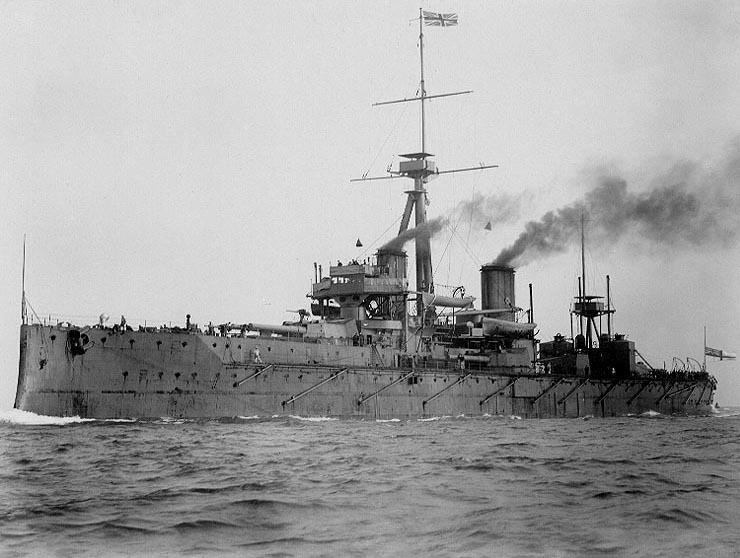
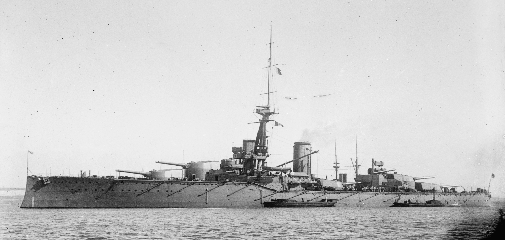
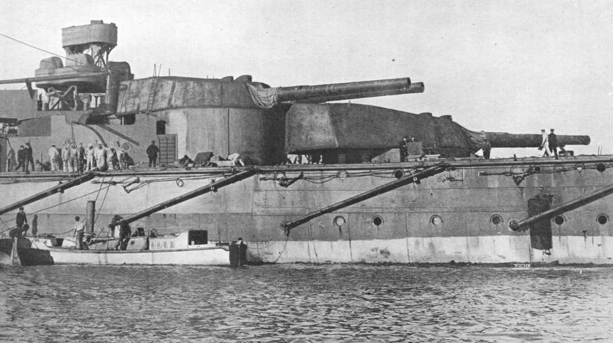
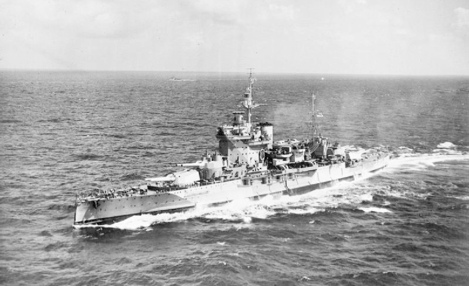
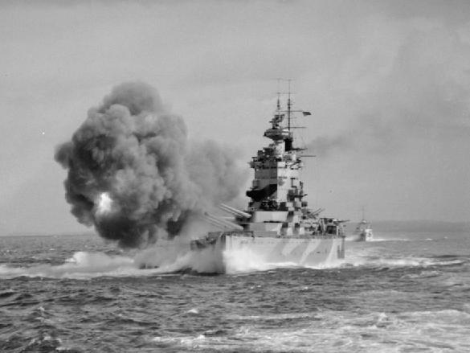
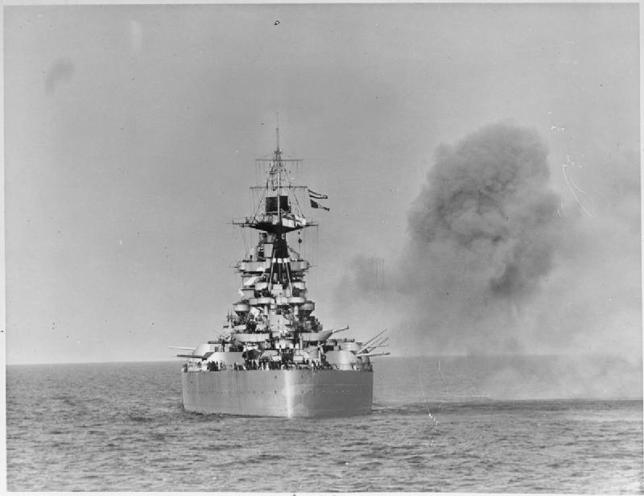
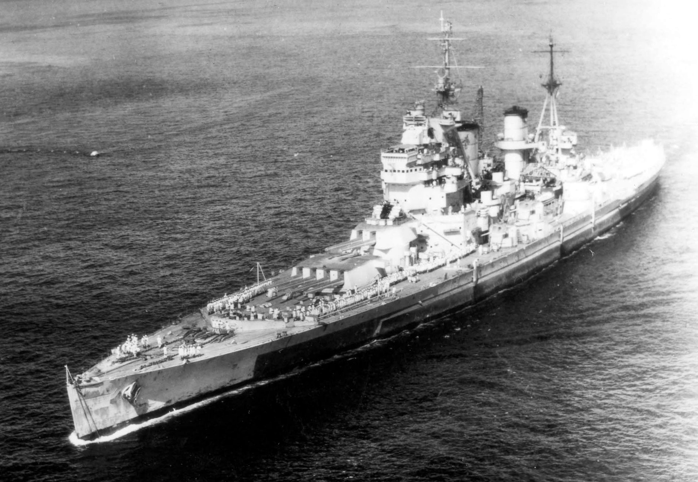

# 英国战列舰

---

## 简介

---

## 各时期战列舰列表

### 无畏舰（1906-1910）

| 船名（中文） |  船名（英文）   |    级别    | 下水年份 | 服役年份 |
|:------------:|:---------------:|:----------:|:--------:|:--------:|
|    无畏号    | HMS Dreadnought |   无畏级   |   1906   |   1906   |
|  柏勒洛丰号  | HMS Bellerophon | 柏勒洛丰级 |   1907   |   1909   |
|    壮丽号    |   HMS Superb    | 柏勒洛丰级 |   1907   |   1909   |
|    鲁莽号    |  HMS Temeraire  | 柏勒洛丰级 |   1907   |   1909   |
|  圣文森特号  | HMS St.Vincent  | 圣文森特级 |   1908   |   1909   |
|  科林伍德号  | HMS Collingwood | 圣文森特级 |   1908   |   1910   |
|    前卫号    |  HMS Vanguard   | 圣文森特级 |   1909   |   1910   |
|   涅普顿号   |   HMS Neptune   |  涅普顿级  |   1909   |   1911   |
|    巨像号    |  HMS Colossus   |   巨像级   |   1910   |   1911   |
|  赫丘利斯号  |  HMS Hercules   |   巨像级   |   1910   |   1911   |

### 超无畏舰（1910-1945）

* **俄里翁级战列舰**（Orion class）（1910-1911）（同级舰 4 艘）
  * 俄里翁号（HMS Orion）
  * 君主号（HMS Monarch）
  * 征服者号（HMS Conqueror）
  * 雷神号（HMS Thunderer）
* **英王乔治五世级战列舰** （1911 年）（King George V class）（1911-1912）（同级舰 4 艘）
  * 英王乔治五世号（HMS King George V）
  * 百夫长号（HMS Centurion）
  * 大胆号（HMS Audacious）
  * 埃阿斯号（HMS Ajax）
* **铁公爵级战列舰**（Iron Duke class）（1912-1913）（同级舰 4 艘）
  * 铁公爵号（HMS Iron Duke）
  * 马尔博罗号（HMS Marlborough）
  * 本鲍号（HMS Benbow）
  * 印度皇帝号（HMS Emperor of India）
* **爱尔兰号战列舰**（HMS Erin）（1913）
* **加拿大号战列舰**（HMS Canada）（1913）
* **伊丽莎白女王级战列舰**（Queen Elizabeth class）（1913-1915）（同级舰 5 艘）
  * 伊丽莎白女王号（HMS Queen Elizabeth）
  * 厌战号（HMS Warspite）
  * 巴勒姆号（HMS Barham）
  * 英勇号（HMS Valiant）
  * 马来亚号（HMS Malaya）
* **复仇级战列舰**（Revenge class）（1914-1916）（同级舰 5 艘）
  * 复仇号（HMS Revenge）
  * 皇家橡树号（HMS Royal Oak）
  * 君权号（HMS Royal Sovereign）
  * 决心号（HMS Resolution）
  * 拉米利斯号（HMS Ramillies）
  * **纳尔逊级战列舰**（Nelson class）（1925）（同级舰 2 艘）
  * 纳尔逊号（HMS Nelson）
  * 罗德尼号（HMS Rodney）
* **英王乔治五世级战列舰** （1936 年）（King George V class）（1939-1940）（同级舰 5 艘）
  * 英王乔治五世号（HMS King George V）
  * 威尔士亲王号（HMS Prince of Wales）
  * 约克公爵号（HMS Duke of York）
  * 安森号（HMS Anson）
  * 何奥号（HMS Howe）
* **前卫号战列舰**（HMS Vanguard）（1944）

---

##  英国部分战列舰介绍 

###  无畏号 

> [!tip]
> 无畏号（英语：HMS Dreadnought），英国皇家海军的一种划时代设计的战列舰。它出现了很多现代军舰的特征，远优于同时期的同类军舰，而之后的火力改进，更在 20 世纪初期导致了列强之间的海军军备竞赛。

**无畏号 技术数据**

|    数据项    |                                                                                                          数据值                                                                                                           |
|:------------:|:-------------------------------------------------------------------------------------------------------------------------------------------------------------------------------------------------------------------------:|
|  **排水量**  |                                                                          18120 长吨（18410 公吨）（标准）   20730 长吨（21060 公吨）（满载）                                                                           |
|   **全长**   |                                                                                                   527 英尺（160.6 米）                                                                                                    |
|   **全宽**   |                                                                                                 82 英尺 1 英寸（25.0 米）                                                                                                 |
|   **吃水**   |                                                                                            29 英尺 7.5 英寸（9.0 米）（满载）                                                                                             |
|   **动力**   |                                                                                          4 轴   帕森斯直接驱动蒸汽涡轮发动机                                                                                           |
| **最高速度** |                                                                                                           21 节                                                                                                           |
| **续航距离** |                                                                                              以 10 节速度航行时为 6,620 海里                                                                                              |
|   **乘员**   |                                                                                                      700 人－810 人                                                                                                       |
| **武器装备** |                                                        5×双联装 BL 12 英寸 Mk X 主炮   27×单管 QF 12 磅 18 英寸 Mk I 副炮   5×18 英寸（450 毫米）鱼雷发射管                                                         |
|   **装甲**   | 水线装甲带：4～11 英寸（102～279 毫米）  甲板：0.75～3 英寸（19～76 毫米）  炮座：4～11 英寸（102～279 毫米）  炮塔：3～12 英寸（76～305 毫米）  司令塔：11 英寸（279 毫米）  水密舱壁：8 英寸（203 毫米） |

**设计特点**

无畏号为长艏楼船型，取消一般战列舰的船艏水下撞角。其最大不同是「全装重型火炮（All-Big-Gun）」，十门主炮都是 12 英寸口径，分成五座双联装炮塔。艏艉各一座，舯部舰体中心线一座，在锅炉舱后方；两舷对称各一座，在二个锅炉舱之间。因此，单侧舷火力最大为主炮八门，向前火力最大为主炮六门，各主炮射击性能一致并配合火力控制系统，无畏号整体攻击火力大幅提升。副炮口径仅 3 英寸以下，用以防御小型鱼雷艇等（注：「艏」音同首，造船工程学的船首；「舯」音同中，指船中央部分；「艉」音同尾，指船尾部）。5 门鱼雷发射管装设在吃水线下方，并在船侧身加挂钢制防鱼雷网。

无畏号是第一个使用了 4 台蒸汽涡轮推进机组的大型战舰，功率大于旧式往复式蒸汽机组，其 21 节的最高航速超过既有的任何战列舰，使得虽有的巨大吨位，在追逐与躲避仍能十分灵活。长时间高速行驶的可靠性也很好，恶劣天气也能出海作战，并对官兵的工作和生活环境条件都有了明显的改善，确保了人员的士气与战力。无畏号的设计也获得了更加强的生存力，该舰种安装的内外防护工程均经过设计，全面防御能力不下于任何战舰，装甲以表面硬化处理，重要部位的厚度高达 11 英寸。水线下的水密隔舱不设横向联络门，以加强水密结构，提高抗沉能力。

**服役生涯**

1907 年 12 月 3 日才正式服役，并担任英国皇家海军各本土舰队的旗舰，直到 1912 年。

第一次世界大战中的 1916 年 3 月 18 日，无畏号在北海撞沉德国 U-29 号潜艇，由于入坞维修而错过了日德兰海战。1916－1918 年派往泰晤士河口巡逻。1919 年转入后备役。1921 年出售拆毁。

**影响**

> 无畏号革新武备、动力、防护等各方面的传统观念，其火力和动力装置的设计更具革命性，可以说是近代造船工业化经验与成就指标，当时各海军强国非常重视，纷纷把旧战列舰快速更新换代，比照而建成新型战列舰舰队，产生新一轮海军军备竞赛。无畏号代表战列舰技术的重要分水岭，是 19 世纪列强海军不断演进的集大成者，一般通称其同类为「无畏舰」，之前的战列舰则称作「前无畏舰」。

---

### 俄里翁级战列舰

1909 年英国为应付与德国之间海军造舰竞赛的压力，通过开工 8 艘主力舰的庞大追加预算，回应德国海军的挑战。英国皇家海军全新设计的四艘猎户座级战列舰于 1909 年 11 月 29 日 -1910 年 4 月开工，重点提升了火力，与以往英国建造的战列舰完全不同，在英国被称为「超级无畏级」战列舰，并成为后续英国超级无畏舰乔治五世国王级战列舰、铁公爵级战列舰的设计蓝本（也被称为 1909 型战列舰）。为保持英国海军在火力方面的优势地位，安装 10 门新的 13.5 英寸口径主炮取代原先的 12 英寸口径，并用更重的炮弹。之前的 12 英寸/ 50 倍口径长身管的主炮存在散布大以及相当大的烧蚀的问题。首次在英国皇家海军无畏舰上采用主炮塔全部沿舰体纵向中轴线布置的形式，5 座双联装主炮主炮塔，炮塔舰体艏艉呈背负式各布置两座，舯部一座，便于全部主炮发扬同舷侧射火力。猎户座级进一步加强了要害区域的防御装甲。为控制重量，猎户座级取消了以往英国战列舰标志性的后部主桅杆，相比后续的英国超级无畏舰前部主桅截然不同的置于前烟囱之后。

1912 年英国皇家海军在雷神号战列舰上首次安装了「中央火力控制系统」，由皇家海军军官珀西·斯科特爵士发明的射击指挥仪安装在主桅杆的平台上。在主炮齐射时可以集中观测校正弹着点、统一解算射击诸元，火炮根据指令调整方向对准目标变得相对容易，命中率成倍提高。1912 年 11 月在猎户座号和雷霆号之间进行射击对比试验，安装了射击指挥方位盘的雷霆号命中率为猎户座号的 6 倍。

**俄里翁级 技术数据**

| 数据项 | 数值 |
| :---: | :---: |
| 舰型 | 超无畏舰 |
| 排水量 | 22,000 长吨（标准）    25,870 长吨（满载） |
| 全长 | 581 英尺（177.1 米）|
| 全宽 | 88 英尺（26.8 米）|
| 吃水 | 24 英尺（7.3 米）|
| 动力来源 | 主机输出功率 27000 马力 |
| 速度 | 21 节（38.9 千米每小时）|
| 续航距离 | 10 节 续航 6,730 海里 |
| 乘员 | 750–1100|
| 武器装备 | 10 × BL 13.5 英寸 /45 倍径 Mk V 主炮 (5×2)   16 × BL 4 英寸 Mk VII 副炮 (16×1)   3 × 21 英寸（533 毫米）水下鱼雷管 |
| 装甲 | Belt: 12 英寸（305 mm）  防水舱: 10 英寸（254 mm）  甲板: 4 英寸（102 mm）  炮塔: 11 英寸（279 mm）  炮座: 10 英寸（254 mm）|

**同级舰**

|          舰名          |        建造商         |        下水        |        服役        |
|:----------------------:|:---------------------:|:------------------:|:------------------:|
|   俄里翁号 HMS Orion   |   朴次茅斯海军基地    | 1910 年 8 月 20 日 | 1912 年 1 月 2 日  |
|   君主号 HMS Monarch   | 阿姆斯特朗 - 惠特沃斯 | 1911 年 3 月 30 日 | 1912 年 4 月 27 日 |
| 征服者号 HMS Conqueror |     博德摩尔船厂      | 1911 年 5 月 1 日  | 1912 年 12 月 1 日 |
|  雷神号 HMS Thunderer  |      泰晤士钢铁       | 1911 年 2 月 1 日  | 1912 年 6 月 15 日 |

**服役生涯**

「俄里翁」级的四艘姐妹战舰都参与了日德兰海战，在开战后，俄里翁级四艘舰被编入了大舰队，在日德兰海战爆发时，「俄里翁」号作为第二战列舰分舰队的第二战列舰中队旗舰，同其他三艘俄里翁级组成了第二战列舰分舰队的第二战列舰中队。

一战结束后，根据《华盛顿海军条约》的规定而报废。其中君主号担任了炮击和轰炸的目标靶舰，雷神号曾作为训练舰从 1922 年至 1926 年报废。

---

### 伊丽莎白女王级战列舰

20 世纪初期第一次世界大战前夕，各海军强国围绕建造无畏舰展开海军军备竞赛，各国海军正计划建造安装更大口径主炮和加强装甲防护的超级无畏级战列舰；在 1905 年后英德海军造舰竞赛日趋白热化，研发更新更好造更多的战舰成为显学，英国人声称德国额外每增加建造一艘主力舰英国就将造两艘作为回应。本级舰被视为第一款问世之 [高速战列舰](Battleships.md#高速战列舰)。

英国皇家海军在 1912 年研发出成功的第五型 13.5 英寸舰炮，装备在俄里翁级战舰以后服役的战舰上，但是英国得知马肯森级战斗巡洋舰将装备 35 公分（13.8 英寸）舰炮。为巩固皇家海军在战舰火力上的优势地位，海军大臣丘吉尔极力主张为 1912 年即将开工的新战舰开发更强大的 15 英寸舰炮，海洋军事部（英语：Admiralty）评估研发新炮需要 1-2 年的时间，过去的经验是先开发出火炮再兴建可使用的战舰，并没有同时造舰兼开发的往例，假如研发延宕，即有可能让斥资钜额的战舰面临困境，不过开发单位不负上层所望达成需求。新型炮出于保密，对外声称口径为 14 英寸。

伊丽莎白女王级原始布局是效仿铁公爵级战舰，配备 5 座双连装炮塔，极速 21 节。但是在狮级战斗巡洋舰研发经验中，英国工程师了解到取消船体中央的 Q 炮塔可以为整个轮机系统争取到更多可用空间，并让战舰获得额外动力去增强防御，且 15 吋炮的弹头投射能量足以取代一座双连装炮塔，因此主炮采用 4 座双联装，布局采用艏艉对称在舰体中心线上呈背负式各布置两座。

除了火炮设计思维的变更，伊丽莎白女王级同时也是英国皇家海军首批次运用 **全重油锅炉动力** 设计的战舰。皇家海军建设指挥部提供的评估报告认为全重油锅炉设计技术上已可行，海军上将费舍尔也赞成未来战舰运用石油作为轮机动力的概念；相较煤炭，同体积的石油蕴含更大的能量密度，后勤补给较为简便，同时也比较不会产生浓烈的燃烧黑烟；只是在 1910 年代不产石油的英伦三岛要如何确保维持战舰操作的燃料储备是个较考验高层手腕的问题；丘吉尔因此介入英伊石油公司合约，确保战争时皇家海军石油来源无虑。使用全重油推进的伊丽莎白女王级因此获得 25 节极速，接近当时战列巡洋舰的航行速度；英国海军战舰编组上原先是 3 艘主力战舰配合 1 艘战斗巡洋舰，借由战斗巡洋舰的高速争取在海战时抢位优势；因为伊丽莎白女王级具有比当时战舰更加优势的航速，因此在这批订单中直接采购了 4 艘本级舰，不再搭配战斗巡洋舰编组。新建五号舰是因为马来亚自治领提供造舰预算，并不在原订计划当中；在皇家海军的文书资料中已经排入六号舰，该舰将命名为阿金科特，但造舰预算并无着落，最后六号舰的计划在 1914 年取消，而阿金科特号战舰这个舰名则给予征收自为奥斯曼帝国承造的苏丹奥斯曼一世号战舰。

**伊丽莎白女王级 技术数据**

|   **数据项**   |                                                                                                                          数据                                                                                                                           |
|:--------------:|:-------------------------------------------------------------------------------------------------------------------------------------------------------------------------------------------------------------------------------------------------------:|
| **满载排水量** |                                                                                                              33020 吨   改装后 36300 吨                                                                                                              |
|    **全长**    |                                                                                                                         195 米                                                                                                                          |
|    **全宽**    |                                                                                                                27.4 米 (改装后 31.7 米)                                                                                                                 |
|    **吃水**    |                                                                                                                         9.2 米                                                                                                                          |
|    **燃料**    |                                                                                                                          柴油                                                                                                                           |
|    **锅炉**    |                                                                                                                 24 台锅炉 (改装后 8 台)                                                                                                                 |
|    **功率**    |                                                                                                            75000 马力 （改装后 85000 马力）                                                                                                             |
|  **最高速度**  |                                                                                                                25 节 （改装后 23.5 节）                                                                                                                 |
|  **续航距离**  |                                                                                                                   8,600 海里/12.5 节                                                                                                                    |
|    **乘员**    |                                                                                                                925 人 （改装后 1124 人）                                                                                                                |
|  **武器装备**  | 4 座双联装 15 英寸/ 42 倍口径主炮（共 8 门）  12 门 6 英寸 / 45 倍口径副炮   2 门 76 毫米炮   533 毫米鱼雷发射管 4 具   40 毫米和 20 毫迈克尔射炮众多   伊丽莎白女王号、勇士号 1937 年改装中拆除副炮改装 4.45 英寸口径双联装高平炮 10 座 |
|    **装甲**    |                                                          侧舷装甲带（最大）13 英寸   主甲板 2.5-5 英寸   炮塔（正面）13 英寸   炮座 10 英寸   司令塔 11 英寸   装甲总重 8100 吨                                                          |

**服役历程**

一战:

一号舰伊丽莎白女王号 1912 年 10 月 21 日开工，各舰在 1912 年 10 月至 1913 年期间相继开工，单舰造价大约 240 万英镑。原来计划伊丽莎白女王级安装 16 门炮郭式 6 英寸副炮，伊丽莎白女王号建成后发现位于后部炮塔舰体两舷的 4 门炮位置比较低（炮位比其他 6 英寸副炮降低一层甲板），易受海浪冲刷而无法使用，完工不久就拆除了，其他各舰均未安装。

1915 年 2 月 25 日伊丽莎白女王号参加了对土耳其苏都巴哈土军阵地的轰击。这次对岸炮击行动是英国海军第一次在实战中使用 381 毫米火炮，1916 年 5 月 22 日进入干船坞进行大修。

1916 年 5 月 31 日在日德兰海战中，4 舰同级舰（伊丽莎白女王号回国入坞维修，错过参战）编成第 5 战舰中队（指挥官休·埃文·托马斯海军少将，旗舰巴勒姆号战舰），海战中支援前卫，迎战由弗朗兹·冯·希佩尔将军指挥的德国海军第 1 侦查集群；就德国公海舰队司令赖因哈德·舍尔陈述：「她们以绝佳的速度与准确性开火」。

海战中，第 5 战舰中队重创了吕佐号战斗巡洋舰、塞德利茨号战斗巡洋舰等舰艇，15 英寸舰炮足够在德国战舰射程外优先开火，让德方陷入被动；不过第 5 战舰中队除旗舰外仍受到轻重不等的创伤，其中受创最重者为厌战号战舰，她因操舵装置失灵卡死右转，因此在海战中曾开入德国舰队射程内，遭到德国舰队击火重创，至少被击中 15-18 发大口径炮弹。海战结束后受伤各舰均在两个月内修复。1916 年 11 月伊丽莎白女王号接替铁公爵号战舰成为皇家海军大舰队旗舰。

二战:

第二次世界大战中该级舰被广泛使用，战争前期该级舰长期在地中海海域作战。尤其是厌战号多次受创伤而最终安然无恙，成为二战中英国海军的传奇战舰。即使是现代化改装项目较少的马来亚号也曾经吓阻过德国肖恩霍斯特号和格奈森瑙号对英国船队的袭击。1940 年 4 月，厌战号调回英国参加挪威战役，在纳尔维克率领驱逐舰围歼了一支德国驱逐舰分舰队。1940 年 7 月，厌战号在地中海卡拉布里亚海战中，命中 26400 码外的意大利战列舰，这是经确认的战列舰最远距离炮击命中纪录。1941 年 3 月马塔潘角海战中，厌战号、英勇号、巴勒姆号为首的英国舰队夜战中击沉了意大利 3 艘重巡洋舰。1941 年马来亚号、厌战号先后受创，根据租借法案开往美国（美国尚未参战）修理。巴勒姆号 1941 年 11 月在地中海被德国潜艇发射 3 枚鱼雷击中沉没。在太平洋战争爆发后，1942 年 1 月厌战号一度加入英国远东舰队成为旗舰。

1941 年 12 月，伊丽莎白女王号和英勇号在亚历山大港内遭到意大利海军蛙人袭击坐沉海底，打捞修复后于 1943 年先后加入英国远东舰队参加对日本作战。1943 年厌战号、英勇号参加了在西西里岛与意大利本土的登陆战役，9 月厌战号在萨莱诺被无线电遥控滑翔炸弹击中丧失了战斗力。1944 年 6 月，厌战号、马来亚号参加了诺曼底登陆战役。

战争结束之后，伊丽莎白女王级战列舰于 1947 年 -1948 年相继退役解体。

**同级舰列表**

|                  舰名                   | 舷号 |         建造商         |      下水日期       |      服役日期       |                备注                 |
|:---------------------------------------:|:----:|:----------------------:|:-------------------:|:-------------------:|:-----------------------------------:|
| 伊丽莎白女王号   HMS Queen Elizabeth |  00  |    朴资茅斯海军船坞    | 1913 年 10 月 16 日 | 1914 年 12 月 22 日 |            1948 年被拆解            |
|        厌战号   HMS Warspite         |  03  |    朴资茅斯海军船坞    | 1913 年 11 月 26 日 |  1915 年 3 月 8 日  |            1950 年被拆解            |
|         英勇号   HMS Valiant         |  02  | Fairfield Shipbuilding | 1914 年 11 月 4 日  | 1916 年 1 月 13 日  |            1948 年被拆解            |
|         巴勒姆号   HMSBarham         |  04  |       John Brown       | 1914 年 10 月 31 日 | 1915 年 10 月 19 日 | 1941 年 11 月被德军潜艇发射鱼雷击沉 |
|        马来亚号   HMS Malaya         |  01  | 阿姆斯特朗 - 威特沃斯  | 1915 年 3 月 18 日  |  1916 年 2 月 1 日  |            1948 年被拆解            |

---

### 纳尔逊级战列舰

英国在华盛顿海军条约限制下建造的一型 35000 吨级、装备 16 英寸主炮的战列舰。也是过去放弃的 N3 级战舰之缩小改良版，该型共有纳尔逊号、罗德尼号两艘。

**服役历程**

第一次世界大战结束后，英国曾计划建造 N3 型战列舰，因《华盛顿海军条约》签定而夭折。1922 年英国在条约规定的吨位内开始建造纳尔逊级战列舰。纳尔逊级采用平甲板船型，不再是以往英国战舰常用的艏楼船型。根据日德兰海战的经验教训着重提升装甲防护水准，首次采用倾斜布置水线装甲带，是当时舷侧装甲最厚的战舰。受条约规定 35000 吨的限制，纳尔逊级采用 3 座三联装主炮炮塔全部在舰桥之前，而动力机舱集中配置在舰体后部这种非常规的布局，目的是将有限的重装甲防护区最大限度集中在重点部位，但是这样的设计造成主炮存在后方死角的缺陷，且密集排列的主炮一旦下方弹药库失火，连锁反应也令人担忧。受条约规定排水量的限制，决定在一定程度上牺牲动力性能，航速较慢 (比较伊丽莎白女王级战列舰)。纳尔逊级安装 16 英寸口径主炮，全炮塔化的双联装 6 英寸口径高平两用副炮。但其高速轻弹在实战中被证明效率低下，其使用的 Mark I 16 寸炮弹在远距存速急剧下降导致炮弹贯穿力不足，远距离贯穿深度只相当于旧式的 Mark I 15 英寸舰炮和新式的 Mark VII 14 英寸舰炮，更无法和同期的美国 Mark I 16 英寸舰炮、日本三年式 410 毫米舰炮相比。并且该舰 23 节的最大速度在二战中不合适伴随高速部队如航母编队等行动，适航性、稳定性也不理想。因而在英国海军中地位不高，甚至低于一战前动工的伊丽莎白女王级战列舰。同级舰：纳尔逊号（Nelson）、罗德尼号（Rodney）。

两艘纳尔逊级战列舰 1927 年完工。纳尔逊级战列舰与日本的两艘长门级战列舰、美国的三艘科罗拉多级战列舰等 7 艘拥有最大口径火炮的战列舰，被各国海军人士称为「七巨头」（Big Seven）。第二次世界大战时，除罗德尼号参加了围歼德国俾斯麦号战列舰的海战外，该级舰大多是执行护航和为登陆行动提供火力支援的任务。1944 年纳尔逊号参加了诺曼底战役。1945 年纳尔逊号开赴印度洋参加针对日本的作战行动，纳尔逊号见证了日军在印度尼西亚群岛的受降行动。战后，两艘纳尔逊级战列舰先后退役拆解。

_profile_drawing.png)

**纳尔逊级 技术数据**
| 数据项 | 数据 |
| :----: | :----: |
| **标准排水量**  | 33,950 吨 |
| **满载排水量**   | 38,000 吨 |
| **全长** | 216.5 米 |
| **全宽** |32.3 米 |
| **动力** | 两座寇蒂斯蒸汽轮机   双轴驱动 |
| **功率**   | 45,000 匹马力                       |
| **最高速度** | 23.8 节 |
| **续航距离**   | 7,000 海里（16 节）5,500 海里（23 节） |
| **乘员** |  1,314-1,640 人            |
| **武器装备**| 3 座三连装 45 倍径 16 英寸主炮   6 座二连装 50 倍径 6 英寸副炮   6 门单装 4.7 英寸高射炮   8 门 40 毫米机炮   2 门 622 毫米鱼雷发射管   二战时   3 座三连装 45 倍径 16 英寸主炮   6 座二连装 50 倍径 6 英寸副炮   6 门单装 4.7 英寸高射炮   6 座 8 连装 40 毫米砰砰机炮   4 座 4 连装 40 毫米波佛斯机炮   2 门 622 毫米鱼雷发射管 |
| **装甲** | 水线装甲带：356 毫米（倾斜 18-22 度）  甲板：152 毫米   炮塔（正面）406 毫米（第三炮塔 457 毫米）（侧面） 229 毫米   炮座 381 毫米   舰桥 330 毫米|

**同型舰**

|     船名     | 旗号数 |              制造厂               |      下水日期       |      服役日期      |     结局      |
|:------------:|:------:|:---------------------------------:|:-------------------:|:------------------:|:-------------:|
| 纳尔逊号战舰 |   28   |       阿姆斯特朗 - 威特沃斯       |  1925 年 9 月 3 日  | 1927 年 8 月 15 日 | 1949 年被拆卸 |
| 罗德尼号战舰 |   29   | 卡梅尔 - 赖德	1925 年 12 月 17 日 | 1927 年 11 月 10 日 |   1948 年被拆卸    |               |

---

### 英王乔治五世级战列舰 （1936 年）

英国于 1930 年代末建造的一级战列舰，也是二战前英国建造的最后一级战列舰。其设计遵守 1936 年第二次伦敦海军条约（限制战列舰的标准排水量不超过 35000 吨，主炮口径不大于 14 英寸即 356 毫米）的规定，是典型的条约型战列舰。同级舰有英王乔治五世号（HMS King George V ）、威尔士亲王号（HMS Prince of Wales）、约克公爵号（HMS Duke of York）、安森号（HMS Anson）、豪号（HMS Howe）5 艘。

**建造背景**

第一次世界大战结束后，英国、法国、美国、日本、意大利等国先后签订了华盛顿海军条约与伦敦海军条约，保证将新战列舰的建造冻结到 1936 年 12 月。1936 年初，美、英、法等国签署了第二次伦敦海军条约，规定战列舰的标准排水量不超过 35000 吨，主炮口径不大于 14 英寸，但不再限制战列舰的数量。于是，各海军强国又出现了建造战列舰的热潮。

虽然面临造价问题、针对战列舰是否过时的争论和调集人力、物力上的问题，英国皇家海军仍然认为需要拥有与潜在对手相当的战列舰。为了新的战列舰能赶在 1937 年初开始建造，1940 年服役，英国海军参考谈判进展，取消了建造装备 15 英寸以上口径主炮战列舰的计划，决定推荐排水量 35000 吨，安装 3 座四联装 356 毫米口径主炮，航速 26 节的战列舰方案。1936 年，英国海军部批准了建造 5 艘英王乔治五世级战列舰的方案。

1936 年，日本宣布退出裁军会议，意大利也未在条约上签字，美国则宣布只有在日本遵守条约限制的情况下美国才不会突破条约限制。结果 1937 年初匆忙开工的英王乔治五世级战列舰的 356 毫米（14 英寸）主炮口径是同时代战列舰中最小的，弹丸重量最轻，威力最低。而在建造时由于设计排水量限制节省重量的原因，最终主炮数量由 12 门又减少为 10 门，数量上的优势也消失了。但是该级舰的水线装甲带仅次于日本大和级。

**英王乔治五世级（1936） 技术数据**

|    数据项    |                                                                                   数据                                                                                   |
|:------------:|:------------------------------------------------------------------------------------------------------------------------------------------------------------------------:|
|  **排水量**  |                                                               标准排水量 35000 吨   满载排水量 40580 吨                                                               |
|   **全长**   |                                                                          227 米 水线长 225.5 米                                                                          |
|   **全宽**   |                                                                                 31.4 米                                                                                  |
|   **吃水**   |                                                                                 10.8 米                                                                                  |
| **燃料柴油** |                                                                           锅炉八具三鼓蒸气锅炉                                                                           |
|   **动力**   |                                                                       四轴三叶螺旋桨 125,000 马力                                                                        |
| **最高速度** |                                                                                  29 节                                                                                   |
| **续航距离** |                                                                            15000 海里/ 10 节                                                                             |
|   **乘员**   |                                                                             1,314 - 1,631 人                                                                             |
| **侦搜系统** |                                                                                   雷达                                                                                   |
| **武器装备** | 10 门 14 英寸/ 45 倍口径主炮（两座四联装炮塔，一座双联装炮塔）  16 门 133 毫米/ 50 倍口径高平两用炮   32-48 门双联装 40 毫米及 20 毫米高射炮   大量 12.7mm 机枪 |
|   **装甲**   |                   舷侧装甲带：13.7-14.7 英寸 艏艉水线 4.4-5.4 英寸   甲板 7 英寸   炮塔（正面）13 英寸   炮座 13 英寸   装甲总重：12612 吨                   |
|  **舰载机**  |                                                                              四架海象侦察机                                                                              |

_at_Devonport,_March_1945.jpg)

**服役历程**

**英王乔治五世号**

英王乔治五世号 1937 年 1 月 1 日于维克斯·阿姆斯特朗船厂开工，1939 年 2 月 21 日下水，1940 年 12 月 11 日服役。服役后担任英国皇家海军本土舰队旗舰。

1941 年 5 月 22 日，参加对德国俾斯麦号战列舰的搜寻。5 月 27 日与其交火并命中。当日俾斯麦号战沉。在交火中它和威尔士亲王一样受到机械故障和不熟练水兵的错误操作的困扰：在 284 雷达的指引下,它在 0853-0913 时的 34 次齐射中取得了 14 次跨射,而从 0920 时一个炮塔失灵,最后每门炮都由于防焰锁定机构的问题经历过一次错过齐射。10 门炮中有 5 门变得无法发射直到最后,而 A 炮塔 3 号炮两次失控开火因此被关闭了半小时。

1941 年 10 月～1942 年 5 月，为前往苏联的护航运输队护航。

1944 年 10 月～1945 年 9 月，加入英国太平洋舰队，参加对日作战。

1945 年 10 月～1946 年 12 月，作为本土舰队旗舰。

后改为训练舰，1950 年转预备役，1957 年拆毁。

**威尔士亲王号**

1937 年 1 月 1 日在卡梅尔·赖德船厂开工，1939 年 5 月 3 日下水，1941 年 3 月 31 日服役。

1941 年 5 月，在尚未完成测试调试时，就和胡德号战列巡洋舰一起参加了堵截德国海军俾斯麦号战列舰的行动。1941 年 5 月 24 日在丹麦海峡海战中，开火命中俾斯麦号，造成后者航速下降及燃油流失。胡德号被击沉后，被命中 7 弹且受主炮故障困扰的威尔士亲王号退出战斗。

1941 年 8 月，威尔士亲王号运载首相丘吉尔到纽芬兰，签署了著名的《大西洋宪章》。

1941 年，同反击号战列巡洋舰一起加入英国远东舰队（Z 舰队），12 月 2 日到达新加坡。12 月 10 日在马来亚海域由于缺乏空中掩护被日军轰炸机击沉。威尔士亲王号被 6 枚鱼雷和 1 颗炸弹命中。

**约克公爵号**

1937 年 5 月 5 日在约翰·布朗造船厂开工，1940 年 2 月 28 日下水，1941 年 11 月 4 日服役。

1942 年 3 月～10 月，为前往苏联的护航运输队护航，之后参加火炬行动。

1943 年 12 月，在为前往苏联的护航运输队护航途中击沉德国肖恩霍斯特号战列巡洋舰。

1945 年 4 月，加入英国太平洋舰队，随后返回英国成为本土舰队旗舰。

1957 年拆毁。

**安森号**

1937 年 7 月 20 日在斯旺·亨特和怀姆·理查德森船厂开工，1940 年 2 月 24 日下水，1942 年 6 月 22 日服役。

1942 年 9 月起为前往苏联的护航运输队护航。

1944 年 4 月，参加围歼德国提尔皮茨号战列舰的“钨素行动”。

1945 年 4 月，加入英国太平洋舰队。

1949 年转预备役，1957 年拆毁。

**何奥号**

1937 年 6 月 1 日在费尔菲尔德船厂开工，1940 年 4 月 9 日下水，1942 年 8 月 20 日服役。

1942 年 12 月～1943 年 5 月，编入本土舰队。

1943 年 7 月，参加入侵意大利。

1944 年，成为英国太平洋舰队的旗舰，参加对日作战。

1946 年转为训练舰，1951 年转后备役，1958 年拆毁。

---

