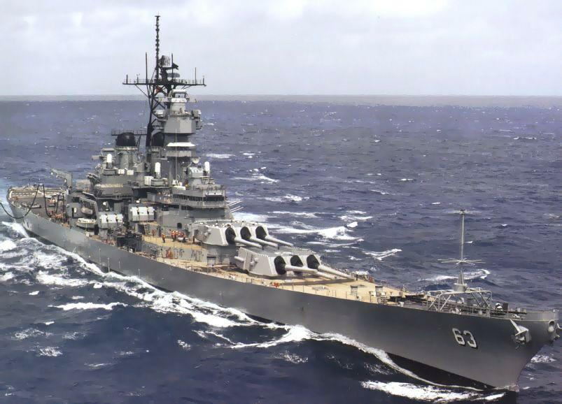

# 美国战列舰

---

## 简介

美国的战列舰大致上可以粗分为前无畏舰、无畏舰、第一至第二次世界大战过渡时期，与第二次世界大战四个不同时期的舰种。唯一的例外是缅因号与德克萨斯号，这两艘战列舰并无法归类至前述四种类型中。

**命名规则**

美国军舰的命名是由美国海军部长亲自决定的。1898 年 5 月 4 日通过的一项法令规定：美国海军所有一等战列舰和浅水重炮舰应以联邦各州的州名命名，不得以任何城市名、地名或人名来命名，除非备选的州名已全部使用完毕，且这些城市名、地名或人名不会和现有的州名混淆 [1]。唯一的例外是奇沙治号（USS Kearsage BB-5），是以南北战争期间非常活跃的北军战斗用单桅纵帆船（Sloop-of-war）奇沙治号为命名来源，至于后者则是以新罕布什尔州境内的奇沙治山作为命名。美国的 50 个州中不曾“拥有”战列舰的州有是蒙大拿州、阿拉斯加州及夏威夷州。由于二战结束且战列舰在海军的地位已逐渐被航空母舰取代，蒙大拿级战列舰的建造项目仅在纸上规划的阶段就遭到中止，从未被制造出来过。阿拉斯加及夏威夷则在停止建造战列舰后的 1959 年才正式成为美国州份。

每年，美国海军历史中心通过指挥链为海军作战部长提供一批主选和备选的舰名，随后由作战部长将该年度造船计划可用的舰名以备忘录的形式推荐给海军部长，由其从中挑选合适的名字命名新建造的战列舰。总体而言，美国战列舰舰名的选择没有严格的规律，但从 1901 年的伊利诺伊号战列舰开始，如果每级内有两艘，则以梅森 - 迪克森线南北各一个州来命名。如 1941 年的北卡罗来纳级战列舰中的华盛顿号源北方州、北卡罗来纳号源自南方州；如果每级内有三艘、四艘或六艘，也必定至少包含一艘以南方州命名的战列舰。如新墨西哥级战列舰中的密西西比号、科罗拉多级战列舰中的西弗吉尼亚号和马里兰号、以及衣阿华级战列舰中的密苏里号等，都是源于南方州。

## 美国战列舰列表

| 船舰编号 | 舰名 | 级别 |
| :---: | :---: | :---: |
| 无编号 | Maine 缅因号 | 无级别 |
| 无编号 | Texas 德克萨斯号 | 二等战列舰 |
| BB-1 | Indiana 印第安纳号 | 印第安纳级 |
| BB-2 | Massachusetts 马萨诸塞号 | 印第安纳级 |
| BB-3 | Oregon 俄勒冈号 | 印第安纳级 |
| BB-4 | Iowa 衣阿华号 | 印第安纳级 |
| BB-5 | Kearsarge 奇沙治号 | 奇沙治级 |
| BB-6 | Kentucky 肯塔基号 | 奇沙治级 |
| BB-7 | Illinois 伊利诺伊号 | 伊利诺伊级 |
| BB-8 | Alabama 亚拉巴马号 | 伊利诺伊级 |
| BB-9 | Wisconsin 威斯康辛号 | 伊利诺伊级 |
| BB-10 | Maine 缅因号 | 缅因级 |
| BB-11 | Missouri 密苏里号 | 缅因级 |
| BB-12 | Ohio 俄亥俄号 | 缅因级 |
| BB-13 | Virginia 弗吉尼亚号 | 弗吉尼亚级 |
| BB-14 | Nebraska 内布拉斯加号 | 弗吉尼亚级 |
| BB-15 | Georgia 佐治亚号 | 弗吉尼亚级 |
| BB-16 | New Jersey 新泽西号 | 弗吉尼亚级 |
| BB-17 | Rhode Island 罗德岛号 | 弗吉尼亚级 |
| BB-18 | Connecticut 康涅狄格号 | 康涅狄格级 |
| BB-19 | Louisiana 路易斯安那号 | 康涅狄格级 |
| BB-20 | Vermont 佛蒙特号 | 康涅狄格级 |
| BB-21 | Kansas 堪萨斯号 | 康涅狄格级 |
| BB-22 | Minnesota 明尼苏达号 | 康涅狄格级 |
| BB-23 | Mississippi 密西西比号 | 密西西比级 |
| BB-24 | Idaho 爱达荷号 | 密西西比级 |
| BB-25 | New Hampshire 新罕布什尔号 | 康涅狄格级 |
| BB-26 | South Carolina 南卡罗来纳号 | 南卡罗来纳级 |
| BB-27 | Michigan 密歇根号 | 南卡罗来纳级 |
| BB-28 | Delaware 拉伐尔号 | 拉伐尔级 |
| BB-29 | North Dakota 北达科他号 | 拉伐尔级 |
| BB-30 | Florida 佛罗里达号 | 佛罗里达级 |
| BB-31 | Utah 犹他号 | 佛罗里达级 |
| BB-32 | Wyoming 怀俄明号 | 怀俄明级 |
| BB-33 | Arkansas 阿肯色号 | 怀俄明级 |
| BB-34 | New York 纽约号 | 纽约级 |
| BB-35 | Texas 德克萨斯号 | 纽约级 |
| BB-36 | Nevada 内华达号 | 内华达级 |
| BB-37 | Oklahoma 俄克拉何马号 | 内华达级 |
| BB-38 | Pennsylvania 宾夕法尼亚号 | 宾夕法尼亚级 |
| BB-39 | Arizona 亚利桑那号 | 宾夕法尼亚级 |
| BB-41 | New Mexico 新墨西哥号 | 新墨西哥级 |
| BB-42 | Mississippi 密西西比号 | 新墨西哥级 |
| BB-42 | Idaho 爱达荷号 | 新墨西哥级 |
| BB-43 | Tennessee 田纳西号 | 田纳西级 |
| BB-44 | California 加利福尼亚号 | 田纳西级 |
| BB-45 | Colorado 科罗拉多号 | 科罗拉多级 |
| BB-46 | Maryland 马里兰号 | 科罗拉多级 |
| BB-47 | Washington 华盛顿号 | 科罗拉多级 |
| BB-48 | West Virginia 西弗吉尼亚号 | 科罗拉多级 |
| BB-49 | South Dakota 南达科他号 | 南达科他级 |
| BB-50 | Indiana 印第安纳号 | 南达科他级 |
| BB-51 | Montana 蒙大拿号 | 南达科他级 |
| BB-52 | North Carolina 北卡罗来纳号 | 南达科他级 |
| BB-53 | Iowa 衣阿华号 | 南达科他级 |
| BB-54 | Massachusetts 马萨诸塞号 | 南达科他级 |
| BB-55 | North Carolina 北卡罗来纳号 | 北卡罗来纳级 |
| BB-56 | Washington 华盛顿号 | 北卡罗来纳级 |
| BB-57 | South Dakota 南达科他号 | 南达科他级 |
| BB-58 | Indiana 印第安纳号 | 南达科他级 |
| BB-59 | Massachusetts 马萨诸塞号 | 南达科他级 |
| BB-60 | Alabama 亚拉巴马号 | 南达科他级 |
| BB-61 | Iowa 衣阿华号 | 衣阿华级 |
| BB-62 | New Jersey 新泽西号 | 衣阿华级 |
| BB-63 | Missouri 密苏里号 | 衣阿华级 |
| BB-64 | Wisconsin 威斯康辛号 | 衣阿华级 |
| BB-65 | Illinois 伊利诺伊号 | 衣阿华级 |
| BB-66 | Kentucky 肯塔基号 | 衣阿华级 |
| BB-67 | Montana 蒙大拿号 | 蒙大拿级 |
| BB-68 | Ohio 俄亥俄号 | 蒙大拿级 |
| BB-69 | Maine 缅因号 | 蒙大拿级 |
| BB-70 | New Hampshire 新罕布什尔号 | 蒙大拿级 |
| BB-71 | Louisiana	路易斯安那号 | 蒙大拿级 |

---

## 美国部分战列舰介绍

### 内华达级战列舰

内华达级战列舰是美国建造的一种超无畏舰。

内华达级战列舰采用了当时颇具争议的被称为「All or Nothing Armor Scheme」的装甲防护设计（称为「重点防护」），因为美国海军认为战列舰传统防护体系的中等厚度装甲无法防御无畏型战列舰不断加大口径的主炮穿甲弹。这是美国海军战列舰防护设计上的重大革新。其主要设计特点是，战舰的非重要部位减少或没有装甲防护，而重要部位（主炮塔、轮机舱、指挥塔等要害部位）则得到最大限度的装甲防护。其设计思想被其他各国海军所借鉴。安装 10 门 14 英寸口径主炮，双联装和三联装主炮炮塔各两座，采用艏艉对称的布置形式。

同级舰两艘，首舰内华达号（ BB-36 ）1916 年 3 月服役。另一艘是俄克拉何马号战列舰（ BB-37 ）。

1930 年两舰进行中期改装，加宽舰体增加浮力和改善对鱼水雷的防护能力，彻底改造舰桥和前后主桅。改装三脚主桅并增设桅楼。1941 年 12 月 7 日日本海军偷袭珍珠港，俄克拉荷马号至少承受了 5 枚鱼雷和数枚小型炸弹的攻击，致使该舰倾覆沉没。而内华达号是港中唯一得以开动的战列舰，企图驶出港口，在日军第二波进攻中成为主要目标，为避免在港口出口沉没抢滩搁浅。其后在西海岸进行现代化改装，改建上层建筑，撤去全部旧式副炮，改装高平双用炮。战争中内华达号往来于太平洋和欧洲战区之间，参加了诺曼底战役、硫磺岛战役和冲绳岛战役。战争结束后，内华达号 1946 年参与比基尼岛原子弹的试验。1948 年 7 月作为靶船被击沉。

2020 年 5 月美国《海军时报》报道，在珍珠港的西南约 70 海里，深度超过 15400 英尺或者 3 英里的海域发现了内华达号战列舰残骸。

**内华达级（1936） 技术数据**

| 数据项 | 数据值 |
| :---: | :---: |
| 标准排水量 | 28,400 吨（改装后 30,500 吨）|
| 全长 | 177.8 米 |
| 全宽 | 29.6 米（改装后 32.9 米） |
| 吃水 | 9.9 米 |
| 功率 | 26,500 马力（改装后 31,500 马力）|
| 最高速度 | 20.5 节 |
| 续航距离 | 15,700 浬（10 节）|
| 乘员 | 1,300 人 |
| 武器装备 | 10 门 356 毫米/ 45 倍径主炮（双联装和三联装炮塔各两座）   21 座 127 毫米副炮（第一次改装拆除 9 座）   16 门 127 毫米高平两用炮（第二次改装，双联装八座）   太平洋战争中：   加装 40 毫米高射炮 40 门，20 毫米高射炮 45 门  
| 装甲 | 侧舷水线（最大）13.5 英寸   炮塔（正面）18 / 16 英寸   指挥塔 16 英寸 |

**同级舰**

**内华达号**（舷号：BB-36）是本级舰首舰，1912 年 12 月开工，1914 年 7 月下水，1916 年 3 月服役。最初内华达号曾在太平洋和大西洋舰队服役。1927 年到 1930 年进行现代化改装，而后一直在太平洋舰队服役。1941 年 12 月 7 日日本海军偷袭珍珠港，内华达号停泊在珍珠港瓦胡岛战列舰群的末尾。在第一波空袭中，内华达号率先投入反击，并且是港中还能开动的战列舰，内华达号试图开出珍珠港，为此她成为第二波袭击的主要目标。在第二波空袭中，内华达号被命中了 6 枚以上的炸弹后，为避免在港口出口沉没，内华达号在福特岛的西南抢滩搁浅。其后在西海岸进行现代化改装，重新改建上层建筑，撤去全部旧式副炮，改装高平双用炮。内华达号于 1943 年 5 月加入北太平洋收复阿留申群岛的火力支援任务。

1942 年改装后的内华达号
1943 年 6 月，内华达号再次回纽约进行改装。改装后 1944 年，内华达号在大西洋参加了诺曼底登陆战役的火力支援。任务完成后，又返回太平洋。1945 年 3 月，内华达号参加了硫磺岛战役和冲绳岛登陆战的登陆火力掩护任务。被神风自杀飞机击中。内华达号是一艘战功卓著的战舰，第二次世界大战中共获得 7 枚战斗之星勋章。战后，1946 年，作为靶船参与比基尼岛的原子弹的试验。1948 年 7 月，作为 " 衣阿华 " 号的靶舰被击沉 。

**俄克拉荷马号**（舷号：BB-37），是内华达级的 2 号舰。1912 年 10 月开工，1914 年 3 月下水，1916 年 5 月服役。第一次世界大战中，与其姊妹舰内华达号参与护送美国军队去欧洲参战，而后参与护送总统赴巴黎和会。第一次世界大战后，俄克拉荷马号交替在大西洋和太平洋舰队服役，完成了各种训练和显示武力的使命。1927 年至 1929 年，俄克拉荷马号进行了现代化改装。改装后，俄克拉荷马号继续带着海军学院的学员和预备役人员在各大洋训练。在 1936 年西班牙内战期间，参与了人员的撤离任务。而后一直在太平洋服役。1941 年 12 月 7 日晨，俄克拉荷马号由于停泊在马里兰号战列舰的外侧，而至少承受了 5 条鱼雷。由于俄克拉荷马号的气密性问题，致使该舰在进攻开始 20 分钟后向左倾覆。当时舰长和许多高级军官均在岸上，有 410 多人随舰体沉入了大海，只有其中 30 几人获救。1943 年，俄克拉荷马号被打捞上来，但已无维修价值，该舰即从太平洋舰队注销。1944 年，在拖曳回美国西海岸解体途中沉没。因为珍珠港的战斗，俄克拉荷马号得到一枚战斗之星勋章。

_capsized_at_Pearl_Harbor.jpg "俄克拉荷马号横翻")

---

### 宾夕法尼亚级战列舰

宾夕法尼亚级战列舰（Pennsylvania-class）是美国建造的其中一型战列舰。有宾夕法尼亚号和亚利桑那号两条。

美国海军 1913 年开工建造内华达级战列舰的改进型——宾夕法尼亚级战列舰。宾夕法尼亚级增加了主炮数量，采用四座三联装 14 英寸主炮的炮塔替换了内华达级的双联装主炮塔，使用 12 门 14 英寸口径火炮，相对同期日本的战列舰主炮布局，节约了重装甲防护面积。全新的动力系统，全面采用蒸汽轮机，是美国海军首批全部使用燃油锅炉的战列舰，但是航速提高有限。同型舰：宾夕法尼亚号（BB 38）、亚利桑纳号（BB 39）。

1930 年代宾夕法尼亚级进行中期改装，前后主桅改为三脚桅并增设桅楼，改良防护性能，撤去部分副炮改装高射炮。

1941 年 12 月 7 日日本海军偷袭珍珠港时，宾夕法尼亚号是太平洋舰队的旗舰，因正在船坞中修理而未受到鱼雷攻击。而亚利桑纳号的命运与其姊妹舰却有天壤之别，亚利桑纳号被 1 颗 800 公斤炸弹引燃水上机弹射器的黑火药并引起舰艏弹药库发生大爆炸，迅速沉没，舰上共有 1177 人丧生。1942 年宾夕法尼亚号进行现代化改装，拆除后主桅，改建舰桥，撤去全部旧式副炮，改装高平两用炮。1943 年之后至 1945 年在进攻日本的作战中，宾夕法尼亚号参加了历次两栖登陆作战，成为美国海军战功卓著的战舰。战后 1946 年作为靶舰参加比基尼岛原子弹实验。

1962 年美国政府在亚利桑纳号舰体水下原位建立了一个水上纪念馆。

**宾夕法尼亚级战列舰数据**

| 数据项 | 数据值 |
| :---: | :---: |
| 标准排水量 | 32,440 吨 / 34,400 吨（1941 年） |
| 满载排水量 | 39,224 吨（1941 年）/ 40,605 吨（1945 年） |
| 全长 | 185.3 米 |
| 全宽 | 29.6 米 (现代化改装后 32.4 米) |
| 吃水 | 10.2 米 |
| 动力 | 蒸汽轮机带动发电机驱动 |
| 功率 | 31,500 马力（现代化改装后 35,200 马力） |
| 续航距离 | 6070 海里 / 12 节（现代化改装后 7310 海里 / 18 节） |
| 乘员 | 915 人－1300 人 |
| 武器装备 | 12 门 356 毫米 / 45 倍口径主炮   22 座 127 毫米口径副炮（第一次改装拆除 14 座）   宾夕法尼亚号 1943 年改装 127 毫米口径高平炮 (8×2)   波佛斯 40 毫米高射炮 40 门   厄利孔 20 毫米机炮 49 门 |
| 装甲 | 侧舷水线（最大）13.5 英寸   炮塔（正面）18 英寸,（侧面） 9 英寸   司令塔（最大）16 英寸 |
| 舰载机 | 无 |

**服役历程**

宾夕法尼亚号并没有参加第一次世界大战的作战，原因是以燃油为燃料不适合与当时的其它战舰编队。随后宾夕法尼亚号一直作为所在舰队的旗舰参与训练和演习。1930 年代宾夕法尼亚号进行了现代化改装。1941 年太平洋战争爆发时，宾夕法尼亚号是太平洋舰队的旗舰。1943 年后至 1945 年在进攻日本的作战中，宾夕法尼亚号参加了历次两栖登陆作战，成为美国海军战功卓著的战舰。宾夕法尼亚号共获得了 8 枚战斗之星勋章。1946 年宾夕法尼亚号退役，同年作为靶舰参加原子弹实验，在夸贾林岛击沉。

1941 年 12 月 7 日，日本海军偷袭珍珠港时，宾夕法尼亚号是太平洋舰队的旗舰，因正在船坞中修理而未受到鱼雷攻击。而亚利桑纳号的命运与其姊妹舰却有天壤之别，亚利桑纳号被 1 颗炸弹穿透前甲板并引起舰艏弹药库发生大爆炸，迅速沉没，舰上共有 1177 人丧生。亚利桑那号因为珍珠港战斗获得了一枚战斗之星勋章。1962 年 5 月，美国总统肯尼迪指定亚利桑那号沉没处为国家陵园，并在沉没处的水上建立了一座亚利桑那纪念馆。

_burning_after_the_Japanese_attack_on_Pearl_Harbor_-_NARA_195617_-_Edit.jpg "亚利桑纳号沉没")

_on_10_December_1941.jpg "亚利桑纳号")

---

### 新墨西哥级战列舰

新墨西哥级战列舰于 1914 年开工建造，相对宾夕法尼亚级战列舰的设计进行了一些较大的改进，采用「飞剪」型舰艏，提高在大浪中行驶时的稳定性（后来这种舰艏成为美国海军舰船的一种特征）。改用蒸汽轮机—发电机驱动电动机的动力装置，动力系统虽然有改进，但航速提高有限。改用 50 倍口径身管的 14 英寸口径主炮，主炮炮塔的布局与宾夕法尼亚级相同。加强水平甲板的防御装甲。同级舰：新墨西哥号（BB40）、密西西比号（BB41）、爱达荷号（BB42）

该级舰 1930 年代改装中，拆除笼式主桅改建塔式舰桥，改良动力系统，并拆除部分旧式副炮，加装防空火炮。 第二次世界大战爆发时新墨西哥级均在大西洋舰队服役，1941 年新墨西哥号开始参加中立巡逻。珍珠港事件后，新墨西哥级战列舰于 1942 年先后调动到太平洋战区，1943 - 1944 年进行现代化改装。该级舰参加了太平洋战区的数次两栖作战，包括苏里高海峡夜战。新墨西哥号曾在冲绳岛战役中接任美国海军第五舰队司令雷蒙德·斯普鲁恩斯的旗舰。 战争结束后，密西西比号 1946 年开始作为火炮、导弹靶船，1956 年退役被拆毁。该级其它各舰于 1947 年拆毁。

**新墨西哥级战列舰数据**
| 数据项 | 数据 |
| :---: | :---: |
| 标准排水量 | 32,000（改装后 35,000 吨） |
| 满载排水量 | 33,000（改装后 40,181 吨） |
| 全长 | 190.3 米 |
| 全宽 | 29.6 米（改装后 32.4 米） |
| 吃水 | 10.4 米 |
| 动力 | 蒸汽轮机带动发电机驱动 |
| 功率 | 32,000 马力（改装后 44,000 马力）   最大航速：22 节 |
| 续航距离 | 6400 海里 / 12 节（改装后 12,750 海里 / 18 节） |
| 乘员 | 1084 人－1930 人 |
| 武器装备 | 12 门 356 毫米 / 50 倍口径主炮   22 座 127 毫米口径副炮（第一次改装拆除 12 - 14 座）  第二次改装 16 门 127 毫米高平炮 8×2   波佛斯 40 毫米高射炮 40 - 52 门   厄利孔 20 毫米机炮 40 门  
| 装甲 | 侧舷水线（最大）13.5 英寸   炮塔（正面）18 英寸   司令塔 16 英寸   甲板 3.5 英寸（改装后 6 英寸）|
| 舰载机 | 无 |

---

### 田纳西级战列舰

田纳西级战列舰是新墨西哥级战列舰的改进型，1917 年开工。根据日德兰海战的经验，舰体划分多层隔舱，水下防御性能比美国海军以往建造的战列舰有很大改进，并加强了舰体水平防御装甲。该级舰采用与新墨西哥级相同的电气推进动力系统。提高主炮仰角，延长了射程。在其前后主桅上架设安装大型火控设施的桅楼（部分前期建造的战列舰也实施了此项改装）。 同级舰：田纳西号（BB43）、加利福尼亚号（BB44）

加利福尼亚号 1921 年竣工服役时被用作太平洋舰队的旗舰。

1941 年 12 月 7 日日本海军偷袭珍珠港，并排停靠的西弗吉尼亚号沉没阻挡了内侧的田纳西号，附近亚利桑纳号战列舰爆炸后的残骸和火灾给田纳西号造成很大损害。加利福尼亚号被三枚鱼雷击中舰体沉入水中。田纳西级两舰在 1942 年进行彻底的现代化改装，撤去旧式副炮，舰体上层建筑改建成与南达科他级战列舰类似的式样，加强防空和防鱼雷的能力。改装完成的田纳西号、加利福尼亚号 1944 年相继投入太平洋战场，参加了之后包括莱特湾海战、冲绳岛战役在内的大部分的登陆战役。战后，加利福尼亚号、田纳西号于 1947 年和 1959 年退役。

**田纳西级战列舰数据**

| 数据项 | 数据 |
| :---: | :---: |
| 标准排水量 | 33,190 吨 |
| 满载排水量 | 36,455 吨 / 40,950 吨（改装后） |
| 全长 | 190.3 米 |
| 全宽 | 29.7 米（现代化改装后 32.9 米） |
| 吃水 | 9.2 米 |
| 动力 | 2 台威斯丁豪斯式蒸汽机轮（「加利福利亚」号 GE 式）+2 台发电机   8 座巴布科克 - 威尔考克斯式燃油锅炉，功率 27200 马力   航速 21 节   载重油 4656 吨（改装后 4893 吨）|
| 功率 | 28,600 马力（现代化改装后 30,900 马力） |
| 续航距离 | 5240 海里 / 12 节（现代化改装后 9,700 海里 / 18 节） |
| 乘员 | 1500 人－2200 人 |
| 武器装备 | 12 门 356 毫米 / 50 倍口径主炮    14 门 127 毫米口径副炮（现代化中改装拆除）   现代化改装 16 门 127 毫米口径高平炮 8×2   波佛斯 40 毫米高射炮 40 - 56 门   厄利孔 20 毫米机炮 40 门 |
| 装甲 | 侧舷水线（最大）13.5 英寸   炮塔（正面）18 英寸，（侧面）9 英寸   司令塔 16 英寸   甲板 5 英寸（现代化改装后 7 英寸） |
| 舰载机 | 无 |

**服役动态**

**田纳西号**

1941 年 12 月 7 日日本海军偷袭珍珠港时，田纳西号停泊在西弗吉尼亚号的内侧，空袭开始 5 分钟后，田纳西号舰上的高射炮开火，田纳西号外侧的西弗吉尼亚号在被多条鱼雷击中后坐沉，阻塞了田纳西号移动的路线。随后，田纳西号也被几颗炸弹击中，但损伤并不严重，真正给田纳西号造成重大损害的是亚利桑那号爆炸后残骸和燃油火灾。田纳西号上的火势不久得到控制。对比其他舰只的损伤，田纳西号伤势较轻。在西海岸进行了维修和改装。

1942 年 3 月，田纳西号与马里兰号、科罗拉多号重新返回战场，在中途岛海战期间田纳西号编入后备部队。

1942 年 8 月，田纳西号再次回西海岸进行现代化改装。改装中舰体田纳西号的上层建筑拆除重建，增加了对空和对鱼雷的防御能力，这使其适应其护航的任务。
1943 年 5 月之后，田纳西号参加了参加了太平洋大部分的两栖登陆作战，包括北太平洋收复阿留申群岛、马绍尔群岛、塞班岛、关岛、菲律宾战役。
1944 年 10 月 24 日，田纳西号和其它 5 艘战列舰参加了夜间的苏里高海峡海战。其中由于田纳西、加利福尼亚号和西弗吉尼亚号装有较现代化的火控系统，所以较其他战列舰有一定的优势，田纳西号共发射 69 发 14 英寸口径炮弹。随后，田纳西号进行小改装。
1945 年后，田纳西号继续参加了硫磺岛和冲绳岛的两栖登陆战役。

**加利福尼亚号**

1929 年至 1930 年，加利福尼亚号进行了现代化改装，改装内容包括安装各种防空火炮。

1944 年 5 月，加利福尼亚号参加了进攻马里亚纳群岛的战役。

1944 年 10 月，开始收复菲律宾的作战中，莱特湾海战中加利福尼亚号参加苏里高海峡夜战。

1945 年 1 月，加利福尼亚号被神风飞机击中，舰上 44 人丧生，加利福尼亚号再次返回本土修理。

1945 年 6 月，参加冲绳岛登陆战。

---

### 科罗拉多级战列舰

美国在得到日本建造 [长门级战列舰](Battleships_JP.md#长门级战列舰) 的情报后，更改田纳西级战列舰的设计，主要改进火力和防护力，8 门 16 英寸（406 毫米）口径主炮取代了 14 英寸口径主炮。由于火力加强，防御也相应加厚来抵御敌方相同口径炮弹的攻击。科罗拉多级继承了当时美国战列舰的标准风格，包括笼式主桅；飞剪型舰艏；副炮安装在艏楼甲板以上；

科罗拉多级采用电气推进的动力系统。该级的航行速度同当时的所有美国战列舰一样没有得到相应的重视，最大航速只有 21 节。在该级舰建造时美国海军要求不得将蓝图作改动，因为 1917 年海军法案要求建造 16 艘战列舰和 6 艘战列巡洋舰，这样做可以减少建造时间。

科罗拉多级战列舰计划建造 4 艘，但三号舰华盛顿号（BB-47）因华盛顿海军条约的规定终止建造。建成的同级舰三艘：科罗拉多号（BB-45）、马里兰号（BB-46）、西弗吉尼亚号（BB-48）。二号舰马里兰号首先于 1917 年开工，1921 年率先服役，因此也有人将科罗拉多级称为马里兰级。在华盛顿条约有效时期，科罗拉多级和英国的两艘纳尔逊级战列舰、日本的两艘长门级战列舰被各国海军人士称为「big seven」。

_New_York_1932.jpg)

**科罗拉多级战列舰数据**

| 数据项 | 数据 |
| :---: | :---: |
| 标准排水量 | 32,600 吨（科罗拉多、马里兰）  33,590 吨（西弗吉尼亚） |
| 满载排水量 | 37,500 吨   改装后 38,400 吨 |
| 全长 | 190.2 米 |
| 全宽 | 29.7 米   改装后 32.9 米 |
| 吃水 | 11.6 米（标准） |
| 动力 | 4 螺旋桨   两座蒸汽轮机带动发电机驱动 |
| 功率 | 最大 28,900 马力 |
| 续航距离 | 8,000 海里 / 10 节   5200 海里 / 12 节 |
| 乘员 | 1,080 人 |
| 武器装备 | 8 门 16 英寸 / 45 倍口径主炮（双连装）   12 或 14 门 5 英寸 / 51 倍口径副炮（单管）  改装后增加：  8 门 5 英寸 / 25 倍口径高炮   40 毫米高炮 32-44 门   20 毫米高炮 60 门 |
| 装甲 | 侧舷水线（最大）13.5 英寸   炮塔正面 18 英寸   炮塔侧面 10 英寸   指挥塔 16 英寸   甲板 3.5 英寸 |
| 舰载机 | 无 |

**服役情况**

科罗拉多级建成后均在太平洋舰队服役，是第二次世界大战前美国最强大的战列舰。该级舰在 1930 年代进行了现代化改装，加强防空火力并加装 5 英寸高炮。1941 年 12 月 7 日日本海军偷袭珍珠港时，科罗拉多号正在西海岸的圣迭戈维修从而逃过一劫。马里兰号被两颗炸弹穿透上层甲板，舰体发生纵向倾斜。西弗吉尼亚号由于停泊在福特岛外侧，左舷被多枚鱼雷命中，因其水密性较好并且及时打开右侧注水阀门进行反注水而避免倾覆，但舰体严重受损并沉入水中。

1942 年科罗拉多号、马里兰号拆除后部主桅进行现代化改装，大大加强了防空火力。西弗吉尼亚号在 1943 年打捞出水进行改装，拆除前后主桅，舰体上层建筑拆除并彻底重建，使其于田纳西级更加相像。马里兰号随后支援了塞班岛登陆战役并被一枚鱼雷击中受损。1944 年西弗吉尼亚号与马里兰号参加了莱特湾海战并同其他 4 艘老式战列舰一起击沉了扶桑号战列舰和山城号战列舰。这是战争中最后一次的战列舰炮战。其后该级舰参加了包括冲绳岛战役在内的美军登陆作战。

科罗拉多级于 1947 年相继退役，1959 年全部解体。

---

### 南达科他级战列舰 （1920 年）

南达科他级战列舰（South Dakota Class）是美国海军在第一次世界大战后的「三年造舰计划」中，计划建造的最高级别的战列舰，在 1920 年时起造。该级战列舰在 1922 年华盛顿海军条约签订后（即「海军假日」时期）取消建造。

---

### 北卡罗萊纳级战列舰

北卡罗莱纳级战舰是美国海军根据第二次伦敦海军条约于 1937 年开工建造的一种新型战舰，用于取代先前建造的旧式战列舰。

北卡罗来纳级是美国海军建造的第一种快速战列舰，标准排水量 35000 吨，满载排水量 44800 吨，符合伦敦条约对战列舰的规定。最初的主炮设计方案是安装 3 座 4 联装 50 倍口径 14 英寸（356 毫米）主炮，但考虑到由于日本退出第二次伦敦海军条约，主炮口径和数量在开工建造后作了变更，修改为 3 座三联装 45 倍口径 16 英寸（406 毫米）主炮，舰桥前部 2 座，后部 1 座。主炮是在科罗拉多级战列舰的主炮基础上的轻量化改进型，发射重型穿甲弹。副炮为 10 座双联装 38 倍口径 5 英寸（127 毫米）高平两用炮（每舷 5 座），其中 6 座配置在主甲板上，另 4 座配置在上层甲板上。高炮最初采用 28 毫米和 12.7 毫米机枪，但在建成后随即换成盟军制式的 20 毫米及 40 毫米机炮。

北卡罗来纳级的动力装置为 8 座重油锅炉，4 台蒸汽轮机，功率 121,000 马力，蒸汽压力 40.8 千克 / 平方厘米，蒸汽温度 450 摄氏度，最高航速 27 节，达到当时战列舰的较高水平。续航力较强，15 节航速时为 16,320 海里。舰艉装水上飞机弹射器 2 台，舰载飞机 3 架。防御装甲按照防御 14 英寸口径炮弹的标准设计，舷侧装甲采用倾斜布置，舷侧主装甲带，舰体舷侧水下防护包括五层隔舱，采用三层舰底结构。考虑到空中威胁日益增强以及远距离炮战呈大落角炮弹，特别加强了水平防御装甲。装甲总重 14,350 吨。此外，北卡罗来纳级还安装有当时比较先进的火控雷达，远距离主炮命中率显著提高。北卡罗来纳级同级舰两艘：北卡罗来纳号（BB-55）、华盛顿号（BB-56）。1937 年 10 月 27 日北卡罗来纳号开工，1941 年 4 月 9 日服役。华盛顿号于 1938 年 6 月 14 日开工，1941 年 5 月 15 日服役。

**北卡罗萊纳级战列舰技术数据**

| 数据项 | 数据 |
| :---: | :---: |
| 标准排水量 | 35,000 吨 |
| 满载排水量 | 44,800 吨 |
| 全长 | 222 米 |
| 全宽 | 32.98 米 |
| 吃水 | 11.6 米（最大） |
| 动力 | 4 台复式减速齿轮传动涡轮机   8 台锅炉 4 轴推进   输出功率 121,000 马力 |
| 续航距离 | 16,320 海里（15 节）   5,740 海里（25 节） |
| 乘员 | 1,880 人 / 2,339 人 (战时) |
| 武器装备 | 3 座三联装 16 英寸 / 45 倍口径主炮   10 座双联装 5 英寸 / 38 倍口径高平两用炮   15 座四联装博福斯 40 毫米高射炮（1945 年）   36 门厄利孔 20 毫米机炮（1945 年） |
| 装甲 | 装甲带 305 毫米（15 度倾斜）   甲板最厚 196 毫米   炮塔正面 406 毫米   指挥塔最厚 406 毫米 |
| 舰载机 | 3 架 |

**服役情况**

太平洋战争爆发后，1942 年北卡罗来纳级两舰相继加入美国海军太平洋舰队。1942 年 8 月美军在瓜达尔卡纳尔岛登陆，北卡罗来纳号成为当时为美国快速航空母舰舰队护航的唯一一艘战列舰。1942 年 11 月 14 日，华盛顿号在第二次瓜达尔卡纳尔海战中，利用雷达的引导攻击日本海军雾岛号战列舰，命中其 9 枚 16 英寸炮弹，迫使其自沉于瓜岛水域（也有记录称雾岛号是因为无法控制进水而被击沉）。1944 年华盛顿号在一次碰撞事故中舰艏撞毁并更换了新舰艏。在太平洋战争期间北卡罗来纳级两舰参加了大部分重大战斗，主要为航空母舰舰队提供防空火力保护，以及沿岸炮击行动。

北卡罗来纳号于 1947 年退役，并在 1960 年除籍。在民间组织筹募足够经费后，海军在 1961 年将北卡罗来纳号捐赠到北卡罗来纳州威尔明顿，作博物馆舰。华盛顿号也于 1947 年退役，并在 1960 年除籍，最后于 1961 年出售拆解。

---

### 南达科他级战列舰 (1941 年)

南达科他级战列舰（South Dakota class battleship）是美国海军在北卡罗莱纳级战列舰基础上改进设计的一种战列舰。

因为北卡罗来纳级战列舰只能防御 14 英寸炮，显得攻强守弱，于是南达科他级战列舰诞生了。南达科他级战列舰的设计排水量、火力与北卡罗莱纳级相同，重点加强防护力，因此尽可能的减轻一些不必要的重量重点优化装甲防护。由于排水量受华盛顿海军条约限制及试用了一些未经全面测试的革新性新技术而使该级舰并不是十分成功，而且没有安装空调，但仍被公认为攻防比较平衡的、最优秀的条约型战列舰。该级保持与北卡罗来纳级相同的最大舰宽，缩小水线长度，动力舱室更加紧凑，造成航速略为降低，转弯半径较北卡罗莱纳级稍大；采用单烟囱，增加侧舷装甲带倾斜角度以及甲板装甲厚度，防护水平得到了明显的提高；采用球鼻型舰艏以降低舰体阻力，并增大了主机功率。该级舰于 1938 年 5 月批准建造，同级四艘：南达科他号（BB57）、印第安纳号（BB58）、马萨诸塞号（BB59）、亚拉巴马号（BB60），均于 1942 年间服役。由于长宽比小，所以南达科他级战列舰（1941）是美国唯一一级长宽比保持在 6.5 以下新式战列舰。

_anchored_in_Hvalfjörður,_Iceland,_on_24_June_1943_(NH_97265).jpg "USS_South_Dakota 1943")

**南达科他级战列舰技术数据**

| 数据项 | 数据 |
| :---: | :---: |
| 标准排水量 | 35,000 吨 |
| 满载排水量 | 45,200 吨 |
| 全长 | 207.4 米（水线 203 米） |
| 全宽 | 33 米 |
| 吃水 | 10.5 米（最大） |
| 动力 | 重油锅炉，4 轴 |
| 功率 | 130,000 马力 |
| 最高速度 | 27 节 |
| 续航距离 | 17,000 海里（15 节） |
| 乘员 | 1793 人/2346 人（战时） |
| 武器装备 | 3 座三连装 16 英寸 45 倍口径主炮   10 座双连装 5 英寸 38 倍口径高平两用炮   （南达科他号仅有 8 座高平两用炮）   18 座四连装 40 毫米高射炮   35 门 20 毫米机炮 |
| 装甲 | 水线 310 毫米   甲板 134.6 毫米   炮塔正面 457 毫米   侧面 241.3 毫米   顶部 190.5 毫米   副炮 292-444.5 毫米   指挥塔 406 毫米 |
| 舰载机 | 3 架「翠鸟」型侦查飞机 |

**技术特点**

* 设计特点

  南达科他级战列舰由于重量欺骗（条约对标准排水量下载油比例，弹药搭载比例等作了严格的定义，因此美国不得不减少设计搭载量，而考虑到战时需要。设计师预留了一些空舱，在战时这些空舱负责搭载那些比设计更多的弹 药，燃油等物资 ）的原因其实际吃水更大，因而该级舰成为了美国海军有史以来吃水最大的一级战列舰，在最大载重下吃水超过 11 米。当然这和其缩短舰体的设计是分不开的。该规定倾中心高度在排水量 43178 吨时为 2.72 米，44519 吨时为 2.89 米，这样的高度在美国海军的无畏舰中仅次于「田纳西」级位列第二。保证了其优秀的稳定性。该舰设计最大输出功率为 13 万轴马力，最高航速 27.5 节。由于「南达科他」级秉承了美国战列舰大续航力的设计思想，该级舰拥有高达 15000 海里 / 15 节的设计续航力，同样由于重量欺骗的原因，其实际载油量还要大一些。以该级战舰本身的舰体而论，该舰的横向稳定性不错，但适航性却很成问题，尤其是在战争当中加装了众多防空和电子设备之后这样的问题显得尤其突出。另外，出于节省空间等原因，人员住舱面积与先前的战列舰相比有所缩水，甚至连空调系统也不得不被取消，其居住性能因此在一向以战舰居住条件极佳而著称的美国海军中臭名昭著，这对兵员士气或多或少也是一种损耗。 

  南达科他级战列舰与北卡罗来纳级由于设计时间接近，很多设计仍然参考了其前辈北卡罗来纳级。在设计时，海军设计师制定了一系列方案，其中最主要的问题在于如何在保持吨位限制的同时，找到改进北卡罗来纳级战列舰弱点的的方案。北卡罗来纳级的装甲仅仅能够抵御 14 英寸口径炮弹的攻击，显得攻强守弱，因此南达科他级在设计时被要求在吨位、火力不变的情况下加强防护力，因此尽可能的减轻一些不必要的重量，重点优化装甲防护，其设计方案被定为「1939 式战列舰」。

* 舰型结构

  南达科他级战列舰与北卡罗来纳级具有相同的最大舰宽，减少舰体水线长度，以节省结构重量；拥有单个烟囱是在外形上与北卡罗来纳级战列舰最明显的区别；精心设计了船型，采用球鼻型舰艏降低了阻力；将副炮的位置提高，改善射界； 增加了甲板装甲厚度以及加大侧舷装甲带的倾斜角度（倾斜角 19 度），提高装甲区抗攻击能力。南达科他级增大了主机功率，动力舱室更加紧凑，造成航速略为降低，转弯半径较北卡罗莱纳级稍大；虽然舰体长度与北卡罗来纳级相比大大减少，但是通过对轮机舱结构的改进使得其仍能保持与后者基本相同的 27 节航速。

* 武器系统

  1913 年，美国就开始 406 毫米火炮搭载舰的设计论证，后来由于对于交战距离的错误判断转而改进其 356 毫米炮。到 1921 年，美国又开始了重型长身管 457 毫米火炮的研制，这便是后来的 Mk1 型 48 倍径 457 毫米舰炮，其开发时间虽晚于英国，但开发目的自始至终都是为装备战列舰而服务的，而不像英国那样为装备大型轻巡洋舰被迫采用了较短的 40 倍径身管。然而由于后来签订的《华盛顿条约》规定了战列舰主炮口径的上限为 406 毫米，因此还未研制成功的 MK1 便不得不更换内膛改成了 406 毫米炮，即后来的 Mk4 型 56 倍径 406 毫米舰炮。以当时的冶金技术水平，Mk4 型发射 40 发炮弹就需要更换内膛，这几乎限制了其一切有价值的实战应用。尽管如此，Mk1 型 457 毫米炮在后来却仍然成为美国战列舰设计方案中的常规备选主炮之一，一直持续到了依阿华级战列舰的设计工程中。到了北卡罗来纳级设计工作开始的 1935 年，其设计宗旨最初仍然偏向于传统的主力舰队战列舰，即最大航速 23 节的重炮重甲主力舰。对于前卫分队快速战列舰最也有提及，但绝非主要。因此对于火力的重视依旧没有改变。然而无论如何，出于对未来战斗模式的不确定，很多的指标都没有被明确下来，因此总委员会对设计部门的标准定位多次改变，后者最终不得不事先为每一种可能的情况做好准备，这也给当时的设计工作带来了不小的麻烦。

  由于第二次伦敦海军条约试图将主炮口径限制在 356 毫米以下，虽然在日本拒绝签字后理论上这个限制可以放宽到 406 毫米，各国却都不敢轻易触动这个开关。这使得加强火力的选择面更窄，唯一的做法就是增加火炮数量，以便在非常有限的范围内增加其威力。至于美国所设想的解决方式，一是采用四联装炮塔，这点在 1935 年新型战列舰设计论证阶段还未完全显现出来，但在之后发展的大量计划中则开始更多的出现。值得注意的是，与此同时，设计方案中航速在 30 至 30.5 节的高速战列舰计划突然占据了方案数量上的压倒性优势，并且分化为两种设计九门 356 毫米主炮，对自身主炮 19 至 30 千米的免疫区，以及 12 门主炮，24 至 30 千米免疫区。另外也稍带提下，在这一时期的设计案中已经出现了 406 毫米搭载舰的设计，开始的 C.D.E 方案以及后来的 V 方案均采用了 406 毫米炮。虽然后来美国战列舰确实采用了 406 毫米主炮，但这四个计划并没有被采用，实际上南达科他级和北卡罗来纳级的最终设计都是从搭载 356 毫米主炮的 XVI 方案直接更换炮塔而来。 

**服役情况**

1942 年 10 月 26 日，南达科他号同两艘约克城级航空母舰一起参加圣克鲁斯群岛战役，在海战中击落 32 架日本飞机，创造了一艘战舰一天内击落飞机的纪录。 同年 11 月 8 日，马塞诸塞号参加了北非的「火炬」登陆行动，炮击停泊在卡萨布兰卡港的法国让·巴尔号战列舰，16 英寸大炮显示了强大的威力，法国战列舰被命中 5 枚炮弹，丧失了战斗力。2 艘法国驱逐舰亦被击沉。这是战争中美国军舰第一次发射 16 英寸炮弹。 1942 年 11 月 14 日夜间，南达科他号与华盛顿号战列舰在瓜岛海域和日本海军雾岛号战列舰编队遭遇，随后的战斗即为瓜达尔卡纳尔海战。南达科他号在电路故障的情况下遭到日本舰队集中攻击，被 1 枚 14 英寸炮弹及 40 余枚其他炮弹击中，上层建筑损伤严重，但舰体并没有受到大的损坏。这是史上唯一一次确认的被敌人战列舰击中的美国战列舰。随后南达科他号进厂大修 62 天并换掉一门主炮。 南达科他级各舰随后参加了包括菲律宾海海战、莱特湾海战、冲绳岛战役等其他盟军大型行动，大多为快速航空母舰特混舰队提供强大的防空火力掩护，以及为两栖登陆作战提供强大的对岸火力支援等。

战后 1947 年该级舰开始陆续退役，1962 年至 1965 年相继报废处理。1965 年马萨诸塞号成为马萨诸塞州的一个纪念馆开始对公众开放。亚拉巴马号也作为博物馆予以保留。

**同型舰**
* 南达科他号（BB-57）
* 印第安那号（BB-58）
* 马萨诸塞号（BB-59）
* 亚拉巴马号（BB-60）

---

### 依阿华级战列舰

依阿华级战列舰（Iowa-class Battleship），是美国海军建成的排水量最大也是最新锐的一级战列舰。这一级战列舰因日本帝国投降签字仪式于其 3 号舰密苏里号上进行而名扬万里，同时，首舰依阿华号因美国总统富兰克林·罗斯福的需要，而成为历史上唯一一艘有浴缸的战列舰。此外，依阿华级战列舰也是世界上最晚退役（1990 年代）的战列舰，4 艘同型舰仍保存至今。

由于依阿华级的继承舰——蒙大拿级的取消建造，使得这一级战列舰成为美国海军实际上的最后一级战列舰。

_at_anchor,_30_May_1944_(80-G-453313).jpg "USS_Wisconsin_1944")

**历史**

衣阿华号在 1940 年按照第二次文森法案（Second Vinson Act），于布鲁克林造船厂开始建造，在 1942 年下水，并在 1943 年服役，其时美国已参与第二次世界大战多时。衣阿华号首项任务是乘载并护送美国总统小罗斯福往返德黑兰会议，然后才转入太平洋战区。接着衣阿华号先后参与吉尔伯特及马绍尔群岛战事、马里亚纳群岛及帕劳战事及莱特湾海战。海战后衣阿华号遭到眼镜蛇台风正面吹袭，使其中一轴螺旋桨损毁，而要返国维修。维修后衣阿华号重返战场，并在战争末段炮击了东京工业设施。日本投降后，衣阿华号协助美军占领日本，并在东京湾见证日本签字投降仪式。接着衣阿华号参与魔毯行动（Operation Magic Carpet），接载美军返国。

战后衣阿华号因海军经费不足，而在 1949 年退役。一年后朝鲜战争爆发，海军经费逐步恢复，且极需前线舰炮火力支援，而衣阿华号则因此在 1951 年重返现役，并主要炮击朝鲜运输路线及工业重镇。朝鲜战争结束后，衣阿华号调回大西洋，并参与包括反击行动（Operation Strikeback）在内的北约海军演习。1958 年衣阿华号再次退役封存。1960 年代越战时期，衣阿华号亦没有重新服役。

1981 年，里根当选新任美国总统，并提出「六百舰队」（600-ship Navy）扩军计划，大规模扩充海军，以压抑苏联。衣阿华号因而重新复修，并进行大规模现代化改建，包括装设战斧巡航导弹及鱼叉导弹发射器，以及密集阵近程武器系统。1984 年衣阿华号再次重返现役，并集中在大西洋、地中海与波斯湾巡航。1987 年两伊战争期间，衣阿华号参与挚诚意志行动（Operation Earnest Will），协助保护科威特的油船免遭两伊攻击。1989 年，衣阿华号的其中一门主炮在演习中意外爆炸，造成 47 人死亡。衣阿华号受损的舰炮自此未再复修，而 1990 年 8 月爆发的海湾战争，衣阿华号亦没有参与。

1990 年 10 月，衣阿华号最后一次从海军退役，一度在 1995 年除籍。其时国会忧虑海军将在四艘衣阿华级退役后丧失舰炮火力支援能力，故通过法案，限令海军至少保留两艘衣阿华级于船籍之内。海军起初选择保留新泽西号及威斯康辛号，不过到 1999 年，新泽西号因要捐赠予民间团体作博物馆舰，海军因而将衣阿华号重新列入船籍。2006 年，当时美国海军部长以行政权力将衣阿华号除籍，使其可用作捐赠，但海军与地方政府及民间组织一直未能达成捐赠共识。要到 2011 年，衣阿华号的捐赠计划才得以落实，并在 2012 年 5 月由拖船拖到洛杉矶圣佩德罗停泊。同年 7 月 7 日，衣阿华号正式向公众开放参观。

衣阿华号分别在二战及朝鲜战争获得九枚及二枚战斗之星。

**衣阿华级技术数据**

| 数据项 | 数据 |
| :---: | :---: |
| 标准排水量 | 45,000 吨 |
| 满载排水量 | 58,000 吨 |
| 全长 | 270.4 米 （水线 262.5 米） |
| 全宽 | 32.92 米 |
| 吃水 | 11 米（最大） |
| 动力 | 8 座 M 型重油锅炉   4 座西屋公司蒸汽涡轮发动机   4 轴推进 |
| 最大功率 | 212,000 匹马力 |
| 最高速度 | 32.5 节   全功率：33 节   轻负载：35.2 节 |
| 续航距离 | 16,600 海里（15 节）   9,600 海里（25 节） |
| 乘员 | 2,700 人（二战至越战时期）   1,800 人（冷战及海湾战争时期） |
| 武器装备 | 二战至越战时期   3 座三连装 Mk 7 型 16 吋 / 50 倍径舰炮   10 座双连装 Mk 12 5 英寸 / 38 倍径舰炮（分别装于十座 Mk.28 双联装炮塔内）   20 座四连装博福斯 40 毫米高射炮   49 门厄利孔 20 毫米机炮   冷战及海湾战争时期   3 座三连装 Mk 7 型 16 吋 / 50 倍径舰炮   6 座双连装 Mk 12 5 英寸 / 38 倍径舰炮   32 枚 BGM-109 战斧巡航导弹   16 枚 RGM-84 鱼叉反舰导弹   4 座 20 mm Phalanx CIWS 密集阵近程武器系统 |
| 装甲 | 侧舷装甲带 307 毫米（倾斜角 19 度）  水密隔舱装甲 287 毫米   甲板装甲 190 毫米   炮塔正面装甲 500 毫米   炮塔座装甲 295 至 439 毫米 |
| 舰载机 | 3 架水上飞机（二战时期）   3 架直升机（朝鲜战争、越战时期）   8 架无人驾驶侦察机|

**设计**

* 动力

  该级战列舰在保持南达科他级防护水平的基础上重点提高航速，搭载更大功率的动力装置。巴布柯克 & 威尔科斯公司的 M 型锅炉可提供每平方英寸 600 磅的压力（4,137 kPa; 42 kgf/cm²）、过热器提供最高温度华氏 875 度（摄氏 468 度），依阿华级的高压锅炉输出的动力效益与稳定度是二战战列舰中之首，在平常状态仅需 4 具锅炉便可达到 27 节航速，全功率下航速高达 33 节，是历史上主机功率最大、航速最高的战列舰。

  为了新型舰炮与雷达所需电力，依阿华级四座蒸汽涡轮主机舱间内都装设了 2 具西屋公司制造的船用涡轮发电机，船上共装设 8 具机组，涡轮动力来源由锅炉提供；每座发电机提供 1.25 百万瓦特（1.25 MW）电力，最大输出电力可到 10 MW。

* 船体

  为了能够通过巴拿马运河船闸，便于大西洋和太平洋之间的快速调动，采用限制船体最大宽度，拉长舰体的措施，细长的舰艏曲线与日本海军的大和级战列舰相似。舰长达到 270.4 米，舰体长宽比 8.18：1，水线长宽比 7.96：1，而当时其它战列舰的长宽比大多不足 7。但长舰体在有效提高航速时亦会影响适航性能，尤其是在主炮齐射时，船身稳定性问题尤为突出。（巴拿马运河最高只能通过 33 米宽，是造成依阿华级战列舰长宽比过大的主要原因）

* 武备

  武装方面，安装 3 座三联装主炮塔，舰桥前呈背负式安装两座，烟囱后安装一座。采用 Mk 7 型 16 吋 / 50 倍径舰炮，发射的穿甲弹为 Mk 8 型，在 14.5 海里的距离上可穿透 570 毫米的垂直装甲。该炮射速为 2 发 / 分，高于当时大多数战列舰主炮。副炮为 10 座双联装 Mk 12 5 英寸 / 38 倍径舰炮高平两用炮，配备无线电近炸引信，对空射程 6 海里，由 Mk.37 舰炮火控系统 （Mark 37 Fire Control System）指挥射击。此外装备大量盟军制式的博福斯 40 毫米高射炮和厄利孔 20 毫米机炮。

* 装甲

  依阿华级整体防护水平在南达科他级的标准上有所加强，舷侧采用倾斜装甲，加强舰体水下防御能力，并进一步增强了水平装甲。

  

**同型舰**

* 依阿华号（BB-61）

  首舰依阿华号 1939 年 7 月 1 日下单，1940 年 6 月 27 日开工，1942 年 8 月 27 日下水并于次年 3 月 22 日服役。1943 年 2 月 24 日，依阿华号从切萨皮克湾出发，沿着大西洋海岸线进行试航。8 月 27 日，由于有提尔皮茨号战列舰出现在挪威水域的报告，依阿华号开往较为接近挪威的纽芬兰，以应对提尔皮茨号的威胁。10 月 25 日返回诺服克维修。1944 年移师太平洋并加入太平洋舰队，期间参与马绍尔战役、马里亚纳群岛战役、莱特湾海战等战役；1950 年代参与过朝鲜战争，战后作为训练舰使用，不久进入预备役；1980 年代重新启用，在 1989 年 4 月 17 日，依阿华号发生炮塔爆炸事故，造成 47 名水兵丧生；1990 年，依阿华号接到退役通知；2006 年 3 月 17 日从现役军舰名单中除名，并转移至萨斯湾的国防后备舰队（NDRF）的封存舰只中，并被宣布将会成为一座浮动博物馆。2012 年 7 月 4 日，依阿华号战列舰于洛杉矶正式成为依阿华号战列舰浮动博物馆，并于 7 月 7 日正式对公众开放。这座浮动博物馆也是美国本土西海岸首座浮动博物馆。

  _firing_her_406_mm_guns_at_North_Korean_coastal_defenses_in_1952.jpg "USS Iowa North Korean")

* 新泽西号（BB-62）

  2 号舰新泽西号于 1940 年 9 月 16 日开工，1942 年 12 月 7 日下水，1943 年 5 月 23 日服役。试航行动在西大西洋和加勒比海完成，并加入太平洋舰队参与太平洋战争。在莱特湾海战中担任第三舰队总旗舰，炮击过硫磺岛、冲绳岛；1950 年代的朝鲜战争中负责炮击岸上目标，战后也作为训练舰使用，随后进入预备役封存；1968 年重启并参加越南战争，战后又进入预备役；1980 年代响应“600 艘军舰”计划再次启用，直至 1991 年 2 月 8 日接到退役通知。最后新泽西号从现役军舰名单中除名并抵达新泽西州卡姆登，成为一座新泽西号战列舰浮动博物馆。另外由于新泽西号参与了多场冷战期间的区域冲突跟战事，她是同型舰中得到最多奖章的一艘。

* 密苏里号（BB-63）

  3 号舰密苏里号于 1940 年 6 月 12 日下单，1941 年 1 月 6 日动工，1944 年 1 月 29 日下水，同年 6 月 11 日服役，在纽约对开海域和切萨皮克湾完成海试并加入太平洋舰队。太平洋战争中参与过硫磺岛战役和冲绳战役，并炮击过本州岛和北海道；1945 年 9 月，日本投降代表团在其上签署了著名的降伏文书，宣告日本正式投降；二战战后作为训练舰使用，直到朝鲜战争后 1956 年进入预备役封存；1984 年重新服役，1991 年的海湾战争中，向伊拉克的军事目标发射了 28 枚“战斧”和 759 枚 16 英寸炮弹；1992 年退役，随后转移至夏威夷珍珠港，1998 年成为浮动博物馆，在珍珠港事件与遭日军偷袭沉没的亚历桑纳号战列舰纪念馆相互辉映，共同见证了太平洋战争的开始与结束。本舰在 1992 年后也进行过数次大维护，最近一次在 2009 年 10 月。

_begins_its_2-mile_journey_back_to_Ford_Island.jpg "USS_Missouri")

_Tomahawk.jpg "USS Missouri Tomahawk")

* 威斯康星号（BB-64）

  4 号舰威斯康星号于 1942 年 1 月 25 日动工，1943 年 12 月 7 日下水，次年 4 月 16 日服役，在切萨皮克湾完成海试并加入太平洋舰队，主要为盟军舰队提供强大的火力支援，参与过进攻日本的多次战役，炮击过日本本土；朝鲜战争中负责炮击岸上目标，1956 年与艾登号驱逐舰相撞导致船首损毁，1958 年进入预备役，保存于费城海军船坞，直到 1986 年复出。在 1991 年的海湾战争中，共向伊拉克发射了 24 枚「战斧」和 319 枚 16 英寸炮弹；1991 年 9 月 30 日退役，移至国防后备舰队直到 2006 年 3 月 17 日被除名。目前在弗吉尼亚州诺福克的瑙蒂格斯海事博物馆中。

_underway_at_sea,_circa_1988-1991_(NH_97206-KN).jpg "USS Wisconsin circa 1988-1991")

_preps.jpeg "USS Wisconsin")

---

