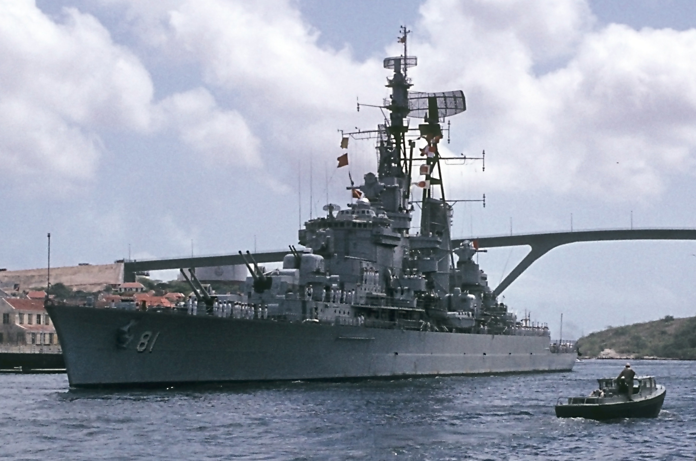

# 巡洋舰

## 简述
巡洋舰（英语：Cruiser）指在排水量、火力、装甲防护等方面仅次于战列舰的大型水面舰艇，拥有同时对付多个作战目标的能力，以及能胜任多种任务的多样性。历史上，巡洋舰由于吨位大、火力强、性能佳，一开始是指可以独立行动的战舰 ; 而与此相对的驱逐舰则需要其它船只（比如补给船只）的协助，才能执行任务。不过随着现代驱逐舰大型化后的综合作战能力的提升，吨位其实超过早年的巡洋舰，所以这个区分已不明显，很多新式的大型军舰都不再冠以巡洋舰之名。到了现代足够资格被称为巡洋舰的排水量一般在 8,000 吨至 30,000 吨左右，在二战时也是属于战舰的级别。

早期巡洋舰舰炮火力仅次于主力旗舰 、战列舰。现今的巡洋舰都装备有先进的导弹系统、火炮、鱼雷等武器，能执行远海攻击行动。有些巡洋舰可携带反潜直升机、执行反潜及巡逻任务；动力装置多采用蒸汽轮机，少数采用核动力装置。随着驱逐舰的作战能力大幅提升，有些吨位接近轻巡洋舰，故也能执行巡洋舰的任务，现今只有美国海军及俄罗斯海军的巡洋舰仍在服役中。而韩国海军的世宗大王级驱逐舰及中国人民解放军海军的055型驱逐舰和美国海军的朱姆沃尔特级驱逐舰，其吨位、性能及作战能力亦属巡洋舰级别。另外，由于海军航空兵亦能分担巡洋舰的工作，故大部分国家已无计划新建巡洋舰。

