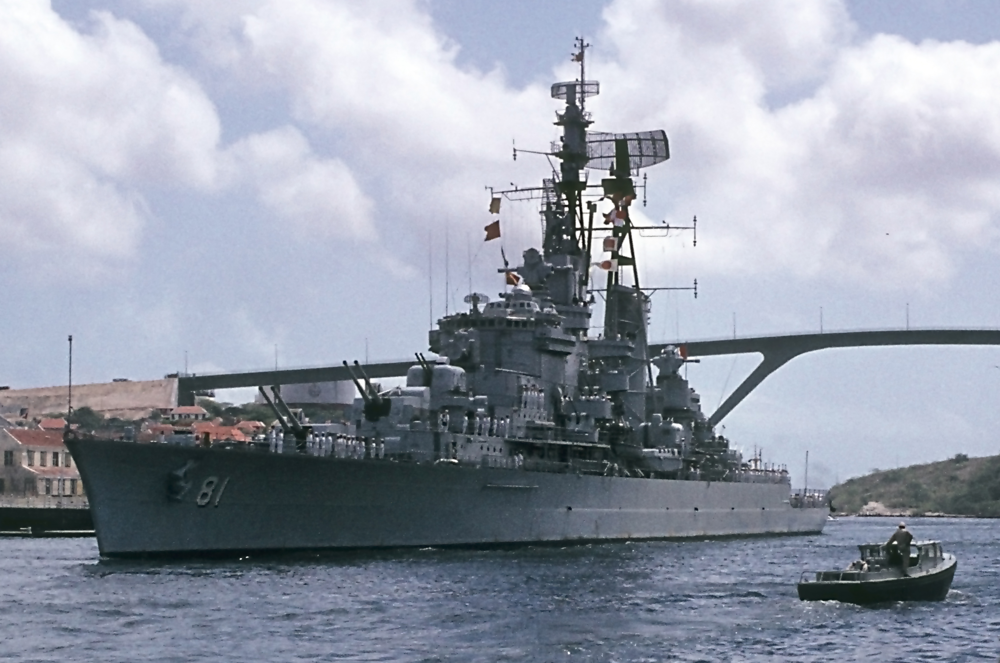

---
aliases:
  - 
tags:
  - ship
  - cruiser
  - linghtcruiser
  - heavycruiser
  - battlecruiser
created: 2022-11-07 10:56:33
modified: 2023-04-07 3:06:21
---
# 巡洋舰笔记

---

## 目录

* [防护巡洋舰](#cruiser_pc)
* [装甲巡洋舰](#cruiser_ac)
* [轻巡洋舰](#cruiser_lc)
* [重巡洋舰](#cruiser_hc)

---

## 简述

巡洋舰（英语：Cruiser）指在排水量、火力、装甲防护等方面仅次于战列舰的大型水面舰艇，拥有同时对付多个作战目标的能力，以及能胜任多种任务的多样性。历史上，巡洋舰由于吨位大、火力强、性能佳，一开始是指可以独立行动的战舰 ; 而与此相对的驱逐舰则需要其它船只（比如补给船只）的协助，才能执行任务。不过随着现代驱逐舰大型化后的综合作战能力的提升，吨位其实超过早年的巡洋舰，所以这个区分已不明显，很多新式的大型军舰都不再冠以巡洋舰之名。到了现代足够资格被称为巡洋舰的排水量一般在 8,000 吨至 30,000 吨左右，在二战时也是属于战舰的级别。

早期巡洋舰舰炮火力仅次于主力旗舰 、战列舰。现今的巡洋舰都装备有先进的导弹系统、火炮、鱼雷等武器，能执行远海攻击行动。有些巡洋舰可携带反潜直升机、执行反潜及巡逻任务；动力装置多采用蒸汽轮机，少数采用核动力装置。随着驱逐舰的作战能力大幅提升，有些吨位接近轻巡洋舰，故也能执行巡洋舰的任务，现今只有美国海军及俄罗斯海军的巡洋舰仍在服役中。而韩国海军的世宗大王级驱逐舰及中国人民解放军海军的 055 型驱逐舰和美国海军的朱姆沃尔特级驱逐舰，其吨位、性能及作战能力亦属巡洋舰级别。另外，由于海军航空兵亦能分担巡洋舰的工作，故大部分国家已无计划新建巡洋舰。

---

##  防护巡洋舰 

**防护巡洋舰**（Protected Cruiser）是十九世纪后期出现的一种巡洋舰，它的名字来源于其船体中设有平式或是穹顶式的装甲板以保护机器不被炮弹破片击伤。与它们同时出现的还有 [装甲巡洋舰](#cruiser_ac)，后者在两侧船壳上也有装甲带。中国近代也称为穹甲快船。

到了 1910 年代以后，军舰为了增强动力输出，转向燃烧油料，油料容易燃烧不能当防御设施用，因此防护巡洋舰便遭到淘汰了，取而代之的是装有舷侧装甲的 [轻巡洋舰](#cruiser_lc) 以及其演进而来的 [重巡洋舰](#cruiser_hc)。

---

##  装甲巡洋舰 

**装甲巡洋舰**（Armored Cruiser） 是十九世纪晚期到 20 世纪初期的一种巡洋舰。它的火力能击败战列舰外的所有航种，面对战列舰又有足够速度逃离。尽管吨位各有差异，该种舰与同时代的另一巡洋舰主要分类 --[防护巡洋舰](#cruiser_pc) 的区别就是两侧船壳有装甲带来保护自己。

最早的此舰种是沙俄海军的俄国海军一紴上将号巡洋舰，1873 年下水，使用风帆 - 汽轮混合动力。

1890 年代出现表面硬化装甲，使得军舰能用较少的重量得到较高防护。一战前出现取代它的战列巡洋舰，从此它便衰落，有少数存活到了二战。

---

##  轻巡洋舰 

轻巡洋舰瘦身为 [防护巡洋舰](#cruiser_pc)，自 1879 年开始，英国皇家海军建造了一系列的蒸汽动力的小型巡洋舰，虽称 **防护巡洋舰**，各主要海军强国对于如何在中型舰的有限吨位上配置装甲各有其设计哲学，因此产生了不同亚种的设计。

1913 年，英国才建成了第一种真正意义上的现代轻巡洋舰 --「林仙级」。该级吨位 3750 吨，使用油煤混烧锅炉达到极速 28.5 节，主炮为 2 门 6 寸（152 毫米）后膛速射炮，装有鱼雷发射管，水线装甲带厚 3 寸（76.2 毫米），这样的军舰在舰队中主要定位是执行侦察任务，或在大西洋上攻击德国的破交舰。

此级舰成功创造出当时中型舰艇的平衡折衷设计观：以相对较小的吨位塞入强劲动力获得各国巡洋舰或战舰难以追击的航速、具有足够消灭驱逐舰及同等巡洋舰的火力、及不会被驱逐舰或是伪装破交舰主炮轻易击破的装甲。第一次世界大战时期，英国的轻巡洋舰排水量一般在 3500 至 5000 吨左右，通常装备 2 门 6 英寸（152 毫米）主炮，或 8 门 4 英寸（ 100 毫米）炮。

在一战期间，各国也复制英国概念建造吨位相近的巡洋舰。巡洋舰这时要面对的敌人就是设计概念都类似的敌舰，为了确保有能力消灭敌方目标，巡洋舰再度重武装、大型化发展；1921 年，海军强国签订了《华盛顿海军条约》。条约规定，所有巡洋舰排水量不得超过 10000 吨，主炮口径不得大于 8 英寸（203 毫米），巡洋舰自此后开始有明确的量级定位；1930 年的《伦敦海军条约》则更加明确地划定了轻巡洋舰规格必须在排水量 1 万吨以内，主炮不超过 6.1 英寸（155 毫米），主炮 6.1 英寸至 8 英寸间的则是重巡洋舰，这个时代海军列强所研制的巡洋舰统称为条约级巡洋舰。

在日本退出《伦敦海军条约》后，海军列强开始重启巡洋舰建造，第二次世界大战各参战国都建造了大量的轻巡洋舰，比如美国的亚特兰大级轻巡洋舰（8 艘）和克里夫兰级轻巡洋舰（27 艘）等，而重巡洋舰完工数量则较少。这主要是由于航空兵的崛起，大型军舰能提供的打击力找到替代方案，量产的水面舰就朝向规模与有限功能发展，较小型的军舰反而相对来说比较经济；且轻巡洋舰毋须厚重装甲，因此材料加工较为容易，施工期较短易于量产；且具有足够的吨位与弹性塞入大量武装，提供舰队警戒和防空火力。这时期的轻巡洋舰排水量在 3000 吨至 10000 吨左右；主炮口径则介于 5 英寸（127 毫米）至 6.1 英寸（155 毫米）不等，但绝大多数轻巡洋舰都装备 6 英寸主炮；由于排水量限制，装甲一般来说比较薄，所以抗打击力较差，战损率亦较高；而航速则一般都在 30 节以上。

不过将轻巡洋舰作为舰队防空中主力的国家也仅有英美等国，如日本帝国海军等仍然将轻巡洋舰作为指挥驱逐舰队实行大规模鱼雷战的领队舰。

战争结束后，各国大量的军舰都被拆毁或用于武器试验。而随着导弹以及雷达的出现，巡洋舰的任务可用更小型的驱逐舰以及巡防舰执行，「大舰巨炮」已不再成为海上巡弋的必备条件，因此搭载重炮的巡洋舰虽然仍保留编号，但新造的巡洋舰遍不再分轻/重等分类。二战结束后，主要海军国家都仍维持了大批巡洋舰，但是 1950 年代海军导弹化与电子化时，万吨出头的巡洋舰无论就容积或是电机出力都不够容纳原始的大型电子机材，在重要性下降后 1960 年代这些船只逐渐降为预备役或直接退役拆解。

1970 年代以后，由于电子科技的进化部分长距离搜索雷达可装在一万吨船舰船体上，一些曾经是海洋国家的小国，如荷兰便对旗下的轻巡洋舰执行改装实施有限的导弹化持续延役；但如美国等财政状况较为宽裕的国家则持续进行万吨级军舰的建造工程，这些军舰有些仍维持巡洋舰编号，有些是以驱逐舰名义服役，但是在她们的任务目标与二战时期的轻巡洋舰是相同的。

各国轻巡洋舰详细信息，请参考 [轻巡洋舰笔记](./LightCruisers.md)。

---

##  重巡洋舰 

---

##  战列巡洋舰 

---

